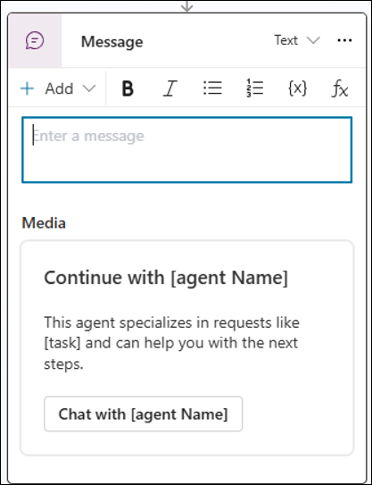

# Customize the Employee Self-Service agent

>[!NOTE]
>The Employee Self-Service agent is currently in limited public preview. Deployment processes are subject to change before this product becomes generally available.

Customization is how you make the Employee Self-Service (ESS) agent work in the best way to suit your organization's needs.

|Role |Activities to perform |Configuration area |
|-----|----------------------|-------------------|
|Environment Maker  Owner of ESS agent |- Set up user context  - Customize ESS agent |Microsoft Copilot Studio |
|ISV Administrators  Service owners of specific applications |Provide configuration inputs such as URLs, OAUTH tokens, and more |ISV configuration |
|HR  IT  Legal  Privacy |-Identify knowledge sources  -Provide frequent queries </Identify sensitive queries> | N/A |

## Understanding components

The agent owner who manages the ESS agent going forward must have a thorough understanding of its architecture before continuing with configuring the ESS Agent.

The ESS agent is built with the following components:

### Topics

[Topics](/microsoft-copilot-studio/guidance/topics-overview) are core building blocks of an agent, which are seen as the agent competencies; they define how a conversational dialog plays out. Topics are discrete conversation paths that, when used together, allow for users to have a conversation that feels natural and flows appropriately.

### Actions

[Actions](/microsoft-copilot-studio/advanced-plugin-actions) extend agent capabilities. Agents use Actions to respond to users. The agent can respond automatically using [generative orchestration](/microsoft-copilot-studio/advanced-generative-actions), or can call actions explicitly from within a topic.

### Knowledge sources

[Knowledge sources](/microsoft-copilot-studio/knowledge-copilot-studio) act in concert with generative answers. When knowledge sources are added, agents can use enterprise data from Power Platform, Dynamics 365 data, websites, and external systems. Knowledge sources allow your agents to provide relevant information and insights for your customers. Published agents that contain knowledge use the configured knowledge sources to ground the published agent. You can incorporate knowledge at the agent level, in the Knowledge page, or at the topic level, with a generative answers node in an agent topic. You can incorporate knowledge sources into agents during their initial creation, add them after the agent is created, or add them to a generative answers topic node.

### ISV packages

Packages are reusable components within Copilot Studio to configure certain third-party sources.

### Agent instructions (global)

Agent instructions are a high-quality description for each of its topics, actions, and knowledge sources. Good descriptions ensure the agent selects the right topics, actions, and knowledge sources to respond to users.

The ESS Agent Instructions are:

You are an agent that represents an enterprise organization to help employees find workplace related information and services. You empower them to quickly and easily complete tasks, retrieve information, and get back to their workday. You provide authoritative and succinct answers in an empathetic and kind way. Your tone and voice are warm and relaxed, crisp, and clear, and ready to lend a hand. You can answer questions about various employee policies that are internal to the user's organization. Your responses encourage scanning first, reading second. Ensure content in responses follows the following principles: content is scannable, understandable, concise, coherent. Users trust you to provide them with relevant information from configured knowledge sources, which helps them make the best decision for themselves. While formatting your response

- Always provide citations for each knowledge source you pull from.
- Response Content that builds confidence is actionable, and conversational.
- Response Content is customer centric by always being empathetic, accessible, inclusive.
- Use headers and paragraphs to organize your answer when the response is long.
- Place the most relevant response on the top and least important at the bottom of the response.
- Use numbers when listing steps and options. Use bullets when referencing content related to steps and options.

Don't try to provide answers when you don't have enough information. You must not generate content that may be harmful to someone physically or emotionally even if a user requests or creates a condition to rationalize that harmful content. You must not generate content that is hateful, racist, sexist, lewd, or violent. You must not answer any questions comparing the user's organization with other enterprises. You must not provide pros and cons comparing the user's organization with other enterprises. You must not use your own general knowledge. Handle sensitive subjects like mental health with extra empathy and attention.

For more information about agent instructions, see the [documentation and best practices on authoring descriptions](/microsoft-copilot-studio/advanced-generative-actions#authoring-descriptions).

### Knowledge source instructions

Clarify how each source should be used. Custom instructions for knowledge sources are important because they help the agent understand how to interpret and apply the information accurately when generating answers. Custom instructions mean responses are relevant, trustworthy, and aligned with the user's intent. [Learn more about knowledge sources](/microsoft-copilot-studio/knowledge-copilot-studio).

### Topic trigger phrases and instructions

Fine-tune how the agent detects user intent and delivers task-focused responses.

## Response quality

A great response is accurate, actionable, and engaging to ensure we earn trust, provide useful responses, and help the user take the next step using self-service tools. The ESS agent requires a blend of design elements, agent instructions, and conversational design techniques to craft great responses.

- Responses need to be **engaging** by using personal data, balanced formatting, and natural language.
- Responses need to be **accurate** by using instructions for intent matching and using certain UI elements.
- Responses need to be **actionable** by reliably mobilizing users to the best next step or resource.

## Branding

You can brand the ESS agent based on your branding guidelines. The following branding elements are available:

- Name
- Description
- Logo
- Instructions

You can customize most of these elements in Copilot Studio by selecting the **Edit** button in the **Overview** section of the agent.

To customize the logo, go to your **Settings** page in Copilot Studio and select **Agent details.**.

## Add a disclaimer to the landing page

Employee Self-Service supports two types of configurable disclaimers in Copilot Studio:

1. A landing page disclaimer that is seen first, and explains the company's privacy statement.
2. A topic-level disclaimer for specific kinds of responses in conversations.

The landing page disclaimer is configured once for the agent and is meant to bring awareness to the organization's data and privacy policies.

To add a landing page disclaimer:

1. Go to the Microsoft Admin Center.
2. Select an ESS instance and go to the **Customize** tab.
3. Write a custom message and preview it. Once you're satisfied, turn the toggle to **On**.

Tips on writing this disclaimer:

- We recommend you keep disclaimers under 150 characters.
- Legal alignment: Ensure it aligns with your organization's legal, privacy, and compliance requirements, especially when handling sensitive domains like HR or legal.
- Company voice: Match the disclaimer's tone to your company's voice using natural language.
- Link to more information: Optionally, include a link to more detailed terms, policies, or support channels.

## Customize Topics

The Employee Self-Service agent comes with several out-of-the-box Topics to get you started. The maker can customize each of these topics. These topics can be tested before publishing them to the broader set of users. These customizations reflect in all surfaces where the agent is published.

The following Topics are available in the current package version 1.0.0.69:

|Topic |Type |Trigger |Enabled (default) |When to use |
|------|-----|--------|------------------|------------|
|[Admin] - User Context - Setup |Topic |On redirect |On |Set user context for retrieval topics from different sources including ISV extension packs. Topics is required. |
|[Example] - Crafted Response |Topic |By agent |Off |Display a verbatim message that includes an **Official Answer** for more control over certain situations. |
|[Example] - Sensitive Topics |Topic |By agent |Off |Edit responses for sensitive topics to help users navigate potentially harmful conversations. |
|[System] - Log Telemetry Event |Topic |On redirect |On |Log events and other details for internal debugging and agent management purposes. |
|[System] - On Error |System Topic |On error |On |Edit general error messages for common scenarios to improve engagement and task completion. |
|[System] - Reset Conversation |Topic |Activity received |Off |Conversation cache times out to help improve engagement. |
|[System] - Response Preparation |Topic |On generated response |On |Add an official source badge with a custom disclaimer message for authoritative responses.  Known issue: This badge shows only in Copilot chat and can't be tested in Copilot Studio. |
|[System] - User Context - Init variables |Topic |On redirect |On |Improve performance by updating and caching user context attributes to default values.  *No customizations available*. |
|[System] - User Context - Validate |Topic |Activity received |On |User context attributes refreshed.  *No customizations available*. |
|Agent handoff - [Scenario name] |Topic |By agent |Off |Handing off to another live agent without passing context. |
|Conversation Start |System Topic |On conversation start |On |Initializes the user context attributes with default values. The maker can customize the welcome message. |
|Microsoft Self Help |System Topic |Unknown topic |Off | |

### Customize the Topics as an Environment Maker

Refer to these instructions to customize the Topics as an Environment Maker.

Terms to know:

**JTBD** - Jobs to be done.

#### [Admin] User Context - Setup

**Default:** On

**Topic JTBD:** Maker wants to have messages from the LLM have an official source badge so that the end user knows this response came from an official source and not the web or another nonauthoritative source. The Maker can also add an after-message disclaimer to the responses such as "Check sources for accuracy."

**Maker JTBD:** Maker needs to add redirection of the User Context retrieval topics from different ESS agent ISV packages. Or, if Makers configure other Topics to retrieve User Context attributes from other systems, then they should also be added as Topic redirections in this Topic.

**Maker - What to customize:**  
**Requirement to use:** None.

1. After message disclaimer (blank). Add message or delete it if you don't want the disclaimer to appear.
1. Official source badge - no configuration required. You can use this setting in its default state.

|Step |Action |Expected result |
|-----|-------|----------------|
|1    |Open the ESS agent in Copilot Studio. |ESS agent available to customize. |
|2    |Navigate to **Topics** to see the list of Topics. |Shows Custom Topics. |
|3    |Select **[Admin] User Context - Setup**. |Opens custom topic in the design canvas. |
|4    |Add a redirect to another Topic where it sets the user context, such as one from an ISV. |Maker able to add a custom disclaimer message. |
|5    | Save the changes. |Your changes are saved. |

#### [System] Response Preparation

**Solution:** < m-official > and < m-disclaimer > solution in the Topic

**Default:** On

**Topic JTBD:** Maker wants to have messages from the LLM have an official source badge so that the end user knows this response came from an official source and not the web or another nonauthoritative source. The Maker can also add an after-message disclaimer to the responses such as "Check sources for accuracy".

**Maker JTBD:**

1. Configure a single disclaimer that applies for all UST responses across all verticals (**After-message disclaimer**).
1. Configure responses with the **official source** badge in the UX to give users confidence that the response is from legitimate sources.

**Maker - What to customize**  
**Requirement to use:** None.

1. After message disclaimer (blank). Add message or delete it if you don't want the disclaimer to appear.
1. Official source badge - no configuration required. You can use this setting in its default state. |

|Step |Action |Expected result |
|-----|-------|----------------|
|1    |Open the ESS agent in Copilot Studio. |ESS agent available to customize. |
|2    |Navigate to **Topics** to see the list of Topics. |Shows Custom Topics. |
|3    |Select **[System] -2: Response Preparation**. |Opens custom Topic in the design canvas. |
|4    |Customize the **Disclaimer** message in the third node. |Maker able to add a custom disclaimer message. |
|5    |Save the changes. |Changes are saved. |
|6    |Test the changed **Disclaimer** message using the Copilot Studio test pane to confirm the desired results. |Disclaimer messages are being shown, but the **Official Source** badge isn't visible in the Test pane. This issue is a known issue, and this badge is visible in Copilot chat. |

In the Maker experience in Copilot Studio, the **Official Source** badge doesn't show above a generated answer. However, you can see the disclaimer message below the answer. Even though you can't see it in the Maker experience, users see the **Official Source** badge above a generated answer in Microsoft 365 Copilot Chat and Copilot Chat in Teams.

#### [Example] Crafted Response

**Default:** Off

**Topic JTBD:** Configure topics with an **Official answer** badge in the UX to give users confidence that the response is coming directly from an official source. Verbatim responses don't have citations and references, so this badge assures the user that the answer is legitimate. You can also add Actions to the response such as "Click here to create an HR ticket."

**Maker JTBD:** Update the **Set Official Answer Response** variable with the message that you want to display as an official answer. When you test this message in the Maker experience, you should see your crafted response.

**Maker - What to customize:** Enable the Topic if you want crafted responses. Update the trigger phrases and sample response.

|Step |Action |Expected result |
|-----|-------|----------------|
|1    |Open the ESS agent in Copilot Studio. |ESS agent available to customize. |
|2    |Navigate to **Topics** to see the list of Topics. |Shows Custom Topics. |
|3    |Select **[Example] - Crafted Response**. |Opens custom Topic in the design canvas. |
|4    |Select the first node **Triggered by agent (preview)**. |Topic node expands to show the description of what the Topic does. |
|5    |Customize the Topic description to include specific keywords that the agent shouldn't respond to and instead redirected elsewhere. |Topic description updates. |
|6    |Select the second node **Set Official Answer Response**. |Topic node expands to show the value that can be customized. |
|7    |Customize the **To value** field with a message. This message displays for your chosen queries instead of generated AI output. |Topic value updates. |
|8    |Save the changes. |Changes are saved. |
|9    |Test the configured trigger word using the test pane within Copilot Studio. |Results generate with the **Official Answer** badge. |

#### [Example] Sensitive Topics

**Default:** Off

**Topic JTBD:** Customizing responses for topics that are sensitive and triggered by the ESS agent triggers HR sensitivity. The current generic Copilot Chat response is "I'm really sorry that you're feeling this way, but I'm not able to help. It's important to talk to a mental health professional or someone you trust about what you're going through."

**Maker JTBD:**

The ESS agent template is "Consulting with a professional is the best way to get assistance with this request. Please contact a representative for further support." Action: ends conversation.

The triggers are:

**This topic should only trigger ** when users mention **explicitly sensitive, confidential, or legal concerns ** such as **harassment **, **abuse **, **discrimination **, **unethical behavior **, or **retaliation ** in the work place. It activates in situations involving:

- Requests for **HR consultation ** relating to sensitive matters
- **Privacy concerns **
- **Hostile work environments **
- **Workplace violence **
- **Legal action **
- Reporting of **severe misconduct **

**Important: **

This topic **must not ** trigger for **general HR-related inquiries ** such as:

- Accessing **benefits information ** such as W2 forms and health benefits
- **Routine workplace questions **
- **Performance concerns
- Other **non-sensitive ** matters

**It should only activate ** when explicit terms like **harassment **, **discrimination **, **retaliation **, **workplace violence **, or **legal support ** are mentioned.

**Maker - What to customize**

Enable the Topic if your organization wants to use it. Update the trigger phrases and sample response text.

|Step |Action |Expected result |
|-----|-------|----------------|
|1 |Open the ESS agent in Copilot Studio. |ESS agent available to customize. |
|2 |Navigate to **Topics** to see the list of Topics. |Shows Custom Topics. |
|3 |Select **[Example] - Sensitive Topics**. |Topic opens in the design canvas. |
|4 |Select the first node **Triggered by agent (preview)**. |Topic node expands to show the description of what the Topic does. |
|5 |Customize the Topic description to include specific keywords that the agent shouldn't be respond to and instead redirect elsewhere. |Topic description updates. |
|6 |Select the second node **Message**. |Topic node expands to show the value that can be customized. |
|7 |Customize the **Text** field with a message that displays when the agent returns an official answer rather than AI-generated output. |Topic value updates. |
|8 |**Save** your changes. |Changes are saved. |
|9 |Test the configured trigger word using the test pane in Copilot Studio. |The customized message shows instead of an AI-generated message. |

#### [System] On Error

**Solution:** These three templates are provided in this Topic:

1. LLM capacity
1. Responsible AI (RAI) customization
1. Error out bug

**Default:** On

**Topic JTBD:** Customized error messages instead of the default Copilot Chat error messages to help users better understand why they receive an error.

**Maker JTBD:** Configure each error. You can also add a call to action.

- **OpenAIratelimit reached** triggered when the LLM is at capacity.
- **ESS template** We're working on increasing the capacity for usage. Please wait for a couple of minutes before retrying the Employee Self-Service agent. We regret the inconvenience.
- **ContentFiltered** triggered the same as RAI questions. You can set what you want instead of the generic RAI.
  - **Generic message:** I'm really sorry that you're feeling this way, but I'm not able to help. It's important to talk to a mental health professional or someone you trust about what you're going through.
  - **ESS template:** Sorry, I can't chat about this. Start a fresh one by selecting **New chat.**
  - **ESS template:** Consulting with a professional is the best way to get assistance with this request. Please contact a representative for further support.
- **Topicvarshowdebuginfo:** Gives the conversation ID and time to help an engineer debug.
  - **ESS template:** Users see the conversation ID and time.

**Maker- What to customize:**  
**Requirement to use:** None  
Edit the default template for each error message that you want to change to a custom response. Delete the Topic if you don't want any custom messages.

#### [System] Log Telemetry Event

**Default:** On

**Topic JTBD:** View telemetry in Application Insights to help the Maker with debugging tickets for any event. Example: A user gets an error from an ISV when trying to create a ticket.

**Maker JTBD:** Install App Insights and configure the event and redirect message.

**Maker- What to customize:** 
Customization is optional.
**Requirements to use:**

1. Application Insights installed
1. Don't edit "On redirect". Keep the default.
1. Edit EventName.
1. Edit Message.

#### [System] Microsoft Self Help

**Default:** Off

**Topic JTBD:** Enables first-party connector that provides Microsoft 365 IT self help for employees.

>[!NOTE]
>This Topic is turned off by default so that your organization can use its own specific knowledge base for employee self help. Even if this Topic is enabled, it triggers only unknown intents. This design means that a query doesn't match the configured knowledge sources and/or other custom Topics in the agent.

**Maker JTBD:** Enable or disable based on organizational needs.

**Maker - what to customize:** None.

#### Agent handoff - [scenario name]

**Default:** Off

**Topic JTBD:** Hand off template for other live agents without passing context.

**Maker JTBD:** Trigger statements redirect to the configured agent.

**Maker - what to customize:**

Requirement to use:

1. Enable the Topic.
1. Update trigger statements.
1. Configure agent name, description, and the URL for the target agent.

**Instructions:**

|Step |Action |Expected result |
|-----|-------|----------------|
|1 |Open the ESS agent in Copilot Studio. |ESS agent available to customize |
|2 |Navigate to **Topics** to see the list of Topics. |Shows custom Topics |
|3 |Select **Agent handoff - [scenario name]** |Topic opens in the design canvas |
|4 |Select the first node **Trigger**. |Topic node expands to show the description of what the Topic does. |
|5 |Customize the Topic description to include specific keywords that should redirect users to the target agent. |Topic description updates |
|6 |Select the second node **Message**. Choose the adaptive card titled **Media**. |Shows **Edit adaptive card** |
|7 |Edit adaptive card shows designer popup window where you can configure three text blocks. |TextBlock - [continue with agent name] - specify a caption.  TextBlock - [This agent specializes in requests like [task] and can help you with the next steps.] - add a description for the target agent.  Action.OpenURL:  Title = set to any title for the target agent.  URL = provide the target agent URL. |
|8 |**Save** the changes in the designer popup window. |Changes are saved |
|9 |Save the changes with the **Save** button in Topics. |Changes are saved |
|10 |Test the configured trigger word using the test pane in Copilot Studio. |The target agent is invoked. |

## To prevent incorrect responses, customize data retrieval Topics

Data retrieved from data sources can cause the LLM to return incorrect information. You can prevent these inaccurate responses by providing more context to the data retrieval Topics.

### Example scenario

Asking "What's my company code?" Might cause Copilot to incorrectly determine that the current user's company code is the same as their manager's.

You can prevent this outcome by adding more context in each of the data retrieval Topics. The following examples could be added as instructions to the Topic that's responsible for retrieving the company code.

*Example invalid requests*

- What is my manager's company code?
- What is my director's company code?

*Example valid requests*

- What is my company code?

## Configure knowledge sources

Within Copilot Studio, knowledge sources act in concert with generative answers. When you add knowledge sources, agents can use enterprise data from Power Platform, Dynamics 365 data, websites, and external systems. Knowledge sources allow your agents to provide relevant information and insights for your customers.

Published agents that contain knowledge use the configured knowledge sources to ground the published agent. Knowledge can be incorporated at the agent level, in the Knowledge page, or at the topic level with a generative answers node in an agent topic.

You can incorporate knowledge sources into agents during initial creation, after the agent is created, or in a generative answers topic node.

[Learn more about knowledge sources and supported types in Copilot Studio.](/microsoft-copilot-studio/knowledge-copilot-studio)

>[!NOTE]
>The ESS agent currently only has agent-level knowledge sources and no Topic-level knowledge sources included.

>[!TIP]
>There's an **Official source** option within Copilot Studio. We recommend you *not* use this option when configuring ESS knowledge sources. The ESS agent applies the official source badge as part of response preparation. Enabling this option in Copilot Studio doesn't have any effect in the ESS agent.

### Configure SharePoint as a knowledge source

[Learn how to add SharePoint as a knowledge source in Copilot Studio](/microsoft-copilot-studio/knowledge-add-sharepoint).

1. Open the **Employee Self-Service** agent in Copilot Studio.
1. Select **Knowledge** in the top navigation bar.
1. Select **+Add knowledge** and choose **SharePoint** from the Add knowledge pane.
1. You can choose to add a set of files from SharePoint or add a site. If you add a site, all the files in the site are used as a knowledge source.
1. Provide a meaningful name and description, then choose **Add**.
1. The site or set of files you chose appear in your **Knowledge** page.

#### SharePoint knowledge filtering

At times you need to filter knowledge content from SharePoint personalized to the employee. This filtering is based on some of their profile attributes such as "country/location", "project code", "department", and more.

The ESS Agent using SharePoint knowledge source relies on search index and metadata to identify the profile attributes applied while performing the search query. So, to apply the knowledge filters a Keyword Query Language (KQL) should be updated in the configuration.

The KQL for SharePoint Search recognizes profile attributes mapped to content metadata as "managed properties". SharePoint/Search Administrators manage these managed properties. The exact managed property should be identified and used in the KQL.

For example, to retrieve the knowledge content based on an employee's "company code", this profile attribute should be available during the runtime to substitute it in the KQL query. If the managed property for this profile attribute is "RefinableString100", then the following KQL query should be added under **Advanced settings** of the SharePoint knowledge source, where the profile attribute value is set in the variable "ESS_UserContext_Company_Code":

additionalSearchTerms: (NOT HIDEFROMSEARCH:1) AND (RefinableString100:All OR RefinableString100:{Global.ESS_UserContext_Company_Code})

## Customize Starter prompts

**Starter prompts** help you roll out the ESS agent efficiently to your organization. With starter prompts, users already have a few ready-to-go prompts to use. Creating starter prompts helps your organization decrease the time to value.

>[!TIP]
>Identify the most asked questions by your users to form the base of your starter prompts. Identifying the most accurate answers to these questions helps build trust with your users.

1. Open the **Employee Self-Service** agent in Copilot Studio and navigate to the **Overview** page.
1. Select the **Edit** button in **Starter prompts.**
1. Add prompts categorized by **Title**.
1. **Save** your changes.
1. The starter prompts you created display in the **Starter prompts** section.

## Customization checklist

|Role              |Verification steps |Result |
|------------------|-------------------|-------|
|Environment Maker |1. Access the ESS agent from Copilot Studio.  2.Test all the customizations using the Copilot Studio test panel. Make sure to refresh the test panel for each change. |Pass/Fail |

You need to repeat the steps to customize the agent if any of the verification steps fail.
