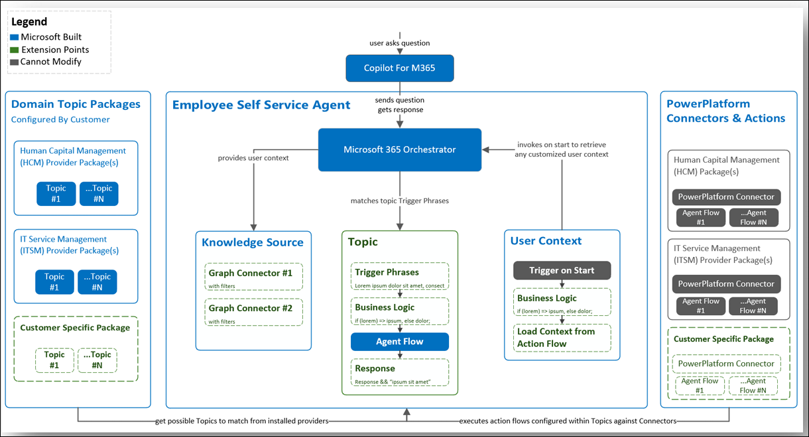

# Overview of the Employee Self-Service agent

>[!NOTE]
>The Employee Self-Service agent is currently in public preview. Deployment processes are subject to change before this product becomes generally available.

The Employee Self-Service (ESS) agent helps your employees by answering policy related questions, simplifying HR tasks, and assisting with IT help. The agent makes it easier to:

- Retrieve the right information at the right time in the flow of work. Users can access the agent in the environments they already work, including Teams and Microsoft 365 Copilot Chat.
- Take action on essential HR and IT tasks without navigating to multiple tools and workspaces. ESS can even help run diagnostics on Microsoft 365 products and services.
- Complete other tasks important for your organization. The ESS agent includes preconfigured templates, but IT admins can also customize it for their employee workflows. You can even connect it to third-party HR and IT systems.

## Get started with the Employee Self-Service agent

The Employee Self-Service agent is built on top of Microsoft 365 Copilot and Copilot Studio. The following articles can help you understand governance, security, privacy, and Responsible AI terms for both Microsoft 365 Copilot and Microsoft Copilot Studio.

### Microsoft 365 Copilot resources

Before you deploy the Employee Self-Service agent, read through the documentation and familiarize yourself with the areas of deployment and configuration. The ESS agent inherits the Copilot stack, which needs to be considered for initial installation and for operational policies. You can refer to the [Copilot hub](/copilot/microsoft-365) for documentation on architecture, trust, security, compliance, and best practices in Microsoft 365 Copilot.

- [Microsoft 365 Copilot hub](../index.yml)
- [Overview of Microsoft 365 Copilot.](../microsoft-365-copilot-overview.md)
- [Microsoft 365 Copilot architecture](../microsoft-365-copilot-architecture.md)
- [Address oversharing concerns in Microsoft 365 Copilot deployment blueprint](../microsoft-365-copilot-blueprint-oversharing.md)
- [Microsoft 365 Copilot privacy](../microsoft-365-copilot-privacy.md)
- [Microsoft 365 Copilot service description](/office365/servicedescriptions/office-365-platform-service-description/microsoft-365-copilot)
- [What is responsible AI?](https://support.microsoft.com/topic/what-is-responsible-ai-33fc14be-15ea-4c2c-903b-aa493f5b8d92)

### Microsoft Copilot Studio resources

- [Copilot Studio documentation home](/microsoft-copilot-studio)
- [Topics in Copilot Studio](/microsoft-copilot-studio/guidance/topics-overview)
- [Analytics in Copilot Studio](/microsoft-copilot-studio/analytics-overview)
- [Copilot Studio security and governance](/microsoft-copilot-studio/security-and-governance)
- [Personal data requests for Copilot Studio](/microsoft-copilot-studio/personal-data-summary)
- [Responsible AI in Copilot Studio](/microsoft-copilot-studio/responsible-ai-overview)

## Roles and responsibilities

The ESS Agent involves multiple roles across different service areas. Operators in each of these should understand the configuration entirely for better operational efficiency.

The **Admin** works in the Microsoft admin center to assign roles.

The **Maker** works in Microsoft Copilot Studio to configure the agent. The maker sets up user context, knowledge sources (including M365 data and ISV connectors), topics, and ISV packages. All of this goes through orchestration to reach the end user.

The **End user** accesses the Employee Self-Service agent in Microsoft 365 Chat or through Microsoft Teams.

## Structure of the Employee Self-Service agent

The Employee Self-Service agent consists of three main parts: the agent itself, domain topic packages, and Power Platform connectors and actions.

[Learn more about how Copilot architecture works](../microsoft-365-copilot-architecture.md)
