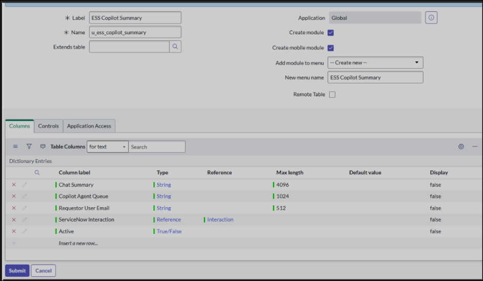
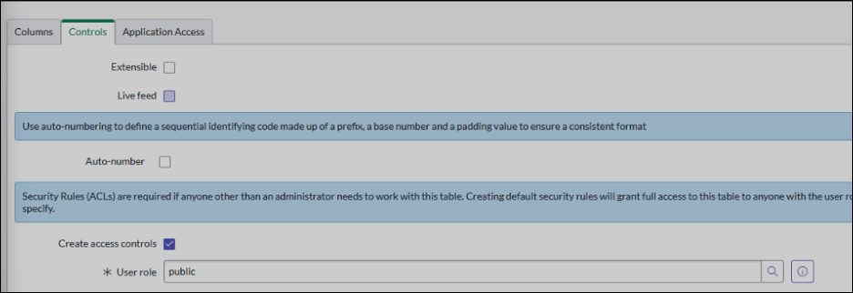
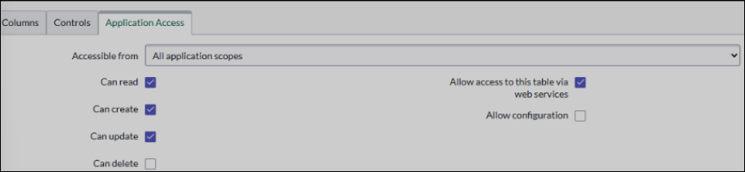
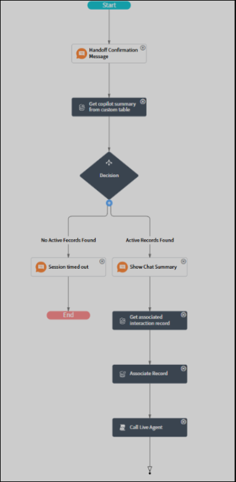
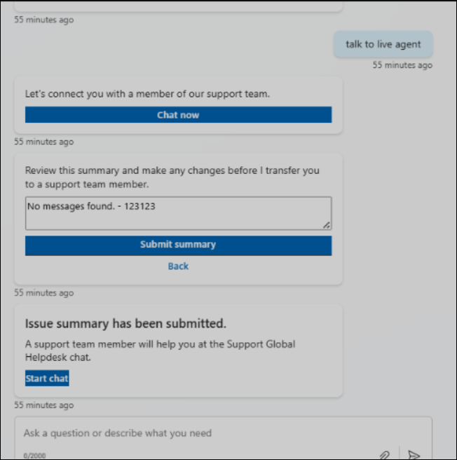

# Integrate ServiceNow Live Agent with your Employee Self-Service deployment

>[!NOTE]
>The Employee Self-Service agent is currently in limited public preview. Deployment processes are subject to change before this product becomes generally available.

>[!IMPORTANT]
>You need to complete the steps to deploy the Employee Self-Service (ESS) agent before you can configure this supplemental extension pack.

This document elaborates on the process of setting up ServiceNow Live Agent. This process requires major configuration in ServiceNow Instance and also making a few configurations in ESS Agent. This document assumes the person doing configuration has a good understanding of the ServiceNow PDI ecosystem.

## Prerequisites

- A working ServiceNow PDI with the latest patch update.
- A pair of user credentials with an admin role.

## ServiceNow plugins requirements

- Virtual Agent API (Plugin ID: sn_va_as_service)
- Agent Chat (Plugin ID: com.glide.interaction.awa). Remember to select **Load demo data** for internal dev while installing.

## Steps

Follow these steps in order.

### Step 1: Sign in

Sign into ServiceNow PDI as an admin.

### Step 2: Table creation

Search for **System definition** and select the **Tables** under it. Label: ESS Copilot Summary.

|Field name |Type |Size |Reference table |
|-----------|-----|-----|----------------|
|Chat Summary |String |4096 |  |
|Copilot Agent Queue |String |1024 |  |
|Requestor User Email |String |512 |  |
|ServiceNow Interaction |Reference |  |Interaction |
|Active |True/False |  |  |

](media/snow-live-1.png#lightbox)

Before clicking on the submit, you need to update the permissions on this table based on the organization policy. Basically, all users who are going to use Live Agent should have permission to create records. For internal dev, we can set this role to **public**. An actual customer may have a different approach to handling this.

Select the **Controls** tab and change User role to public.



Select **Application Access** and check the box for **Can create** and **Can update**.



Now select the **Submit** button.

### Step 3: Virtual Topic creation

Search for **Conversation interfaces** and choose **Virtual Agent** > **Designer**.

1. Name: ESS Copilot Summary
1. Ignore other input boxes
1. Select **Create**
1. Now create a flow using drag and drop items from the left menu. Add items in the order described here after **Start**.
1. Add a text response component:
    1. **Node name:** Handoff confirmation message
    1. **Response message:** Employee Self-Service handed you off to chat with a live agent.
1. Add a lookup utility node:
    1. **Node name:** Get Copilot summary from custom table
    1. **Table:** Select using "u_ess_copilot_summary"
    1. **Filter using table by using:** Select script and enter the following code:

```javascript
(function execute (table) {
    var userUPN= vaInputs.user.email;
    var gr= new GlideRecord ('u_ess_copilot_summary');
    gr.addQuery('u_requestor_user_email', userUPN); 
    gr.addQuery('active',true);
    gr.orderByDesc('sys_created_on');
    gr.setLimit(1); 
    gr.query();
    if (gr.next()){  
        return gr;
    }
    return null;
}) (table)
```

7. Add a decision node.
8. Add a path to decision node indicating **No Active Records Found**. Update the branch condition to **Get Copilot Summary from Custom Table** **is empty**.
9. Add a text response in that path.
    1. **Node name:** Session timed out
    1. **Response message:** The session you have accessed has timed out. Please return to Employee Self-Service to start a new session.
10. This path ends here.
11. Add a path to decision node indicating **Active Records Found**.
12. Add a text response to the path you created.
    1. **Node name:** Show Chat Summary
    1. **Response Message:** Here is a summary from your session with Employee Self-Service:
13. Next use the **Data Pill Picker** to select **Input Variables** > **Get Copilot Summary from Custom Table** > **Chat Summary**.
14. Add a look up utility:
    1. **Node name:** Get associated interaction record
    1. **Table:** Interaction
    1. **Filter this table by using:** Select script and enter the following code:

```javascript
(function execute(table) {  
  var gr = new GlideRecord("interaction"); 
  gr.addQuery('opened_for',vaInputs.user.getValue()); 
  gr.addQuery('active',true); 
  gr.query();  
  if (gr.next()) {  
    return gr;  
  }  
  return null;  
})(table) 
```

15. Add a Record action utility.
    1. **Node name:** Associate Record
    1. **Action type:** Update a record
    1. **Record:** Get Copilot Summary from Custom Table
    1. **Field:** Select **Add Field**. Then choose **ServiceNow Interaction.** Use Data Pill Picker to select **Input Variables** > **Get Associated Interaction Record**.
16. Add script action utility
    1. **Node name:** Call Live Agent
    1. **Action expression:** input the following code:

```javascript
(function execute() {  
  vaSystem.connectToAgent();  
})() 
```

17. Next, **Save** and **Publish**. Refer to the screenshot for an example of the flow.



### Step 4: Get the ServiceNow Live Agent URL to the ESS agent

The following is the format for the URL:

https://base-url/sn_va_web_client_app_embed.do?sysparm_skip_load_history=true&sysparm_topic=topic-id&sysparm_vasource=ESS

base-url: base URL of the ServiceNow PDI

topic-id: To get the Topic ID, search for "sys_cs_topic.list." Locate the flow that you created. Select the name and copy "sysId."

#### Changes on the ESS agent

1. Install the ServiceNow Live Agent ISV package.
1. You may not have been asked to put the ServiceNow Live Agent URL. In this case, visit the solutions page. You'll likely see **One environment variable needs to be updated.** Select that message and put the URL.
1. Enable topic ServiceNow Live Agent IT Escalate.

## Validate the integration of ESS and ServiceNow

This flow operates on the expectation that the user used to sign into CPS is already created in ServiceNow PDI.

1. Open the ESS agent and go to the **Test** window.
1. Type **Talk to Live Agent** then select **Chat now.**
1. The summary review box appears. You can modify the message as required.
1. Select **Submit**.
1. The **Issue summary submitted** message shows with a **Start chat** link.

1. Select **Start chat.** In the new tab that opens, sign in with your ServiceNow credentials.
1. You should see the summary shown in step four.

If you successfully completed these validation steps, the integration is successful.

## Agent orchestration

Agent orchestration is out of scope for this guide.