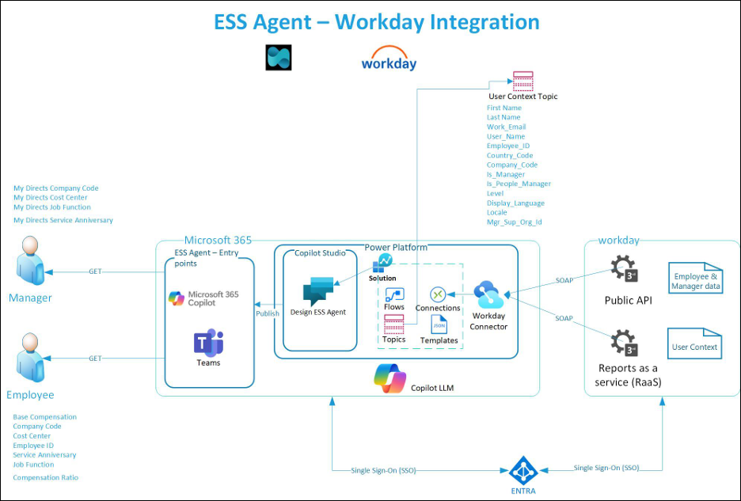

# Integrate Workday with your Employee Self-Service deployment

>[!NOTE]
>The Employee Self-Service agent is currently in limited public preview. Deployment processes are subject to change before this product becomes generally available.

>[!IMPORTANT]
>You need to complete the steps to deploy the Employee Self-Service (ESS) agent before you can configure this supplemental extension pack.

The Employee Self-Service agent is built on Copilot and uses AI to provide relevant information to employees and take actions on their HR data. If your organization uses a human resource management system, the ESS agent requires access to that system to function most effectively.

## Technical synopsis

[](../media/ess/workday-1.png#lightbox)

This diagram outlines the high-level components that make up the overall solution for ESS agent and Workday integration. Different roles need to perform various activities for both initial deployment and ongoing operation. As this solution involves multiple platforms, it's recommended to read through the documentation and understand the process before beginning integration. A first step is to identify stakeholders to set up an environment to [deploy the ESS agent](deploy-overview-alm.md).

>[!NOTE]
>Workday integration is currently configured to get only Employee details and doesn't work for External staff or Non-Employees.

## Prerequisites

### Subscription prerequisites

- A Microsoft Entra user account with active subscription
- Workday single sign-on (SSO) enabled subscription

You'll also need to meet the [prerequisites to deploy the Employee Self-Service agent.](prerequisites.md)

### Set up Copilot Studio capacity

It's recommended to set up Copilot Studio capacity to monitor capacity usage of the ESS agent over time. [Learn more about the deployment process for the ESS agent.](deploy-overview-alm.md)

## Deployment role requirements

|Role |Description |Activities performed |Configuration area |
|-----|------------|---------------------|-------------------|
|Workday administrator |User who can perform administrative tasks |1. Create X509 public key</br> 2. Edit tenant setup - security</br> 3. Create Integration System User</br> 4. Create security group</br> 5. Manage authentication policies</br> 6. Register API client</br> 7. Security domain permission changes</br> 8. Create reports |Workday |
|Application administrator **or** Cloud application administrator **or** application owner** |User who can configure SSO integration with Workday |1. Adding workday from gallery</br> 2. Configure Microsoft Entra SSO</br> 3. Configure Workday</br> 4. Test SSO |Microsoft Entra</br> Workday |
|Environment Maker |User who can customize the ESS agent |1. Install and configure Workday extension pack</br> 2. Manage Workday Topics</br> 3. Set up user context |Microsoft Copilot Studio |
|InfoSec/ IT Infrastructure/ Change control board |User committee responsible for security infrastructure changes |Configure IT platform services such as network and firewall rules |Network firewall policies |

## Infrastructure setup for third-party ISV integration

Most enterprise organizations have secured their HR management systems and knowledge sources from external networks, as it's critical to protect sensitive information about employees, organizations, knowledge assets, and more.

When you integrate these enterprise systems into the ESS agent, it becomes a more reliable source for providing information to your users. In order to integrate these systems, you need to make them accessible to the Power Platform environment where the ESS agents are hosted.

You need to configure these systems with allowlists for the source IP addresses from which the ESS agent is hosted and executed, such as the Power Platform environment. See the documentation listed below for information on retrieving the list of IP address ranges to configure in the network environment:

[Learn about overall Power Platform URLs and IP address ranges.](/power-platform/admin/online-requirements)

[Learn about Managed connectors outbound IP addresses](/connectors/common/outbound-ip-addresses#power-platform)

For Workday integration, the ESS agent uses the RaaS (Reports as a service) endpoint with SOAP exchange. It's required to work with InfoSec to allowlist the ESS agent to communicate with this endpoint. If any more data security requirements need to be met, especially for SOAP exchange, work with your security specialists to increase the security for data in transit.

## Configure and prepare Workday reports

The following configuration and preparation tasks need to be done in Workday by a Workday Administrator:

1. [Create X.509 public key](#task-1-create-the-x509-public-key)
1. [Edit tenant setup- security](#task-2-edit-tenant-setup---security)
1. [Create Generic User, Integration System User, and Security Group](#task-3-create-generic-users-and-integration-system-user)
1. [Manage authentication policies](#task-4-manage-authentication-policies)
1. [Register API client](#task-5-register-api-client)
1. [Security configuration](#task-6-security-configuration)
1. [Create reports](#task-7-create-reports)

### Task 1 Create the X.509 public key

Use the X509 public key provided by Microsoft Entra to create a new
 key in Workday.

### Task 2 Edit tenant setup - security

1. configure your redirection URL.

1. Enable OAUTH 2.0 clients and SAML authentication by choosing **Yes** in the **OAuth 2.0 Clients Enabled** and **Enable SAML Authentication** sections.
1. Configure SAML Identity Provider. Verify the following fields if SSO is already configured for Workday with Microsoft Entra:

|Field |Description |
|------|------------|
|Identity provider name |This can be any name |
|Issuer |Enter the unique identifier for your SAML IdP, which must match the Issuer ID in SAML messages that the IdP sends. You can get this identifier from your IdP. For Microsoft Entra, this should be "Microsoft Entra Identifier." |
|X509 Certificate |Select or create the X.509 public certificate to use to verify the signature on SAML sign-in and sign out requests. You can get this information from your SAML provider. |
|SP initiated |Select to specify SP-initiated SAML authentication |
|Service Provider ID |Identifies Workday as the service provider in the Issuer element of SAML messages sent to the IdP.</br> Service Provider ID needs to be unique (IdP requires this value to be unique on their end.)</br> This needs to match "Identifier (Entity ID) field on Microsoft Entra.</br> These formats are examples (remove the spaces for your own URL):</br>http:// www .workday .com/sbx</br>*http:// www .workday .com/prod</br>*http:// www .workday .com/< tenant name > |
|Sign SP-initiated Request |Set to "No" if your SAML provider isn't using Workday's Public Key |
|Don't Deflate SP-initiated Request |Select this checkbox to ensure that Workday doesn't deflate the message again if the IdP deflates the authentication request message |
|Always require IdP Authentication |Don't select this |
|IdP SSO Service URL |Enter the URL to which Workday sends SAML authentication requests. You can get this URL from your SAML IdP.</br> For Microsoft Entra, you can get this from the **Login URL** field. |

### Task 3 Create Generic Users and Integration System User

1. Task - Create Integration System User

|Username |Do not allow UI sessions |
|---------|-------------------------|
|ISU_WQL_COPILOT |check |
|ISU_Generic_COPILOT |check |

2. Task - Integration System Security Groups (Unconstrained)

|Group name |Integration System Users |
|-----------|-------------------------|
|ISSG_WQL_COPILOT |ISU_WQL_COPILOT |
|ISSG_GENERIC_COPILOT |ISU_Generic_COPILOT |

>[!NOTE]
>If these Generic user accounts are created in Microsoft Entra, the Workday Account username for these users must exactly match the Microsoft Entra Account to support OAuth mechanisms.

### Task 4 Manage authentication policies

Edit the authentication policy for the Workday tenant. If there are no authentication policies configured yet, create one first.

1. Run the report **Manage Authentication policies**. Then select the **Edit** button respective to the policy for the tenant.
1. Add the two generic users that you created in task 3.
1. Select **SAML** as Allowed Authentication Type if the generic user accounts are also created in Microsoft Entra. Otherwise, select **User Name Password**. If both methods are in use, then allow both.
1. Ensure these generic user entries are at the top of the list.
1. Make sure you have the SAML option enabled for the **All Employees** security group along with any other required method in your workday environment.
1. **Execute Task - Activate All Pending Authentication Policy Changes** to activate all pending authentication policy changes. This is required to finalize all authentic policy changes.

### Task 5 Register API Client

This task is required to invoke Workday APIs from an external system such as the ESS agent.

**Scope (Functional Areas)** shown in the screenshot is just an example. Your configuration might need different Functional areas depending on the Workday APIs that you plan to use. If the required Functional area isn't available in the list, then set **Include Workday Owned Scope** to **Yes**.

The Client ID and the endpoints autogenerated after the client is created must be shared securely with Microsoft Entra Administrators for Microsoft Entra configuration for ESS Copilot.
[](../media/ess/workday-3.png#lightbox)

### Task 6 Security configuration

>[!NOTE]
>These security configurations are basic requirements to run basic topics; other security permissions might be required depending on the topics you plan to implement, as they might need different Workday APIs.

1. Security configuration for Integration System Security Group (ISSG)
    1. Search for the ISSG you created in task 3.
    1. Using related actions, select **Maintain Domain Permissions for Security Group** under the **Security Group** option.

|ISSG |Security Domain |Report/Task permissions: Modify Access| View access| Integration permissions: Put access |Get access|
|----|------|------|--------|------|-------|
|ISSG_WQL_COPILOT |Workday accounts |no |yes |no |no |
|ISSG_WQL_COPILOT |Custom Report Creation |yes |no |no |no |
|ISSG_WQL_COPILOT |Person Data: Work Email |no |yes |no |yes |
|ISSG_WQL_COPILOT |Worker Data: Current Staffing Information |no |yes |no |yes |
|ISSG_WQL_COPILOT |SetUp: Tenant Setup - Reporting and Analytics |no |yes |no |yes |
|ISSG_WQL_COPILOT |Worker Data: Worker ID |no |yes |no |yes |
|ISSG_Generic_COPILOT |Job Information |no |no |no |yes |
|ISSG_Generic_COPILOT |SetUp: Compensation Packages |no |no |no |yes |

Add Domain Security Policies for respective ISSG under the **View/Modify** access of **Report/Task Permissions** or under **Put/Get** access of **Integration permissions**. Refer to the graphic for more information.


After Domain addition, run the task below to finalize the Domain policy changes:

**Task - Activate Pending Security Policy Changes**

Security configuration to support ESS Copilot features for full-time employees and managers

|Security Domain |Security Groups to be added in Security Domain |Integration Permissions: Put Access |Get Access|
|----------------|-----------------------------------------------|------------------------------------|----------|
|Worker Data: Public Worker Reports |1. Employee As Self</br> 2. Manager |no |yes |

### Task 7 Create Reports

[Learn how to create the reports you need for Workday integration](workday-reports.md)

## Set up SSO for Workday with Microsoft Entra

You don't need to do this step if SSO is already established for Workday with Microsoft Entra.

[See the comprehensive guidance on setting up SSO integration with Workday](/entra/identity/saas-apps/workday-tutorial)

### Install the Workday Extension Pack for ESS agent

The ESS agent is designed to have separate extension packs for each third-party ISV. Consequently, you need to install these extension packs before starting any configurations or customizations.

The following steps are required to install and enable the Workday Extension Pack:

#### Step one: Entitlement

Work with your ESS agent preview product managers for the entitlement process. Once the entitlement process is complete for your tenant, the Workday Extension Pack appears in the **Customize** section of your ESS agent.

#### Step two: Install the extension

>[!NOTE]
>The entitlement process is a workaround until the extension pack installation is streamlined in Microsoft Copilot Studio.

1. Open the ESS agent in Copilot Studio.
1. Navigate to **Settings**.
1. Select **Customize** from the left navigation.
1. Select **Workday** and choose **Install**.
1. When prompted, update the connections as described by selecting the ellipses (**...**) on the right side for each connection.

#### Step three: Set up connection authentication

Currently, the Workday connector in Power Platform supports three types of authentication:

- Basic
- Microsoft Entra ID Integrated
- Microsoft Entra ID Integrated with API Management

In this article, you learn how to set up the **Microsoft Entra ID Integrated** authentication method. You need to have completed SSO configuration in order to do this.

When installing the Workday connector, the first step is to set up connections using the form. Fill out the following fields:

**Microsoft Entra resource URL (Application ID URI)**
This is Microsoft Entra's app registration created for Workday SSO. [Learn how to access app registrations](/entra/identity-platform/quickstart-register-app).

1. Select **All applications**.
1. Choose the correct application created for Workday SSO.
1. In the **Overview** section, use the **Application ID URI** under the **Essentials** tab.

**Workday OAuth token URL and Client ID**
Workday API client settings have the OAuth token URL.

1. Sign in to Workday with privileges to **View API Client**.
1. Identify the correct API client entry from the table and open it.
1. In the **View API Client** page, look for **Token Endpoint**.
1. The value for **Client ID** appears above the Token Endpoint.

**SOAP base URL**
Workday report configuration provides the SOAP base URL.

1. Sign in to Workday with privileges to **Run custom report**.
1. Specify the custom report you created in task 7.
1. Provide the input value and run the report.
1. Select the ellipses (**...**) next to the report title in the output page.
1. Select **Web Service** > **View URLs**.
1. Choose **WSDL**.
1. In the report XML output window, scroll to the bottom and look for the following tag:

```xml
<soapbind:address location="https://wd2-impl-services1.workday.com/ccx/service/<<ReportInstance>>/<<WorkdayInstanceName>>/<<ISUAccount>>/<<ReportName>>"/>
```

|Name |Used in |Variable/parameter |Default value |
|-----|--------|-------------------|--------------|
|Report Instance |PP environment variable |EmployeeContextRequestReportInstanceName |Report2 |
|WorkdayInstanceName |Connection configuration |Workday instance name |< Workday Instance Name > |
|ISUAccount |PP environment variable |EmployeeContextRequestAccountName |ISU_WQL_COPILOT@< domain >.com |
|ReportName |PP environment variable |EmployeeContextRequestReportName |WD_User_Context |

>[!NOTE]
>[If the ISUAccount name gets encoded in the report XML output, substitute %40 with @ character to make it a qualified UPN.]

>[!IMPORTANT]
>If the custom report name is different from the default name (**WD_User_Context**), follow these steps:

1. Sign in to Copilot Studio and open the **Employee Self-Service** agent.
1. Open **Solutions** in the navigation pane.
1. Select the **Workday** solution from the list.
1. Select **Objects** > **Employee Self-Service Template Configuration** > **HRWorkdayHCMEmployeeGetContext**.
1. Update the value with the correct name in the **Value** section.

>[!NOTE]
>[The ESS agent uses a new Workday connector, which is not the same as the one published in the Power Platfrom connectors list (Workday HCM - Connectors). The current connector used in the agent is Workday SOAP. Plan for any DLP policies to allowlist this connector in the environment where the agent is being deployed and tested.]

#### Step four: Configure connections

During the Workday Extension Pack installation process, you'll be prompted for the following connection configurations:

|Connection reference name |Connection reference ID |Expected connection user account |
|--------------------------|------------------------|--------------------|
|OAuthUser |new_sharedworkdaysoap_ff0df |Maker/the signed-in user |
|Context Generic User |new_sharedworkdaysoap_d6081 |ISSG_WQL_COPILOT |
|Generic User |new_sharedworkdaysoap_0786a |ISSG_Generic_COPILOT |
|Microsoft Dataverse |msviess_sharedcommondataserviceforapps_92b66 |ISSG_WQL_COPILOT |

Note that all the above user accounts mentioned in the table under "Expected connection user account" should be available in Entra for SSO and use the respective accounts in UPN format (example: `ISSG_WQL_COPILOT@contoso.com`). Ensure that each connection is explicitly set up with its own account even though the connection status turned green after the first connection setup.

#### Step five: Update the environment variables

1. After you install the Workday extension, select **Solutions** in the left navigation in Copilot Studio.
1. A banner on the solutions page prompts you to fill in the environment variables.
1. Update the following environment variables. Refer to the following inputs from the **SOAP Base URL** section.

|Environment variable |Description |
|---------------------|------------|
|WorkdayWebsiteRedirectMessage |This is the message shown to users in success/failure scenarios for update email/phone number actions |
|EmployeeContextRequestAccountName |Should contain the account that has access to the RaaS report. Reference from connection table: ISUAccount |
|EmployeeContextRequestReportName |should be the name of the report that contains the required information reference from above connection table: ReportName |
|EmployeeContextRequestReportInstanceName |should be the instance name that the report belongs to reference from above connection table: Report Instance |

#### Step 6: Confirm the Workday flows are turned on

1. Open the **Workday** solution from the Solutions page.
1. Select **Cloud flows** from the sidebar and verify that both workflows are turned on.
1. If the cloud flows aren't turned on, select the display names to open the cloud flow and select **Turn on** in the toolbar.

#### Step 7: Add a Topic redirect to Workday System Get User Context

1. Open the ESS agent in Copilot Studio.
1. Navigate to the Topic **[Admin] - User Context - Setup**
1. Add a Topic redirect as shown in the screenshot.


## ESS agent customizations for Workday integration

Use **Templates** to complete the customizations required for Workday integration. Templates are XML objects that define connection information and data extraction information. Here, you use Templates to retrieve information from Workday.

### Permissions to read Templates

You need the following permissions to retrieve Template data from Dataverse.

|Microsoft Dataverse |ISSG_WQL_COPILOT |Dataflow Maker, Environment Maker, System Admin for the environment  |

>[!NOTE]
>If the least privileged principles need to be followed for this account on Dataverse environment, the permission required for this account is **Read Organization** in Power Platform. Follow the instructions for creating a custom role with least privileged access and assign it to this account.

### Templates included in the solution

The following Templates and their associated Copilot Topics are listed here:

|Workday Template name |ESS agent associated Topic |
|----------------------|---------------------------|
|HRWorkdayHCMEmployeeGetBaseCompensation |Workday Get BaseCompensation |
|HRWorkdayHCMEmployeeGetCompanyCode |Workday Get CompanyCode |
|HRWorkdayHCMEmployeeGetSalaryRange |Workday Get CompensationRatio |
|HRWorkdayHCMEmployeeGetCostCenter |Workday Get CostCenter |
|HRWorkdayHCMEmployeeGetJobTaxonomy |Workday Get JobFunction |
|HRWorkdayHCMEmployeeGetServiceAnniversary |Workday Get ServiceAnniversary |
|HRWorkdayHCMManagerDirectCompanyCode |Workday Get MyDirects CompanyCode |
|HRWorkdayHCMManagerDirectCostCenter |Workday Get MyDirects CostCenter |
|HRWorkdayHCMManagerDirectJobTaxonomy |Workday Get MyDirects JobFunction |
|HRWorkdayHCMManagerDirectServiceAnniversary |Workday Get MyDirects ServiceAnniversary |
|HRWorkdayHCMEmployeeGetContext |Workday System Get UserContext |
|HRWorkdayHCMEmployeeGetEmploymentInfo</br> HRWorkdayHCMEmployeeGetReferenceData |Employee Get EmploymentInformation |
|HRWorkdayHCMEmployeeGetHomeContactInformation</br> HRWorkdayHCMEmployeeGetWorkContactInformation</br> HRWorkdayHCMEmployeeGetWorkAddress |Employee Get ContactInformation |
|HRWorkdayHCMEmployeeGetEmergencyContactInfo</br> HRWorkdayHCMEmployeeGetReferenceData |Workday Get EmergencyContact |
|HRWorkdayHCMEmployeeGetGovernmentIds</br> HRWorkdayHCMEmployeeGetReferenceData |Workday Get GovernmentIDs |
|HRWorkdayHCMEmployeeGetNationalIds</br> HRWorkdayHCMEmployeeGetReferenceData |Workday Get NationalIDs |
|HRWorkdayHCMEmployeeGetPassports</br> HRWorkdayHCMEmployeeGetReferenceData |Workday Get Passports |
|HRWorkdayHCMEmployeeGetVisas</br> HRWorkdayHCMEmployeeGetReferenceData |Workday Get Visas |
|HRWorkdayHCMEmployeeGetLanguageInformation</br> HRWorkdayHCMEmployeeGetReferenceData |Workday Get LanguageInformation |
|HRWorkdayHCMEmployeeGetEducation</br> HRWorkdayHCMEmployeeGetReferenceData |Workday Get Education |
|HRWorkdayHCMEmployeeGetCertifications</br> HRWorkdayHCMEmployeeGetReferenceData |Workday Get Certifications |
|HRWorkdayHCMEmployeeGetPersonalEmail</br> HRWorkdayHCMEmployeeAddPersonalEmail</br> HRWorkdayHCMEmployeeUpdatePrimaryAndSecondaryEmail |Workday Update Email |
|HRWorkdayHCMEmployeeGetPhoneNumber</br> HRWorkdayHCMEmployeeAddPhoneNumber</br> HRWorkdayHCMEmployeeUpdatePhoneNumber</br> HRWorkdayHCMEmployeeUpdatePrimaryAndSecondaryPhoneNumber</br> HRWorkdayHCMEmployeeGetReferenceData |Workday Update PhoneNumber |

### Template structure overview

The templates are split into two key components: *scenario* and *requestTemplates*.

```xml
<WorkdayEntityConfigurationTemplate>
    <Scenario name="GetJobTaxonomy">
        <apiRequests>
            <apiRequest>
                <authType>User</authType>
                <endpoint>'''
                </endpoint>
                <requestParameters>'''
                </requestParameters>
                <responseProperties>'''
                </responseProperties>
            </apiRequest>
        </apiRequests>
    </Scenario>
    <RequestTemplates>
        <RequestTemplate name="Template_GetWorkerRequest">'''
        </RequestTemplate>
    </RequestTemplates>
</WorkdayEntityConfigurationTemplate>
```

#### Scenario

The scenario object is an XML object used to drive specific customer scenarios in the ESS agent flows. The scenario XML node contains a **name** attribute that describes the scenario from a high-level perspective. Inside the scenario object, there are **apiRequests** and **labels**.

**apiRequest**

The apiRequest nodes contain information that conveys to the Wrokday API flow how to request data.

```xml
<apiRequest> 
    <authType>User</authType> 
    <endpoint> 
        <request>msdyn_HRWorkdayHCMManagerJobTaxonomy_GetWorkerRequest</request> 
        <serviceName>Human_Resources</serviceName> 
        <version>v41.0</version> 
    </endpoint> 
    <requestParameters> 
        <parameter> 
            <name>Include_Roles</name> 
            <value>true</value> 
        </parameter> 
    </requestParameters> 
    <responseProperties> 
        <property> 
            <extractPath>//*[local-name()='Role_Assigner_Reference']/*[local-name()='ID' and @*[local-name()='type']='Organization_Reference_ID']/text()</extractPath> 
            <key>OrganizationReferenceID</key> 
        </property> 
    </responseProperties> 
</apiRequest> 
```

**requestTemplates**

Requests templates are XML objects that define the request body that gets sent to Copilot. These templates often contain replacable values that are filled as part of the flow. Replaceable values appear in curly brackets {example_replaceable_value}.

```xml
<requestTemplates> 
    <requestTemplate name="msdyn_HRWorkdayHCMManagerJobTaxonomy_GetWorkerRequest"> 
        <bsvc:Get_Workers_Request xmlns:bsvc="urn:com.workday/bsvc" bsvc:version="v41.0"> 
            <bsvc:Request_References bsvc:Skip_Non_Existing_Instances="false" bsvc:Ignore_Invalid_References="true"> 
                <bsvc:Worker_Reference bsvc:Descriptor="Employee_ID"> 
                    <bsvc:ID bsvc:type="Employee_ID">{Employee_ID}</bsvc:ID> 
                </bsvc:Worker_Reference> 
            </bsvc:Request_References> 
            <bsvc:Response_Filter> 
                <bsvc:As_Of_Effective_Date>{As_Of_Effective_Date}</bsvc:As_Of_Effective_Date> 
            </bsvc:Response_Filter> 
            <bsvc:Response_Group> 
                <bsvc:Include_Roles>true</bsvc:Include_Roles> 
            </bsvc:Response_Group> 
        </bsvc:Get_Workers_Request> 
    </requestTemplate> 
</requestTemplates>
```

This is a full sample template:

```xml
<?xml version="1.0" encoding="utf-8" ?> 
<workdayEntityConfigurationTemplate> 
    <scenario name="GetJobTaxonomy"> 
        <apiRequests> 
            <apiRequest> 
                <authType>User</authType> 
                    <endpoint> 
                        <request>Template_GetWorkerRequest</request> 
                        <serviceName>Human_Resources</serviceName> 
                        <version>v42.0</version> 
                    </endpoint> 
                    <responseProperties> 
                        <property> 
                            <extractPath>//*[local-name()="Position_Title"]/text()</extractPath> 
                            <key>JobTitle</key> 
                        </property> 
                        <property> 
                            <extractPath>//*[local-name()="Business_Title"]/text()</extractPath> 
                            <key>BusinessTitle</key> 
                        </property> 
                        <property> 
                            <extractPath>//*[local-name()="Job_Profile_Name"]/text()</extractPath> 
                            <key>JobProfile</key> 
                        </property> 
                        <property> 
                            <extractPath>//*[local-name()='Job_Profile_Summary_Data']/*[local-name()='Job_Family_Reference']/*[local-name()='ID' and @*[local-name()='type']='Job_Family_ID']/text()</extractPath> 
                            <key>JobFamilyId</key> 
                        </property> 
                    </responseProperties> 
            </apiRequest> 
        </apiRequests> 
    </scenario> 
<requestTemplates> 
    <requestTemplate name="Template_GetWorkerRequest"> 
        <bsvc:Get_Workers_Request xmlns:bsvc="urn:com.workday/bsvc" bsvc:version="v41.0"> 
            <bsvc:Request_References bsvc:Skip_Non_Existing_Instances="false" bsvc:Ignore_Invalid_References="true"> 
                <bsvc:Worker_Reference bsvc:Descriptor="Employee_ID"> 
                    <bsvc:ID bsvc:type="Employee_ID">{Employee_ID}</bsvc:ID> 
                </bsvc:Worker_Reference> 
            </bsvc:Request_References> 
            <bsvc:Response_Filter> 
                <bsvc:As_Of_Effective_Date>{As_Of_Effective_Date}</bsvc:As_Of_Effective_Date> 
            </bsvc:Response_Filter> 
            <bsvc:Response_Group> 
                <bsvc:Include_Employment_Information>true</bsvc:Include_Employment_Information> 
            </bsvc:Response_Group> 
        </bsvc:Get_Workers_Request> 
    </requestTemplate> 
</requestTemplates> 
</workdayEntityConfigurationTemplate> 
```

**RaaS Template Setup**

If a new Template is needed for an RaaS scenario other than context, the Template requires first-time setup to work.

Update the following fields in the < endpoint > node:

```xml
<endpoint> 
    <request>Template_GetContextRequest</request>
<accountName>{PLACEHOLDER_ACCOUNT_NAME}</accountName> 
    <reportName>{PLACEHOLDER_REPORT_NAME}</reportName> 
    <reportInstanceName>{PLACEHOLDER_REPORT_INSTANCE_NAME}</reportInstanceName> 
</endpoint> 
```

**< accountName >** should contain the account that has access to the RaaS report.
**< reportName >** should be the name of the report that contains the required information.
**< reportInstanceName >** should be the instance name that the report belongs to.

### Copilot Studio customizations

#### Topics

The Employee Self-Service agent Workday extension pack contains the following Topics:

**User Topics**

|Topic |Description |
|------|------------|
|Workday Get BaseCompensation |Retrieves base compensation for the employee making the request |
|Workday Get CompanyCode |Retrieves company code and company name for the employee making the request |
|Workday Get CostCenter |Retrieves cost center code and cost center name for the employee making the request |
|Workday Get EmployeeID |Retrieves Employee ID for the employee making the request. This data is retrieved from User Context |
|Workday Get ServiceAnniversary |Calculates the service anniversary for the employee making the request |
|Workday Get JobFunction |Retrieves job title, business title, job profile name, and job family for the employee making the request |
|Workday Get CompensationRatio |Calculates the compensation ratio for the employee making the request using their annual compensation and the midpoint compensation for their role |
|Workday Get Certifications |Retrieves certifications for the employee making the request. |
|Workday Get ContactInformation |Retrieves contact information for the employee making the request. |
|Workday Get Education |Retrieves education details for the employee making the request. |
|Workday Get EmergencyContact |Retrieves emergency contact details for the employee making the request. |
|Workday Get EmploymentInformation |Retrieves all the employment information for the employee making the request. |
|Workday Get GovernmentIDs |Retrieves government identifiers for the employee making the request. |
|Workday Get LanguageInformation |Retrieves language details for the employee making the request. |
|Workday Get NationalIDs |Retrieves national identifier details for the employee making the request. |
|Workday Get Passports |Retrieves passport details for the employee making the request. |
|Workday Get Visas |Retrieves visa details for the employee making the request. |
|Employee Writes Email |For employees to update their personal email address. |
|Employee Writes PhoneNumber |For employees to update their personal phone number |

**Manager Topics**

|Topic |Description |
|------|------------|
|Workday Get MyDirects CompanyCode |Retrieves company code information for all direct reports of the employee making the request. |
|Workday Get MyDirects CostCenter |Retrieves cost center information for all direct reports of the employee making the request. |
|Workday Get MyDirects JobFunction |Retrieves job title, business title, job profile name, and job family for all direct reports of the employee making the request. |
|Workday Get MyDirects ServiceAnniversary |Calculates the service anniversary for the employee making the request. |

**System Topics**

|Topic |Description |
|------|------------|
|Workday System AccessCheck |Checks the user context for required attributes are null for an employee |
|Workday System ParseError |Logs errors to application insights and defines which error message returned by “Workday System Get Common Execution” to show the end user. |
|Workday System ManagerCheck |Checks if the user attempting to call a Manager topic meets the criteria. Ends the topic with an error message if not. |
|Workday System Get CommonExecution |Executes the call to the flow to invoke the Workday API. |
|Workday System Get UserContext |Executes the call to retrieve user context information and assigns the information to global variables for use in other topics. |

#### Enable or disable topics and use cases

You can toggle Topics on or off in the **Enabled** column.

## Errors

Errors caused by Workday flows are first logged in Application Insights. Then, an error message sends to the user.

The following error codes may be returned from the Invoke Workday API flow. By default, they don't have unique error responses.

|Error string |Description |
|-------------|------------|
|TemplateRetrievalFailure |The call to retrieve the template configuration has failed. |
|XmlTemplateToJsonFailed |The call to parse the template has failed. |
|generateXMLFailure |The call to generate the XML body for the Workday SOAP API has failed. |
|executeUserSOAPFailure |The call to the Workday SOAP API using user authentication has failed. |
|executeGenericSOAPFailure |The call to the Workday SOAP API using the generic user authentication has failed. |
|executeContextSOAPFailure |executeContextSOAPFailure |
|extractManagerDataFailure |The call to extract data has failed. |
