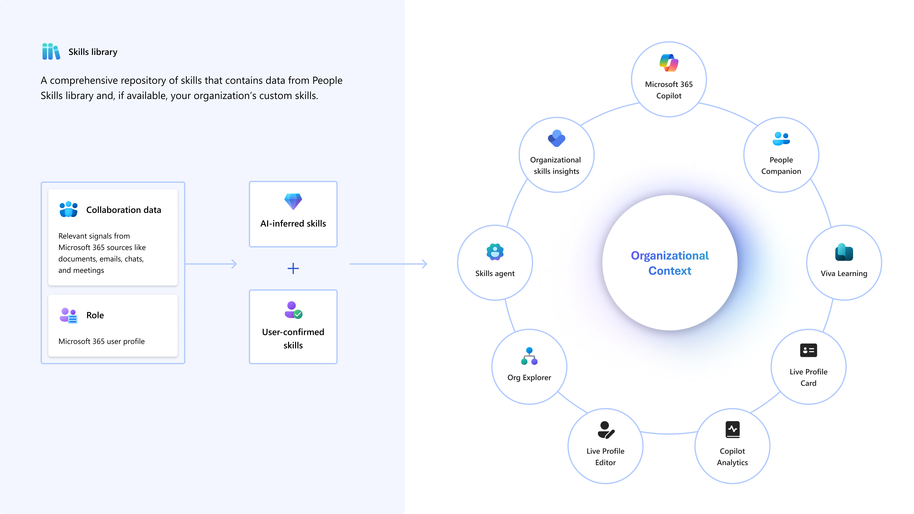

---
# Required metadata
# For more information, see https://learn.microsoft.com/en-us/help/platform/learn-editor-add-metadata
# For valid values of ms.service, ms.prod, and ms.topic, see https://learn.microsoft.com/en-us/help/platform/metadata-taxonomies

title:       People Skills AI Inference Engine
description: The People Skills inference engine uses Microsoft 365 profile and activity signals from the Microsoft Graph to create personalized skill profiles for users in your organization
author:      anibajaj 
ms.author:   anirudhbajaj
ms.service:  microsoft-365-copilot
ms.topic:    how-to
ms.date:     05/29/2025
---

# People Skills AI Inference Engine

The People Skills inference engine uses Microsoft 365 profile and activity signals from the Microsoft Graph to create personalized skill profiles for users in your organization. Profile and activity signals include documents, emails, chats, and meetings.

We use various data sources to infer skills accurately. The following are representative sources and may change as the model evolves:

-  __[Microsoft Graph](/graph/overview) and AI Graph__: Includes data from user profiles, job titles, collaboration signals, and documents; and key phrases from emails, meetings, and documents.

-  __[Microsoft Skills Graph](https://engineering.linkedin.com/blog/2022/building-linkedin-s-skills-graph-to-power-a-skills-first-world)__: Provides a base skills taxonomy and semantic descriptions for skills.

- __M365 User Profiles__: Offers information on job titles and top contacts.

The inference engine uses advanced OpenAI LLM models and a proprietary inferencing approach with relevant Microsoft Graph data. The skill inferencing engine associates users with a representative set of skill names based on the above-referenced sources available to People Skills to keep user skill profiles fresh and relevant. They aren't intended to be a comprehensive reflection of a person’s capabilities.

The skill inferencing engine operates under the following constraints:

- We currently only infer skills from Microsoft 365 sources. We don't currently use user activity in other line of business applications.

- People Skills uses large language models to assign skills that most closely match the taxonomy for the user profile and activity. For example, if a user creates a document on front-end development, we might tag the user with front-end development, web development, React, or Angular based on the closest content match.

- Inferences are impacted by the skill name and description uploaded by customer administrators.

- Read [AI transparency in People Skills](https://support.microsoft.com/office/ai-transparency-in-skills-c54f3ded-58bf-44dd-9fa1-6cbe49fba106) to learn how we use the inferencing data.

### When AI inferences are available and refreshed

People Skills inferencing follows a refresh cycle, typically every 30 days, to ensure that recent changes in a user’s Microsoft 365 work activity are reflected in their inferred skills. 

For the initial computation, we expect most users receive AI-generated skill inferences in 48 hours, although this may take up to a maximum of five days.

After this initial computation, the system will refresh the skills inferencing every 30 days to keep the skills data up-to-date.

###  AI restricted Skills

You can mark confidential, sensitive, or proprietary skills as AI-restricted. Use the Microsoft 365 admin center to mark specific skills as AI restricted. <u>Learn more about how to mark skills as AI restricted.</u>

Our inference engine ensures that any AI restricted skills identified by the admin will be updated and removed from user profiles within 24 hours after being marked as restricted.AI restricted skills aren’t added by AI to user profiles in your tenant. However, a user can manually add any skill from the taxonomy, including AI-restricted skills.

 

### Turning off skills AI inferencing

An organization can turn off People Skills AI inferencing for all or a group of users by using Feature Access Management. <u>Learn more about how to turn off skills AI inferencing</u>

Individual users can also opt out of using AI to generate skills within their Microsoft 365 profile editor settings.

### Improving AI inferencing performance

Customers can understand/improve the quality of their organization’s AI-generated skills by reviewing the below guide.

- __**Manage missing or incomplete** job titles:__ Job titles play a crucial role in skills inferencing because they provide context about an employee's role and responsibilities within an organization. This context helps the inferencing system accurately match and suggest relevant skills. 

If a user has empty primary and secondary job titles, the system uses advanced AI algorithms to infer the most appropriate job title based on the user’s collaboration signals, and documents job title at runtime. The system also has fallback mechanisms to handle cases where job titles are missing or of poor quality. This ensures that every user has a relevant job title that accurately reflects their role. However, the accuracy of skill inferences in this situation could be lower than when we have good quality job title information.

 If your organization has incomplete or missing job title data, you can use the organization upload tool to upload a secondary job title which our system will use instead of the Microsoft Entra job titles. To do this, use the Org. data upload tool and upload a .csv file with users matched to their secondary job title. [Learn more about uploading org data](/viva/import-orgdata) 

- **Review** **user** __Microsoft 365 activity:__ We rely on Microsoft 365 user activity to generate signals for AI inferencing. Performance may be limited for users who don't spend considerable time in the Microsoft 365 ecosystem (for example, frontline, field workers). Performance may also be limited for soft skills, whereby activity about a skill may not be a clear indication of skill application.

- __Review AI restricted skills:__ Microsoft restricts certain skills from being returned by AI to comply with responsible AI best practices. AI-generated skills may be limited for customers in industries which inherently deal with skills that could be sensitive when associated with users.   [Learn more about our commitment to Responsible AI.](https://support.microsoft.com/office/ai-transparency-in-skills-c54f3ded-58bf-44dd-9fa1-6cbe49fba106)

