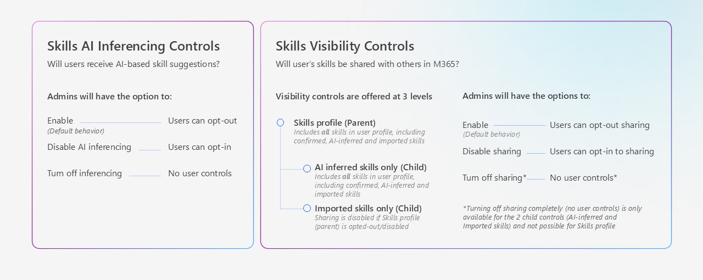

# Manage privacy and sharing controls in People Skills

As an admin, you can set privacy and skill sharing controls for users, groups, or the entire tenant. By using these controls, you can meet your organization's needs and comply with local or business requirements. These settings can also be used to selectively deploy People Skills to a small group of pilot users, while restricting functionality to the rest of your tenant. People Skills provides access controls using [Feature Access Management](/viva/feature-access-management).

To view your skills sharing and privacy settings, you can navigate to the People Skills setup page and select **Settings**. Access controls can be created before, during or after People Skills setup. 

> [!IMPORTANT]
> Privacy controls detailed here can be used to set up access policies to meet Works Council requirements and to pilot People Skills with small groups. Admins can configure inferencing and visibility controls (individually or in combination) to restrict skills inferencing or skills sharing for users outside the pilot or in restricted regions. For more details on piloting People Skills, review our [deployment guide](http://aka.ms/peopleskills-deployment-guide).
> 


## Skills AI inferencing control overview

Skills inferencing controls are enabled by default, but you can let users opt in or out or disable inferencing entirely either before or after setting up People Skills.

- Admins can turn skills inferencing auto-on. Individual users can opt out. 
- Admins can turn skills inferencing auto-off. Individual users can opt in.  
- Admins can disable skills inferencing for their tenant.

## Skills visibility controls overview 

Skills visibility controls whether users can see their colleagues’ skills on surfaces like the people card or in Copilot. All skills in a user's profile are shared and visible by default once you set up People Skills in your tenant. You can also change these visibility controls before or after setting up People Skills.

- Admins can turn skills visibility auto-on. Individual users can opt out.
- Admins can turn skills visibility auto-off. Individual users can opt in.
- Admins can disable skills visibility of some skills (AI-generated or imported skills) for their tenant.


We offer three levels of controls to control skill visibility. Each of these controls can be enabled or disabled using their own access policy.

- **(Parent control) Visibility of entire skills profile:** An individual's skills profile consists of AI-generated skills, user-confirmed skills, and imported skills (if applicable). If sharing is disabled, all user skills are private and not shared in any user, leader, or organizational analyst experiences.

- **(Child control) Visibility of AI-generated skills:** AI-generated skills are skills based on AI inferencing that are relevant to a user’s role. These skills can only be shown if the skills profile (parent) is also set to visible. Separate controls for both admins and for users to allow them to share skills, even if the user’s profile is set to visible.

- **(Child control) Visibility of imported skills:** User skills from third-party applications can be imported by your organization. Skills from these apps might need to be confirmed by users before they're shown in experiences as skills. A user might need to confirm these skills, similar to AI-generated skills. These skills can only be shown if the skills profile (parent) is also set to visible. Separate controls for both admins and for users to share skills, even if the user’s profile is set to visible.

> [!IMPORTANT]
> When multiple policies apply to the same user, the most specific policy takes precedence. User-specific policies override group policies, which override organization-wide policies.
> **Example:** If you create two policies - one that disables a feature for everyone in your organization, and another that enables the feature for people in a specific group - the feature will be enabled for group members because the group policy takes precedence over the organization-wide policy.

The following sections will walk you through on how to set up each of the controls in detail, and the expected functionality when they're enabled or disabled.

## Manage skills data sharing with Viva Insights

When checked, skills data is passed on to Viva Insights. Skills in Viva Insights allows organizations and leaders to discover skills within their workforce and assess skill distribution across groups. Learn more about [People Skills in Viva Insights](/viva/insights/advanced/analyst/templates/skills-landscape).

You can stop skills data from being shared with Viva Insights by unchecking this setting.

## Manage skills AI inferencing

Select **Skill inferencing by AI** under **Settings** to see details about the AI inferencing settings. People Skills provides access controls using [Feature Access Management](/viva/feature-access-management) to ensure you comply with user privacy and local regulations.

When inferencing is enabled, users receive AI-generated skills relevant to their role. When skills AI inferencing is turned off, no AI computation is processed for that user. The user can still create a skill profile by manually searching to add skills from your taxonomy. They can also confirm any imported skills that an admin in your organization adds for them.

Create an access control policy if you need to disable skill suggestions for specific users, groups, or your entire tenant. For more information on how to create and manage policies, see [control access to features](/viva/feature-access-management). 

> [!NOTE]
> Policies for People Skills can only be created in PowerShell at this time. You can’t create or manage policies through the interface in Admin center.

You have the following options for creating an access control policy in PowerShell to manage skills inferencing:  

- **Enable skills inferencing (Default):** When inferencing is enabled, users receive skill suggestions relevant to their role. Users have the option to turn it off for themselves in the Microsoft 365 profile editor, on the Data and privacy tab.

- **Keep skills inferencing enabled but default off:** Skills inferencing is available in your tenant, but users in this access policy will be "opted-out," and won't receive inferencing suggestions. Users have the option to turn it on for themselves in the Microsoft 365 profile editor, on the Data and privacy tab.

   To create this policy, run the following PowerShell cmdlet. 

   ```powershell
  Add-VivaModuleFeaturePolicy -ModuleId PeopleSkills -FeatureId SkillsInferencing -Name SoftDisable -IsFeatureEnabled $true -IsUserControlEnabled $true -IsUserOptedInByDefault $false 
   ```
   
       For this example, the **ModuleId** is *PeopleSkills*, and the **featureId** is *SkillsInferencing*.

- **Completely disable skills inferencing:** With this policy, skills inferencing is disabled for your tenant and users can't opt in to receiving skill inferencing suggestions.

   To create this policy, run the following PowerShell cmdlet:

     ```powershell
   Add-VivaModuleFeaturePolicy -ModuleId PeopleSkills -FeatureId SkillsInferencing -Name HardDisable -IsFeatureEnabled $false 
   ```
  
  For this example, the **ModuleId** is *PeopleSkills*, and the **featureId** is *SkillsInferencing*.

### Control visibility of entire user skills profile (Parent control)

This control can be used to control visibility of a user’s entire skills profile. An individual's skills profile consists of AI-generated skills, user-confirmed skills, and imported skills.

By default, a user’s skills profile is shown to others in their organizations and shared with other Microsoft 365 experience. If you need to disable sharing for specific users, groups, or your entire tenant, create an access control policy.

> [!NOTE]
> If sharing is disabled or "opted-out" by a user, all user skills will be private and won't be shown to other users or shared with any Microsoft 365 experiences.

You have the following options for creating an access control policy in PowerShell to manage visibility of entire user skills profile:  

- **Enable profile visibility (Default):** When visibility is enabled, users skills profile is shared across Microsoft 365. Users have the option to turn it off for themselves in their skill settings. 

- **Keep profile visibility default off:** Users in this access policy will be "opted-out,” and their skills won't be shared across Microsoft 365. Users have the option to turn it on for themselves in their skill settings.

   To create this policy, run the following PowerShell cmdlet:

   ```powershell
   Add-VivaModuleFeaturePolicy -ModuleId PeopleSkills -FeatureId SkillsProfileVisibility -Name SoftDisable -IsFeatureEnabled $true -IsUserControlEnabled $true -IsUserOptedInByDefault $false
   ```

   For this example, the **ModuleId** is *PeopleSkills*, and the **featureId** is *SkillsProfileVisibility*.

> [!NOTE]
> We don't offer the option to completely disable skills profile visibility. A user can always opt in to sharing their skills profile from their personal skills settings in Profile Editor. Admins can disable sharing of some skills such as AI-generated, or org. added skills 

### Control visibility of AI-generated skills

AI-generated skills are provided to users based on their role and Microsoft 365 activity.

By default, a user’s AI-generated skills are shown to others in their organizations and shared with other Microsoft 365 experiences. People Skills provides access controls using [Feature Access Management](/viva/feature-access-management) to ensure you comply with user privacy and local regulations.

> [!NOTE]
> These skills are only shared if Skills Profile visibility is also enabled or shared. If sharing is disabled, AI-generated skills won't be shown to other users or shared with any Microsoft 365 experiences. 

If you need to disable sharing for specific users, groups, or your entire tenant, create an access control policy.

You have the following options for creating an access control policy in PowerShell to manage the visibility of AI-generated skill:  

- **Enable sharing of AI-generated skills (Default):**: When visibility is enabled, AI-generated skills are shared across Microsoft 365. Users have the option to turn it off for themselves in their settings. Users can also manage how they can share AI-generated skills for themselves in the Microsoft 365 profile editor on the Data and privacy tab.

- **Keep the default sharing off for AI-generated skills**: Users in this access policy will be "opted-out," and their AI-generated skills won't be shared across Microsoft 365. Users have the option to turn it on for themselves in their skill settings.

   To create this policy, run the following PowerShell cmdlet:

   ```powershell
   Add-VivaModuleFeaturePolicy -ModuleId PeopleSkills -FeatureId ShowAISkills -Name SoftDisable -IsFeatureEnabled $true -IsUserControlEnabled $true -IsUserOptedInByDefault $false 
   ```

   For this example, the **ModuleId** is *PeopleSkills*, and the **featureId** is *ShowAISkills*.

- **Completely disable sharing of AI-generated skills**: With this policy, AI-generated skills aren't shared with anyone but themselves and users can't opt in to sharing their AI skill suggestions before confirming them those skills.  

   To create this policy, run the following PowerShell cmdlet:

   ```powershell
   Add-VivaModuleFeaturePolicy -ModuleId PeopleSkills -FeatureId ShowAISkills -Name  HardDisable -IsFeatureEnabled $false 
   ```

   For this example, the **ModuleId** is *PeopleSkills*, and the **featureId** is *ShowAISkills*.

### Control visibility of third-party imported skills

Imported skills added by an admin in your organization from external systems display in a user's skills profile alongside AI-generated skills. Like AI-generated skills, these skills are available for the user to confirm in the Microsoft 365 profile editor. By default, third-party skills are displayed to others in their organizations and shared with other Microsoft 365 experiences. If sharing is disabled, imported skills won't display to others in the organization.

> [!NOTE]
> These skills are only shared if Skills Profile visibility is also enabled or shared. If sharing is disabled, third-party skills won’t display to other users or get shared with any Microsoft 365 experiences. 

If you need to disable sharing for specific users, groups, or your entire tenant, create an access control policy. For more information, see [Feature Access Management](/viva/feature-access-management).

You have the following options for creating an access control policy in PowerShell to manage third-party skills visibility imported by your organization:  

- **Enable third-party skills visibility (Default):** When visibility is enabled, third-party skills are shared across Microsoft 365. Users have the option to turn it off for themselves in their settings. 

- **Keep imported skill sharing default off:** Users in this access policy will be "opted-out,” and their third-party skills won't be shared across Microsoft 365. Users have the option to turn it on for themselves in their skill settings.

   To create this policy, run the following PowerShell cmdlet:

   ```powershell
   Add-VivaModuleFeaturePolicy -ModuleId PeopleSkills -FeatureId ShowOrgAddedSkills -Name SoftDisable -IsFeatureEnabled $true -IsUserControlEnabled $true -IsUserOptedInByDefault $false 
   ```

   For this example, the **ModuleId** is *PeopleSkills*, and the **featureId** is *ShowOrgAddedSkills*.

- **Completely disable imported skill sharing:** With this policy, third-party skills aren't shared with Microsoft 365 experience in your tenant and users can't opt in to sharing their third-party skills. 

   To create this policy, run the following PowerShell cmdlet:
  
     ```powershell
   Add-VivaModuleFeaturePolicy -ModuleId PeopleSkills -FeatureId ShowOrgAddedSkills -Name HardDisable -IsFeatureEnabled $false 
   ```
  
     For this example, the **ModuleId** is *PeopleSkills*, and the **featureId** is *ShowOrgAddedSkills*.

For more information on how to create and manage policies, see [control access to features](/viva/feature-access-management).  
