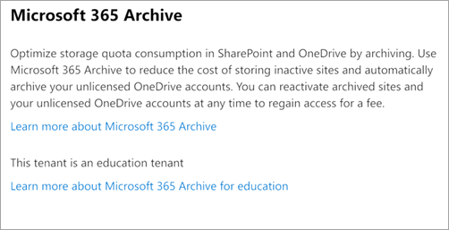

# Education offering for Microsoft 365 Archive

This article provides an overview of Microsoft 365 Archive for Education, including tenant eligibility, pricing model, and billing scenarios.

## Pooled storage eligibility

Education customers that are subject to the pooled storage limit are eligible for the Microsoft 365 Archive for Education offering. If your tenant has more than 50% Education (EDU) licenses assigned, or has purchased more EDU licenses than non-EDU licenses, it's considered an EDU tenant and will use Education Pooled Storage. For more information, see [Education Pooled Storage limits](/office365/servicedescriptions/office-365-platform-service-description/office-365-education#education-pooled-storage-limits).

> [!NOTE]
> Any changes to the license assignment or purchases that change the pooled storage eligibility can take 24-48 hours to reflect.

## Pooled storage status

When you [turn on Microsoft 365 Archive](archive-setup.md#set-up-microsoft-365-archive-1) for your tenant, and if your tenant meets the pooled storage eligibility, on the **Microsoft 365 Archive** panel, under the **Learn more about Microsoft 365 Archive** link, you'll see a status message saying **This tenant is an education tenant**.

:::image type="content" source="../media/m365-archive/m365-archive-1.png" alt-text="Screenshot of the Microsoft 365 Archive panel showing this tenant is an education tenant." :::

If at any time your tenant status changes (that is, moves to less than 50% education licenses) and is no longer subject to pooled storage, the status message will no longer appear. It's important to note that you're eligible for education pricing for Microsoft 365 Archive only when you meet the eligibility for education tenant status.

For customers that are subject to the pooled storage policy, they'll have access to the storage report in the Microsoft 365 admin center under **Reports** > **[Storage](https://admin.microsoft.com/Adminportal/Home#/storagemanagement)**. The user must be logged in as a Global Admin or SharePoint Admin to access the storage report.

If the storage report isn't available, then it’s possible that your tenant isn't subject to the pooled storage policy. To check if your tenant is subject to the pooled storage policy, see whether more than 50% of assigned licenses are EDU, or if more EDU licenses have been purchased than non-EDU licenses.

:::image type="content" source="../media/m365-archive/storage.png" alt-text="Screenshot of an example view of a storage report." lightbox="../media/archive/storage.png":::

> [!NOTE]
> If your tenant is no longer eligible for the Microsoft 365 Archive for Education offering, your tenant's archive content is charged according to the Microsoft 365 Archive standard rate.

## Pricing model

Microsoft 365 Archive charges you for storage.

- **Storage consumption** is charged at a per-GB monthly rate. For SharePoint sites, this charge applies only when the combined size of archived and active pooled storage exceeds your tenant’s included or licensed storage limit. In other words, there's no additional storage cost for archived sites if the tenant hasn't consumed its already licensed storage quota.

- **Site reactivation** is available at no cost as of April 2025. Reactivations will still take up to 24 hours to complete but have no fee.

Monthly archive usage is calculated as the sum of the usage of all currently archived sites. Each site’s usage can be seen on the site itself or from the Active sites page in the SharePoint admin center. The size of an archived site, and therefore the storage for which it’s billed, changes only if the content in the site changes. For example, content naturally expiring in the recycle bin or a retention policy deleting content within the site directly from archive to the recycle bin.

For more information on the pricing for Microsoft 365 Archive, see [Pay-as-you-go services and pricing for Microsoft Syntex.](../syntex/syntex-pay-as-you-go-services.md).

> [!NOTE]
> SharePoint storage is calculated in binary Gigabytes (GB), where 1 GB = 230 bytes.

## Billing scenarios

Your charges for Microsoft 365 Archive depend on your tenant’s pooled storage quota. The following scenarios can help you compare charges based on excess storage:

|Scenario  |Description  |Additional costs  |
|---------|---------|---------|
|**A**   | Tenant hasn't archived any data and exceeds the standard storage quota by 20 TB.        | Purchase standard storage packs at $300/10TB/month.         |
|B    |  Tenant has archived 20 TB of data that exceeds their standard storage quota.       | Pay at $0.02/GB/month for 20 TB of archive storage.        |
|C     |Tenant has archived more storage that exceeds their standard storage quota.         |Pay only for the 20 TB of archived data that exceeds the standard storage quota.         |
|D     | Tenant has archived some, but not all, of the data that exceeds their standard storage quota.        | Purchase one additional standard storage pack for 10 TB and pay $0.02/GB/month for 10 TB of archived data.        |
|E     |Tenant’s total data (standard + archive) is less than their standard storage quota.         |  No additional cost.       |

:::image type="content" source="../media/m365-archive/billing-scenarios.png" alt-text="Screenshot of billing scenarios comparing charges for storage.":::

:::image type="content" source="../media/m365-archive/billing-scenarios-table.png" alt-text="Screenshot of billing scenarios table showing more detail.":::