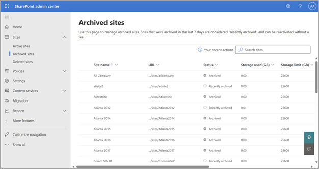

# Manage Microsoft 365 Archive

## Archive a site

[SharePoint Administrators](/entra/identity/role-based-access-control/permissions-reference#sharepoint-administrator) or [Global Administrators](/entra/identity/role-based-access-control/permissions-reference#global-administrator) can archive both nongroup connected sites and group-connected sites from the SharePoint admin center. Archiving group-connected sites archive only the site, and the rest of the group continues being active. As soon as a site is archived, it stops consuming storage from active storage quota, and the storage starts being counted towards Microsoft 365 Archive storage. (There might be a delay in the change in storage being reflected in the admin center.)

[!INCLUDE [global-administrator-note](../includes/global-administrator-note.md)]

To learn more about different archive states, see [Archive states in Microsoft 365 Archive](archive-states.md).

When a site is archived, compliance features such as eDiscovery and retention labels continue to be applied to the site.

1. In the SharePoint admin center, go to [**Active sites**](https://go.microsoft.com/fwlink/?linkid=2185220), and sign in with an account that has [admin permissions](/sharepoint/sharepoint-admin-role) for your organization.

   > [!NOTE]
   > If you have Office 365 operated by 21Vianet (China), sign in to the [Microsoft 365 admin center](https://go.microsoft.com/fwlink/p/?linkid=850627), then browse to the SharePoint admin center and open the **Active sites** page.

2. In the left column, select one or more sites.

3. Select **Archive**, and to confirm, select **Archive**.

4. Archived sites can be seen on the **Archived sites** page in the SharePoint admin center.

    

    > [!NOTE]
    > To archive a hub site, you first need to unregister it as a hub site. Archiving Microsoft Teams-connected sites is only partially supported. For more information, see [Archive a site connected to Teams](/archive-manage.md#archive-a-site-connected-to-Teams).

### Archive a site connected to Teams

Sites associated with Teams with exclusively standard channels are supported for archiving.

Sites associated with Teams that include private or shared channels are only partially supported:

- SharePoint admin center: Archiving a site with channel sites is not possible. (Message: "The group connected site with channel sites associated can't be archived.")

- PowerShell and Graph API: Archiving a site with channel sites is not blocked. Only the main site associated to the Team (and its standard channels) is archived. The private and shared channel sites remain active. Archiving the channel sites directly is not possible, as these sites use unsupported site templates.

## Manage archived sites

Archived sites can be reactivated or deleted. Deletion of archived sites follows the same behavior as that of active sites; that is, a site doesn't need to be reactivated before being deleted. However, sites in the "Reactivating" state can't be deleted until reactivation completes.

Admins can view details of the site, such as the URL, Archive Status, or Storage, from the **Archived sites** page.

## Reactivate a site

If there's a need to access the site content again, the sites need to be reactivated. The activation time depends on the archive state of the site ("recently archived" or "archived"). For more information, see the [Archive states in Microsoft 365 Archive](archive-states.md).

After reactivation, the site moves back to the **Active sites** page. The site resumes its normal function, and the users have the same access rights to the site and its content as they did before the site was archived. After reactivation is complete, the storage consumed by the site will accrue to your storage quota consumption.

1. In the SharePoint admin center, go to [**Active sites**](https://go.microsoft.com/fwlink/?linkid=2185220), and sign in with an account that has [admin permissions](/sharepoint/sharepoint-admin-role) for your organization.

   > [!NOTE]
   > If you have Office 365 operated by 21Vianet (China), sign in to the [Microsoft 365 admin center](https://go.microsoft.com/fwlink/p/?linkid=850627), then browse to the SharePoint admin center and open the **Active sites** page.

2. In the left column, select a site that needs to be reactivated.

3. On the command bar, select **Archive**.

4. On the **Archive** pane, select **Reactivate**.

5. If you're trying to reactivate a site from "Archived" state, you see a confirmation pop-up that shows an estimated price for reactivation. Select **Confirm** to reactivate. The site enters the "Reactivating" state. It moves to active sites once reactivation is complete.

<!---
    Update needed: Screenshot still mentions reactivation cost and does not match current message in SPO Admin Center 
--->

When you reactivate a site, its permissions, lists, pages, files, folder-structure, site-level policies, and other metadata will revert to the prearchival state, except if files are deleted from archived sites. The only two exceptions are when files are deleted while the site is archived:

- Content in the recycle bin expires naturally, and that expiration continues while archived.
- Content marked to be deleted by retention policies will still be deleted as normal.

Other than these two exceptions, you can expect the site to be unchanged.  

## Change the archive status of a site via PowerShell

You can archive and reactivate sites by using the PowerShell cmdlet [**Set-SPOSiteArchiveState**](/powershell/module/sharepoint-online/set-spositearchivestate?view=sharepoint-ps&preserve-view=true).

## Change the archive status of a site via Graph API

You can archive a site by using the Graph API **beta** endpoint [**site: archive**](https://learn.microsoft.com/graph/api/site-archive) or reactivate it by using the Graph API **beta** endpoint [**site: unarchive**](https://learn.microsoft.com/graph/api/site-unarchive).

## Site templates supported

|Template ID  |Template  |Template name|
|---------|---------|---------|
|1|Team site (classic experience)|STS#0|
|1|Blank Site|STS#1|
|1|Document Workspace|STS#2|
|1|Team site|STS#3|
|68|Communication site|SITEPAGEPUBLISHING#0|
|64|Teams site|GROUP#0|
|32|News site|SPSNEWS#0|
|33|News site|SPSNHOME#0|
|4|Wiki site|WIKI#0|
|56|Enterprise Wiki|ENTERWIKI#0|
|7|Document center|BDR#0|
|14483|Records Center|OFFILE#0|
|14483|Records Center|OFFILE#1|

> [!NOTE]
> OneDrive accounts (site template 21) cannot be archived by admins.  Some accounts will be put into archive by the OneDrive service when they are unlicensed for 93 days or more.  When the service archives these accounts, admins can reactivate the accounts via PowerShell. [Learn more about unlicensed OneDrive accounts](/SharePoint/unlicensed-onedrive-accounts).
