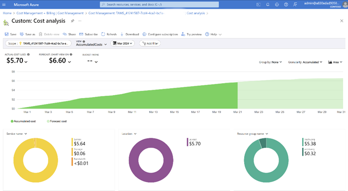

# Manage consumption and invoices for Microsoft 365 Backup

You can view actual and accumulated cost breakdown by tenants and service type for OneDrive, SharePoint, and Exchange in Microsoft Cost Management in the Azure portal or access the information by using the [Cost Management public APIs](/rest/api/cost-management/operation-groups). Cost breakdown by application ID is coming soon.

1. Sign in to the [Azure portal](https://portal.azure.com/).

2. Search for *Cost Management + Billing*.

3. Select **Cost analysis** to see:

    - Accumulated cost and forecast cost.

    - Select **+Add Filter** to see breakdown of cost by meters and tags.

       

You can also export daily cost information using billing export feature in Azure portal. For more information, see [Tutorial: Create and manage exported data](/azure/cost-management-billing/costs/tutorial-export-acm-data?tabs=azure-portal).

### Billing attribution by tenants, service type, and applications

You can see actual cost breakdown by tags in Azure portal. There are currently two tags available for Microsoft 365 Backup: **tenants** and **servicetype**.

To view tags:

1. Select **+Add Filter** to see breakdown of cost by meters and tags.

2. Select the tag:

    - In the key-value pair, select **tenants** or **servicetype**, and then select the respective tenant ID or service type.

        - **tenants** shows a list of tenant IDs.

        - **servicetype** is OneDrive, SharePoint, or Exchange.

        - **applications** shows a list of app IDs.

        - Exchange mailbox - Not available.

        - OneDrive account - SiteId of the corresponding OneDrive site.

        - SharePoint site - SiteId of the corresponding SharePoint site.

    - Azure cost analysis - filter by tag.
    
    - The tag for OneDrive is its siteID. To convert this back to a userID, you can use the following API: `https://graph.microsoft.com/v1.0/sites/<siteid>/drive?select=owner`

4. In the left navigation, select **Billing** to see monthly invoices.

    We recommend using this view to see the costs by resources for Microsoft 365 Backup.

    

5. Set up budget alerts on cost by following the steps in the [Cost Management public APIs](/rest/api/cost-management/operation-groups).

> [!WARNING]  
>The **MailboxDbGuid** tag in the Azure consumption report is intended for Microsoft internal use only. We recommend that you do not rely on it because its value might change. Note that this is different from the MailboxId.
