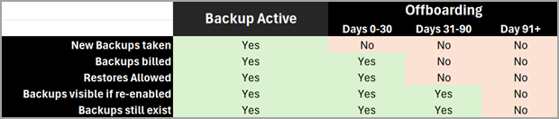

# Offboarding in Microsoft 365 Backup

To no longer use the Microsoft 365 Backup tool, you must offboard usage. This action includes pausing and deleting all active policies and deleting all of the backed-up data. There are two ways that offboarding is initiated:

- Disable the tool in the pay-as-you-go billing setup panel where you first enabled the tool.

- If your billing account goes into an unhealthy state.

# Offboarding specific sites/mailboxes/onedrives

If you wish to delete backups of specific users, sites, or mailboxes to comply with GDPR regulations, you can do so using Admin PowerShell cmdlets.

> Note
> For you to be able to offboard a protection unit, it should be removed from policy first aka it's policy-id should be empty and state as "unprotected". 

Here's the steps you can follow:

1. Get the protection unit-id for the site/user/mailbox, you would like to offboard using the 
2. Use the  to initiate the offboarding progress.
3. If you wish to cancel the offboarding within the 90 days grace-period. Use the 

## Offboarding recovery undo period

If offboarding from Microsoft 365 Backup is begun due to either an explicit request from you or due to an unhealthy billing state, the grace periods shown in the following table initiate.

By bringing your billing back to a healthy state or by asking support to reverse the offboarding, the tool becomes usable again and no backups are lost.

<!---
## GDPR special handling, compliance, and backup data deletion

> [!IMPORTANT]
> Given that compliance tooling actions might destroy primary data, we administratively isolate those destructive actions from flowing through to backed up data automatically. In other words, **compliance actions that automatically delete your primary data will not automatically delete data from your backups**.

The core purpose of the backup and restore service is to provide you with a way to recover from common data deletion, overwrite, or encryption events.

### eDiscovery

Data in the Exchange Online backups is not eDiscoverable via existing eDiscovery tooling.

Data in the OneDrive account and SharePoint site backups that aren't currently part of your live latest version data in your tenant aren't eDiscoverable. An eDiscovery search won't discover data that exists solely in the OneDrive or SharePoint backups.

### General Data Protection Regulations (GDPR) workflow instructions

GDPR workflows aren't directly executable on all data in Microsoft 365 Backup.

GDPR data service request (DSR) data deletion actions operated on the tenant won't delete data in the backups. Those actions must be executed again after a Backup restoration to ensure the original DSR is honored.

DSRs related to the discovery of data using eDiscovery is possible for Exchange Online backups, but the same isn't possible for OneDrive or SharePoint backups.

### Retention policies

Retention and deletion policies don't “flow through” to the backups. This means that backup retention is governed solely by the backup policy. That policy currently has a nonvariable one year retention period. Once data is restored from the backups, that now-live data will be governed by applicable retention or deletion policies.

### Sensitivity labels

Restoration of any data (such as sites or mailbox items) reverts the data's sensitivity labels to the state of that protected item at the prior point from which it's being restored. That is, the state of labeling at the point in time from which the content is being restored; in other words, the state reverts to the prior point in time.
--->
