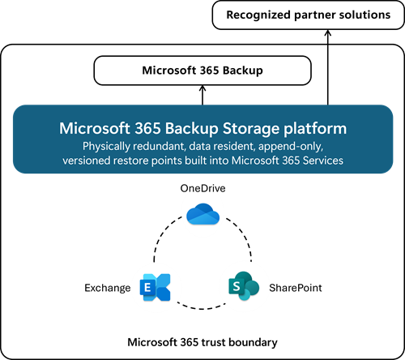

# Overview of Microsoft 365 Backup

Microsoft 365 Backup is designed to ensure your organization’s data is always protected and easily recoverable. With the ability to back up all or select SharePoint sites, OneDrive accounts, and Exchange mailboxes, Microsoft 365 Backup provides comprehensive coverage for your critical data.
<!---
Key features include:

- **Granular and massive scale restorations**: Restore files, sites, and mailbox items to a prior point in time, whether you need to recover a single document or an entire site.

- **Seamless integration**: Managed directly from the Microsoft 365 admin center, making it easy to set up and manage your backup policies.

- **Business continuity**: Ensures quick recovery from ransomware attacks, accidental deletions, or other data loss events, minimizing downtime and maintaining business operations.

- **Partner ecosystem**: Leverage additional features and workflows through integrated partner applications to manage all your backups in one place.
--->
> [!Note]
> Microsoft 365 Backup is currently not available for Government Community Cloud (GCC) organizations. Microsoft 365 Backup also supports PowerShell cmdlets. You can find the associated PowerShell cmdlets in the [Microsoft 365 Backup Storage Graph APIs](/graph/api/resources/backuprestoreroot) reference guide.

## Scenarios and value proposition

Business continuity assurance is a top-of-mind concern for many companies. Microsoft 365 Backup delivers business continuity peace of mind by providing performance and reliable restore confidence. When evaluating a backup and restore offering, what really matters isn't solely the backup, but the ability to restore your data to a healthy state quickly when you need to do so. Recovering large volumes of content is difficult when copying data at a scale from a remote, air-gapped location requiring weeks or even months to get your business back up and running.

In cases of a ransomware attack that encrypts large swaths of your data, or instances of an internal accidental or malicious data deletion or overwrite event, you need to be able to get your business back to a healthy state as soon as possible. This is what the Microsoft 365 Backup product offers, both through the Microsoft 365 admin center, and via partner applications built on the Microsoft 365 Backup Storage platform.

To summarize, applications built on top of the Microsoft 365 Backup Storage platform deliver the following benefits regardless of the size or scale of the protected tenant:

- Fast backup within hours.

- Fast restore (see [performance expectations](#performance-expectations) later in this article).

- Full SharePoint site and OneDrive account restore fidelity, meaning the site and OneDrive are restored to their exact state (excluding, for example, taxonomy mastered outside the site scope) at specific prior points in time via a rollback operation.

- Full Exchange mailbox item restores or granular item restores using search, for modified or fully deleted items.

- Consolidated security and compliance domain management.

## Feature summary

|Feature  |OneDrive  |SharePoint  |Exchange Online |
|---------|---------|---------|---------|
|**Retention period**     | 1 year        | 1 year        | 1 year        |
|**Recovery points**     |10 minutes for two weeks prior  Weekly snapshots 2-52 weeks prior |10 minutes for two weeks prior  Weekly snapshots 2-52 weeks prior | 10 minutes for prior 52 weeks   |
|**Backup granularity**     | OneDrive account |SharePoint site  |Exchange user account  |
|**Restore granularity**     |OneDrive accounts  Files restorable via versions (coming soon)  |SharePoint sites  Files restorable via versions (coming soon)    |Mail/Contacts/Calendar/Task items  |
|**Restore options**     |**Location**: Same or new URL  **OneDrive** restore rolls back to the state of the site at the prior point in time, overwriting all content and metadata since that prior point in time  **File version** restore rolls forward the file to the state at the prior point in time, but retains prior versions    |**Location**: Same or new URL  **Full site** restore rolls back to the state of the site at the prior point in time, overwriting all content and metadata since that prior point in time  **File version** restore rolls forward the file to the state at the prior point in time, but retains prior versions  |**Location**: Same or new folder within user’s mailbox  **Full and item level mailbox** restores only modified/deleted items from prior point in time  |
|**Restore speeds (RTO)**     |Up to 1,000 average-sized OneDrive accounts at a rate of up to 1-3 TB per hour    |Up to 1,000 average-sized sites, at a rate of up to 1-3 TB per hour    |Up to 1,000 average-sized mailboxes at a rate of up to 1-3 TB per hour    |
|**Auditability** |Actions fully auditable |Actions fully auditable |Actions fully auditable |
|**Geographic residency**    |Physically redundant & geographically replicated  Honors tenant’s geographic residency requirements    |Physically redundant & geographically replicated  Honors tenant’s geographic residency requirements    |Physically redundant & geographically replicated  Honors tenant’s geographic residency requirements    |
|**Billing model**    |$0.15 per GB per month for all data protected by Backup  Restores are free  |$0.15 per GB per month for all data protected by Backup  Restores are free   |$0.15 per GB per month for all data protected by Backup  Restores are free  |

## Architectural overview and performance expectations

### Architecture

Microsoft 365 Backup provides ultra-fast backup and restore capabilities by creating backups within the protected services’ data boundaries.

Microsoft 365 Backup not only provides uniquely fast recovery from common business continuity and disaster recovery (BCDR) scenarios like ransomware or accidental or malicious employee content overwrite or deletion. More BCDR scenario protections are also built directly into the service. For example, OneDrive, SharePoint, and Exchange Online have a proprietary architecture design for resiliency with replicated copies of customer data to failover to live active copies seamlessly without the need for end customer intervention.

Our backups are protected from malicious overwrites because OneDrive, SharePoint, and Exchange use Append-Only backup storage. This means that SharePoint can only add new content blobs and can never change old ones until they're permanently deleted. The Exchange items are backed up in a similar append-only manner and can't be accessed by a client process (such as Outlook, OWA, or MFCMAPI). This process ensures that items can't be changed after an initial save, protecting against attackers that try to corrupt old versions. For more information about the built-in service and data resiliency, see [SharePoint and OneDrive data resiliency in Microsoft 365](/compliance/assurance/assurance-sharepoint-onedrive-data-resiliency) and [Exchange Online data resiliency in Microsoft 365](/compliance/assurance/assurance-exchange-data-resiliency).

Key architectural takeaways:

- Data never leaves the Microsoft 365 data trust boundary and honors the geographic locations of your current data residency. Limited metadata (for example, tenantID and siteIDs) sent to Azure for billing purposes only.

- The backups are immutable unless expressly deleted by the Backup tool admin via product offboarding.

- OneDrive, SharePoint, and Exchange have multiple physically redundant copies of your data to mitigate the impact of physical disasters.

    

### Performance expectations

#### Backup policy performance

Creating a new protection policy initiates the process of backing up selected OneDrive accounts, SharePoint sites, and Exchange mailboxes. Once you submit a request to activate a valid protection policy, it takes on average up to 60 minutes to process and another 60 minutes to create restore points. Initial backups take approximately 15 minutes per 1,000 protection units initially or incrementally added to a policy.

Restore points are physically created in the service as soon as the policy is confirmed to be activated in the tool, even if those restore points take some more time to become visible in the restore tool.

#### Restoration performance

Restoration performance correlates with your recovery time objective, or the time it takes for you to restore a healthy state of your data and recover from a data destruction event.

For full OneDrive account and SharePoint site restores, the fastest recovery happens when choosing in-place restore rather a new URL restore. Additionally, choosing one of the recommended express restore points presented in the restore workflow user interface yields the quickest recovery results.

All restore points and restores to new URLs are relatively fast, but same URL restores using a recommended express restore point will typically yield better results. The Exchange Online restore workflow doesn't have or require the "faster" restore points.

The following table summarizes expected performance for a normally distributed tenant, including tenants of large size and scale.

|Protection units  |OneDrive and SharePoint  |Exchange Online  |
|---------|---------|---------|
|1     |30 minutes         |2 hours         |
|50     |3 hours         |2.5 hours         |
|250     |4 hours         | 3 hours        |
|1,000+     |Up to 250 protection units per hour       |4 hours         |
|1,000+|Up to 250 protection units/hour Up to 2 TB/hour*         |250+ protection units/hour Up to 2 TB/hour*         |

**Important Restore performance notes:**

*Single protection unit OneDrive and SharePoint restores using express restore points can take on average between 10 minutes and 120 minutes, depending on site size. For mailboxes, restore times typically fall in the 200 - 300 item/minute range.

*1,000+ protection unit restore speeds published here are based on internal benchmarking where SharePoint sites have an average of 12GB of stored content per site, Exchange Online mailboxes have an average of 26K items and an aggregate size of 10 GB.  Those bulk recoveries use the in-place restore option, which is typical for large scale attack recovery scenarios. Actual times will depend on the number and size of the items in each site/mailbox.

## Pay-as-you-go billing

Microsoft 365 Backup is a pay-as-you-go offering that charges based on consumption, unlike traditional user-based licenses.

## Integrated partner solutions

We partner with many independent software publishers to provide differentiated versions of their applications integrated with the Microsoft 365 Backup Storage platform—all providing the same underlying performance value proposition for your Microsoft 365 data.

For a partner application, operation of the Microsoft 365 Backup tool will be managed and paid for entirely through the partner's application. Those applications have the ability to provide a single pane of glass for all of your data estates that require backups, and they might provide more enhanced experiences or workflows.

## Multi-geo environments

Microsoft 365 Backup supports the backup of sites and user accounts from both the central and satellite locations.

## Append-only vs. immutable storage overview

### Key points

1. Immutability is formally defined as storage that can't be altered, deleted, or overwritten for a specified period of time.

2. Microsoft 365 Backup follows that definition except for disallowing deletion. Backup uses append-only storage to prevent nondeletion modifications or alterations of existing restore point data. This protects against service or malware overwrites of the backup data.

3. Deletion of the backups isn't blocked, giving customers the option to offboard if needed or desired. There are a couple of defenses against undesired deletions built into the tool to approximate full immutability without some of the related drawbacks (for example, lack of GDPR control). These additional features include:

    a. A fixed 90-day existing backup recovery [grace period](/microsoft-365/backup/backup-offboarding), similar to a soft-delete recycle bin within the Backup tool, that allows the customer to recover their backups up to 90 days after offboarding.

    b. Retention and deletion policies (for example, from Purview) don't affect the backup retention period, which remains fully isolated from those policies.

    c. A multi-admin email notification feature (coming later this year) that will automatically notify a preset group of admins if a potentially harmful action is taken on the Backup tool.

### Deeper storage architectural Look

Microsoft 365 Backup Storage is built on top of standard OneDrive and SharePoint infrastructure; and on top of standard Exchange Online infrastructure. Given that, Microsoft 365 Backup Storage inherits some useful implementation benefits.

One of those benefits is built in append-only storage of the backups.

#### OneDrive SharePoint content modification protection

The service isn't capable of modifying existing copies of the backups because content backups are stored on append-only Azure blobs. Read more about [append-only resiliency](/compliance/assurance/assurance-sharepoint-onedrive-data-resiliency). As a result, our service can only create new copies of the primary data in the backups, aligning to a new restore point corresponding to a new point in time. This is at the core of our append-only functionality.

#### OneDrive SharePoint metadata modification protection

Metadata for OneDrive and SharePoint is stored in Azure SQL databases. The Microsoft 365 Backup tool uses a combination of the built-in Azure SQL point-in-time restore functionality and Azure Blob, to which serialized copies of the SQL DBs are periodically snapshotted.

In both cases, modifications to the database result in new and nonmodifiable point in time copies of the data. Once copied to blob, the immutability explanation from the prior section applies to those Blob-stored DB copies as well. Read more about [OneDrive and SharePoint metadata resiliency](/compliance/assurance/assurance-sharepoint-onedrive-data-resiliency).

#### Exchange Online item modification protection

Exchange Online Backup technology creates point-in-time copies of modified and deleted mailbox items. These backup copies, once created, aren't modifiable by the service. A new copy is taken based on changes to the primary data at scheduled restore point frequency targets.

Review the [Microsoft 365 service terms](https://www.microsoft.com/licensing/terms/product/ForOnlineServices/all).

