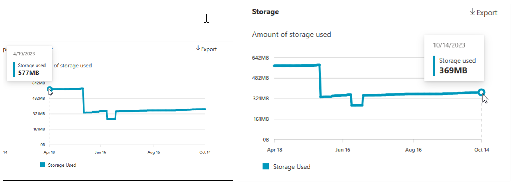

# Pricing model for Microsoft 365 Backup

## Microsoft 365 Backup charge model

The Microsoft 365 Backup service, offered through the Microsoft 365 admin center, is a [pay-as-you-go consumption-based service](/microsoft-365/syntex/syntex-pay-as-you-go-services). The list price is $0.15/GB/month of protected content.

### What’s counted towards protected backup storage?

Microsoft 365 Backup charges you based on the size of the following content once it's added to backup protection. That size is the result of the summation of the following two categories:

- Summation of the user-facing size of the protected content:

    - Size of OneDrive accounts and SharePoint sites as displayed in the live sites’ usage reports, which includes the first-stage recycle bin. If a site or OneDrive account is removed from the protection policy, the size of the site at the time it's removed from the policy will be used as the proxy for the site’s "live" size. In other words, your backup costs will never increase once the OneDrive account or site has been removed from the protection policy.

    - Size of the live user or shared mailbox plus their associated online archives if those are being used. If the mailbox is removed from the protection policy, the size of the mailbox at the time it’s removed will be used as the ongoing proxy for its "live" size until all restore points expire from the backup. In other words, your backup costs will never increase once the mailbox has been removed from the protection policy.

- Deleted and versioned data held for recovery in the backups, which is the summation of:

    - Deleted content in SharePoint sites’ and OneDrive accounts’ second-stage recycle bin (also known as site collection recycle bin).

    - Deleted and versioned items in the protected mailboxes.

    For example, if you protect a 1-GB site that has 0.5 GB of data in its second-stage recycle Bin, and a 1-GB mailbox that has a 1-GB online archive, then you'll be charged for 3.5 GB of Microsoft 365 Backup usage.

#### Important considerations

- The restore point frequency doesn't materially impact the cost of the backup storage, so reducing that frequency wouldn't change your costs.

- Although Azure is being used as a payment processor, there are no additional Azure API or storage costs beyond the Microsoft 365 Backup usage charges previously mentioned.

- Deleted or versioned content held in the recycle bin or in the mailboxes will expire from the backups once the backup retention period lapses (for example, 365 days after the backup is taken). Once deleted or versioned content expires from the backups, they're no longer counted in the backup consumption equation and therefore no longer contribute to the cost. For example, if you have a site under protection that is currently 1 GB for the first month, you're charged for 1 GB of Microsoft 365 Backup usage. If you delete content in that site such that it's now only 0.5 GB, your next monthly bill will still be for 1 GB since the backup tool is retaining that deleted content for a year. After a year when the backup of that deleted content expires, the 0.5 GB being retained for backup purposes will no longer be charged for backup.

- If you're using a partner (ISV) solution built on the Microsoft 365 Backup Storage platform, you'll be charged solely by them for their application. You won't receive a separate bill or charge directly from Microsoft for the Backup Storage consumption.

## Pricing calculator

The Microsoft 365 Backup pricing calculator is a tool that helps you estimate the amount of backup storage and the costs that you incur to protect and back up your Microsoft 365 data.

> [!NOTE]
> The tool isn't intended to provide an exact prediction of your backup consumption, but rather to give you an estimate.

<!---
### Pricing calculator overview

The Microsoft 365 Backup pricing calculator, when calculating the storage required for each month, takes into consideration the following heuristics:

- How much storage is typically added (or removed) from a protection unit during the month. For example, if the protection unit was a SharePoint site, how much storage on average is added (or removed) from a SharePoint site during the month due to documents being added (or deleted).

- How many new protection units for a service type are typically added (or removed) every month. For example, if the service type is Exchange mailboxes, how many new mailboxes are added (or deleted) on average each month.

- The largest amount of storage required for the previous 12 months.
--->

### Using the pricing calculator

To use the Microsoft 365 Backup pricing calculator, you need to perform the following steps. Information about how to collect data from each of these steps is [detailed later in this article](#finding-the-sizes-of-stored-data).

1. Download the latest version of the [Microsoft 365 Backup pricing calculator tool](https://aka.ms/M365BackupCalculator) (an Excel spreadsheet).

2. Open the Excel spreadsheet. This sheet produces a simple model for cost calculations.

3. Gather the information needed in the orange cells on the **High-Level Estimates** worksheet.

    - The **Total Storage (GB)** input field should include the sum of sizes of live data and sizes of recycle bins and mailbox online archives in your tenant. You can get the live data plus the archives and recycle bin deleted content sizes using either PowerShell commands or the Microsoft 365 usage reports. For more information about how to get this data, see [Finding the sizes of stored data](#finding-the-sizes-of-stored-data) later in this article.

    - The **Percentage Storage to protect** input field should represent the percentage of your content you plan to protect in the Backup tool. You're only charged for what you protect in the tool.

4. Once you have this information, enter it into the **High-Level Estimates** worksheet as shown in the following example.

    

5. An estimate of the Microsoft 365 Backup costs for 1 month and 12 months will then be generated.

> [!NOTE]
> The 12-month cumulative cost assumes no data growth or churn. Understanding your data's growth and churn is a more complex exercise, but can be estimated by looking at your primary storage growth trends in the Microsoft 365 admin center reports and the size of your second-stage recycle bin (which is a general heuristic for the amount of data your tenant churns over a three-month period of time).

### Finding the sizes of stored data

Sizes of live data, and deleted data for your SharePoint sites, OneDrive accounts, and Exchange mailboxes can be calculated using two different methods:

- [PowerShell commands or scripts](#powershell-commands-or-scripts)
- [Microsoft 365 admin center usage reports](#microsoft-365-admin-center-usage-reports)

PowerShell is the most powerful option because you can get the second-stage recycle bin sizes for SharePoint and OneDrive, and the online archive sizes for Exchange Online. The admin center provides better growth visualization, but doesn't include the second-stage recycle bin or online archive sizes, and is thus incomplete.

#### PowerShell commands or scripts

##### SharePoint or OneDrive


You can get the sizes of live sites and first-stage recycle bin in the tenant (one site at a time) by running the following PowerShell cmdlet:

```
Get-SPOSite
```

Learn more about the *Get-SPOSite* cmdlet - [*Get-SPOSite* cmdlet](/powershell/module/sharepoint-online/get-sposite) and the  [SharePoint Online Management Shell](/powershell/sharepoint/sharepoint-online/connect-sharepoint-online).

You can get the sizes of the second-stage recycle bin by running the following PowerShell cmdlet:

```
Get-PnPRecycleBinItem - -SecondStage
```

Learn more about [PnP PowerShell](https://pnp.github.io/powershell/).

##### Exchange

You can estimate size of online archives by running the following Exchange Online PowerShell command:

```
Get-MailboxStatistics -Identity "user@example.com" -Archive | Select DisplayName, TotalItemSize, ItemCount
```

For live mailbox sizes, use the [Microsoft 365 admin center usage reports](#microsoft-365-admin-center-usage-reports).

#### Microsoft 365 admin center usage reports

This section describes how to use your Microsoft 365 admin center usage reports to populate the Microsoft 365 Backup pricing calculator. Note that content in the OneDrive and SharePoint second-stage recycle bins and data in a mailbox's online archives won't be reflected in these reports, and need to be calculated separately.

##### Using the Microsoft 365 usage reports

To get information on current usage, go to [Usage - Microsoft 365 admin center](https://admin.microsoft.com/Adminportal/Home#/reportsUsage) and then review the [OneDrive - Usage](#onedrive---usage), [SharePoint - Site usage](#sharepoint---site-usage), or [Exchange - Mailbox usage](#exchange---mailbox-usage) reports.

You can change the period that the reports display data for by selecting the **Past *n* days** on the right-hand side and then selecting the period. That option provides you with a historical view over that period of the size of your live data, and thus gives you a hint about how quickly your live data tends to grow, if you choose to extrapolate those graphs into the future.


#### OneDrive - Usage


<!---
##### Accounts

Number of total and active accounts at the start of the period and at the end of the period. For example, 14 accounts and 16 accounts:


--->

##### Storage

Amount of storage used at the start of at the start of the period and at the end of the period. For example, 0.58 GB and 0.37 GB:



#### SharePoint - Site usage


<!---
##### Sites

Number of total and active sites at the start of the period and at the end of the period. For example, 2,457,360 sites and 2,457,454 sites:


--->

##### Storage

Amount of storage used at the start of at the start of the period and at the end of the period. For example, 2,200 GB and 2,200 GB:


#### Exchange - Mailbox usage


<!---
##### Mailbox

Number of total and active user mailboxes at the start of the period and at the end of the period. For example, 26 mailboxes and 30 mailboxes:


This example doesn't show archive mailboxes, but any archive mailbox size count towards your backup storage.
--->

##### Storage

Amount of storage used at the start of the period and at the end of the period. For example, 5.5 GB and 4.3 GB:


### Pricing calculator notes

When using the Microsoft 365 Backup pricing calculator, be aware of the following points:

- Any cell that is colored orange can have data entered.

- To modify how much storage you want to protect per service type, you can change the **Percentage of Storage to protect**. For example, if you only want to protect 20 percent of your SharePoint storage, you can set the **Percentage of Storage to protect** for SharePoint to 20%.

- The **Price per GB** field can be modified if necessary. For the Microsoft 365 Backup solution, we recommend that you use the default value.

<!---

- In the Microsoft 365 Backup pricing calculator, any Excel spreadsheet cell that is colored orange can have data entered.

- To modify how many protection units you want to protect per service type, you can change the **Percentage of Protection Units to protect**. For example, if you only want to protect 20 percent of your SharePoint sites, you can set the **Percentage of Protection Units to protect** for SharePoint to 20%.

- The estimate is calculated projecting forward from the end of period data. That is, Month 1 is calculated using the end of period data.

- The **Variables** worksheet displays the heuristics such as average growth and usage patterns of the service types that are used to calculate the estimate.

- The **Price per GB** field on the **Variables** worksheet can be modified if necessary. For the Microsoft 365 Backup solution, we recommend that you use the default value.

- The OneDrive accounts, SharePoint sites, and Exchange mailboxes worksheets provide more detail on the estimated costs including the ability to override the estimated number of protection units or storage for a month.

- If the number of protection units for a month is overridden and the storage for a month isn't* overridden as well, then the amount of storage required for the month is calculated by multiplying the overridden number of protection units by the average new protection unit storage added per month (GB).

### Variables

The following variables are used to estimate the Microsoft 365 Backup costs and are defined in the **Variables** worksheet:

- **Number of months in a protection unit period**: The number of months in the period converted from the number of days in the period.

- **Average number of protection units added per month**: The average number of new protection units that are added each month. Essentially protection unit growth per month.

- **Average protection unit storage per type at start of period (GB)**: The average amount of storage consumed by a protection unit at the start of the period.

- **Average protection unit storage per type at end of period (GB)**: The average amount of storage consumed by a protection unit at the end of the period.

- **Average protection unit storage growth per month (GB)**: The amount of storage that is typically added to each protection unit every month. Essentially protection unit storage growth per month.

- **Average new protection unit storage added per month (GB)**: The average amount of storage that is required if a new protection unit is added during a month.
--->