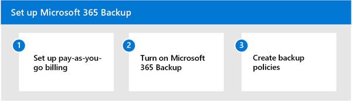
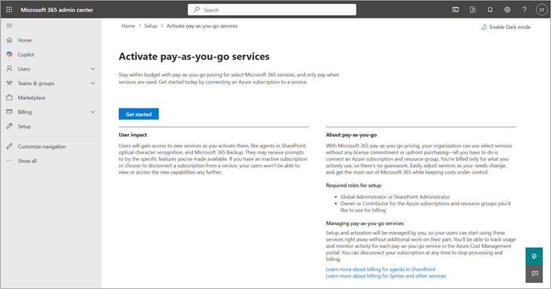
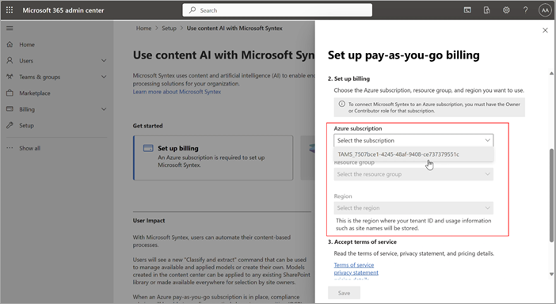
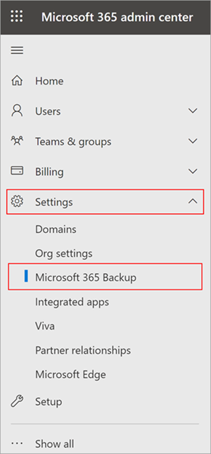

# Set up Microsoft 365 Backup

Get started with Microsoft 365 Backup by following these simple three steps in the Microsoft 365 admin center.

## Permissions

You must be a [SharePoint Administrator](/entra/identity/role-based-access-control/permissions-reference#sharepoint-administrator) or [Global Administrator](/entra/identity/role-based-access-control/permissions-reference#global-administrator) to be able to access the Microsoft 365 admin center and set up Microsoft 365 Backup.

[!INCLUDE [global-administrator-note](../includes/global-administrator-note.md)]

## Step 1: Set up pay-as-you-go billing

To set up pay-as-you-go for Microsoft 365 Backup, you need to have this information:

> [!div class="checklist"]
> * **Valid Azure subscription**. An Azure subscription provides a logical container for your resources. Each Azure resource is associated with only one subscription. Creating a subscription is the first step in adopting Azure. To learn more about Azure, see [Azure fundamental concepts](/azure/cloud-adoption-framework/ready/considerations/fundamental-concepts).
> * **Resource group**. A resource group provides a logical grouping of resources within an Azure subscription.
> * **Region**. The region in which you want to register the service.
> * **Owner or contributor**. Name of an owner or contributor role on the Azure subscription.

Once you have the information on this list, you're ready to begin. As a first step, you should link an Azure subscription in Microsoft Syntex pay-as-you-go, if you haven't already done so. Although Microsoft 365 Backup isn't part of the Microsoft Syntex product suite, this offering is still using the Syntex billing setup for consistency with other Microsoft 365 pay-as-you-go offerings.

To set up pay-as-you-go billing for Microsoft 365 Backup, follow these steps:

1. In the Microsoft 365 admin center, select <a href="https://go.microsoft.com/fwlink/p/?linkid=2171997" target="_blank">**Setup**</a>, and then view the **Billing and licenses** section.

2. In the **Billing and licenses** section, select **Activate pay-as-you-go services**.

3. On the **Activate pay-as-you-go services** page, select **Get started**.

    

    > [!NOTE]
    > To set up pay-as-you-go billing for Microsoft 365 Backup, you must provide an owner or contribution role on the Azure subscription to be used.

4. On the **Pay-as-you-go services** page, on the **Billing** tab, select **Syntex services**.

5. If you ***don't*** have an Azure subscription or resource group, follow these steps. If you have an Azure subscription and resource group, go directly to step 5.

    To create a new Azure subscription with the same organization and Microsoft Entra tenant as your Microsoft 365 subscription:

    1. Sign in to the [Azure portal](https://portal.azure.com) with your Microsoft 365 admin, Microsoft Entra DC admin, or [Global Administrator](/entra/identity/role-based-access-control/permissions-reference#global-administrator) account.

        [!INCLUDE [global-administrator-note](../includes/global-administrator-note.md)]

    1. In the left navigation, select **Subscriptions**, and then select **Add**.

    1. On the **Add subscription** page, select an offer and complete the payment information and agreement.

    To create a new Azure resource group:

    1. On the **Set up pay-as-you-go billing** panel, select **Learn more about Azure resource groups**.

    1. Or, you can follow steps in [Manage Azure resource groups by using the Azure portal](/azure/azure-resource-manager/management/manage-resource-groups-portal) to create a resource group.

    

    > [!NOTE]
    > The resource group should be mapped to the Azure subscription you provided when you set up pay-as-you-go.

6. If you ***have*** an Azure subscription, follow these steps:

    1. On the **Set up pay-as-you-go billing** panel, under **Azure subscription**, select the subscription from the dropdown list.

       > [!NOTE]
       > The subscription dropdown list won't populate if you don't have an owner or contributor on the subscription.

       

    1. Under **Resource group**, select the resource group from the dropdown list.

    1. Under **Region**, select the region from the dropdown list.

    1. Review and accept the terms of service, and then select **Save**.

You have successfully set up billing. You can proceed to [turn on Microsoft 365 Backup](#step-2-turn-on-microsoft-365-backup).

> [!NOTE]
> Any subsequent changes made to the billing for Microsoft 365 Backup in the Microsoft 365 admin center or the Azure portal can take up to 24 hours to become effective.

> [!NOTE]
> There will be only one billing profile created. Microsoft 365 Backup currently doesn't support multiple billing profiles.

## Step 2: Turn on Microsoft 365 Backup

To turn on Microsoft 365 Backup, you need to go to the Microsoft 365 admin center.

1. In the Microsoft 365 admin center, select <a href="https://go.microsoft.com/fwlink/p/?linkid=2171997" target="_blank">**Setup**</a>.

2. Under **Billing and licenses**, select **Activate pay-as-you-go services**.

3. On the **Activate pay-as-you-go services** page, select **Get started**.

4. On the **Pay-as-you-go services** page, select the **Settings** tab, and then select **Syntex services**.

5. On the Syntex page, in the **Storage** section, select **Backup**.

6. On the **Backup** panel, select **Turn on**.

7. On **Turn on Backup** panel, review the applicable [terms of service for Microsoft 365](https://www.microsoft.com/licensing/terms/product/ForOnlineServices/all), and then select **Save**.
<!---
    
--->
## Step 3: Create backup policies to protect your data

Now that Microsoft 365 Backup is enabled for your organization, follow through to create policies and start protecting your content.

1. Go to the [Microsoft 365 admin center](https://admin.microsoft.com/Adminportal/Home).

2. Select **Settings**.

3. Select **Microsoft 365 Backup** from the list of products.

    

4. [Create backup policies for OneDrive, SharePoint, or Exchange](backup-view-edit-policies.md#create-backup-policies).

<!---
## Multi-geo environments

Microsoft 365 Backup supports the backup of sites and user accounts from both the central and satellite locations if the multi-geo feature is enabled on your tenant. This means that you can add the sites or user accounts from all geos while creating the backup configuration policy via the CSV file upload method. Adding sites via the site picker, search, or filter rules doesn't currently support multi-geo. Those user interface experiences today only support addition of sites in the tenant's central location.
--->

## Admin roles and backup management privileges

Only tenant-level admins can create and manage backups using Microsoft 365 Backup for their users. End users don't have the ability to enable backup or restores for their user account, distribution lists, mailboxes, or sites. It’s important to note that your admin role determines which products you can manage with Microsoft 365 Backup. We have also introduced a new dedicated role for this tool, the Microsoft 365 Backup Administrator, that can control the entire tool. For more information about this role, see [Microsoft 365 Backup Administrator](/entra/identity/role-based-access-control/permissions-reference#microsoft-365-backup-administrator).

|Admin role  |OneDrive  |SharePoint  |Exchange  |
|---------|---------|---------|---------|
|Global Administrator     | ✓        | ✓        | ✓       |
|SharePoint Administrator     | ✓        | ✓        |         |
|Exchange Administrator    |         |         | ✓        |
|Microsoft 365 Backup Administrator     | ✓        | ✓        | ✓       |

## Glossary

- **Protection units** – SharePoint sites, OneDrive accounts, or Exchange Online mailboxes backed up by the Microsoft 365 Backup tool.

- **Restore point** – A prior point in time from which you can restore a version of your content and metadata. If the protection unit from a prior point in time is identical to the present state of your data, then a restore from that point has no effect on your current data.

- **RPO** – Recovery point objective, or how close in time the most recent restore point is to an impacting event.

- **RTO** – Recovery time objective, or how fast a restore to a prior point in time might complete.
