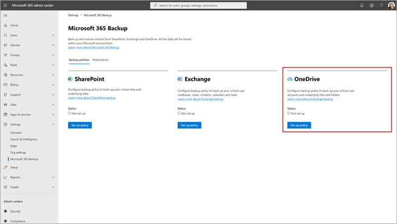
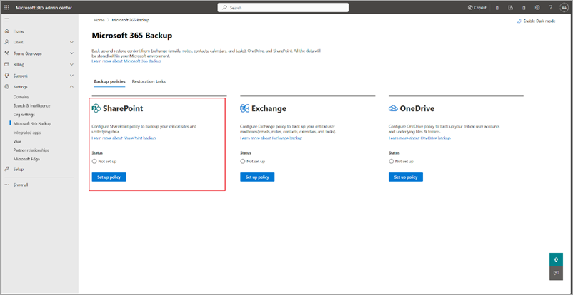
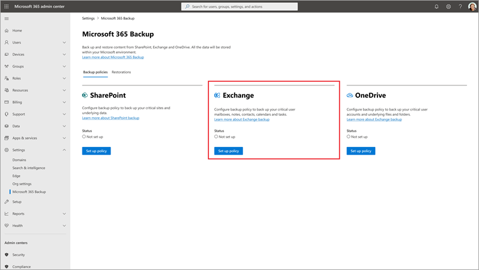

# Create, view, and edit backup policies in Microsoft 365 Backup

## Create backup policies

To use Microsoft 365 Backup for OneDrive, SharePoint, or Exchange, you need to create a backup policy for each product. A *policy* represents the backup plan defined by admins for protecting the Microsoft 365 data of an organization.

A policy contains details of what data (OneDrive accounts, SharePoint sites, and Exchange mailboxes) to protect. Although you see the retention period and backup frequency (which defines the restore point objective), those settings aren't currently variable or modifiable.

Select the **OneDrive**, **SharePoint**, or **Exchange** tab for steps to create a backup policy for that product.

# [OneDrive](#tab/onedrive)

Follow these steps to set up a backup policy for OneDrive accounts using Microsoft 365 Backup.

1. Go to the [Microsoft 365 admin center](https://admin.microsoft.com/Adminportal/Home).

2. Select **Settings**.

3. Select **Microsoft 365 Backup** from the list of products.

4. On the **Microsoft 365 Backup** page, in the **OneDrive** section, select **Set up policy**.

    

5. On the **Overview** page, review the backup policy attributes for OneDrive, and then select **Next**.

    

6. On the **Choose selection method** page, you can select OneDrive user accounts using any of four available methods. A protection scope is the scope of user accounts within OneDrive that you want to protect with Microsoft 365 Backup.

    

    a. Under **Upload a list of accounts in a CSV file**, you can upload a list of accounts to back up via a CSV file.

    The CSV upload feature for bulk addition of sites or user accounts in the backup policy creation workflow can accommodate a maximum of 50,000 entries per CSV file.

    b. Under **Using a dynamic rule**, you can select **Distribution lists** or **Security groups**, or both. With dynamic rules, any changes to membership in the selected distribution lists and security groups are automatically reevaluated daily, ensuring the backup policy reflects those membership changes regularly.

    For example, if a user is added to a distribution list that is included in the dynamic rule, then that user will be included in the backup policy within a day. After that, Microsoft 365 Backup will create restore points for that user. If a user that was previously in the included distribution list is removed from that list, then they will be removed from the backup policy within 24 hours. That user’s existing backups will remain restorable for until they expire based on their retention period, but new backups will no longer be taken until that individual is re-added to the included distribution list, or until they are re-added manually in a static addition.

    > [!NOTE]
    > The dynamic rule feature is in preview.

    c. Under **Using filters**, you can select **Distribution lists** or **Security groups**, or both. The distribution list and security group are flattened when added, meaning the policy won't update dynamically if the groups or distribution list members are updated later.

    The rule-based feature for bulk addition of user accounts via security groups or distribution lists can accommodate a maximum of three groups at a time. These rules are static and applied one time only. That is, the security groups or distribution lists are flattened at the time of adding to the backup configuration policy. For example, groups or lists won't be dynamically updated in the system if users are added or removed from the original security group.

    d. Under **Select accounts individually**, you can search and select accounts you want to add to a backup policy.

7. Once you've made the right selections, select **Next** to create the backup policy for OneDrive.

8. On the **Review OneDrive backup policy** page, review the information to make sure it's how you want it, and then select **Create policy** (or **Update policy** if it's an update).

9. The backup policy for OneDrive is created.

    

    Once the sites are added to a backup policy, it might take 15 to 25 minutes per 1,000 sites for restore points to become available for restore.

# [SharePoint](#tab/sharepoint)

Follow these steps to set up a backup policy for SharePoint sites using Microsoft 365 Backup.

1. Go to the [Microsoft 365 admin center](https://admin.microsoft.com/Adminportal/Home).

2. Select **Settings**.

3. Select **Microsoft 365 Backup** from the list of products.

4. On the **Microsoft 365 Backup** page, in the **SharePoint** section, select **Set up policy**.

    

5. On the **Overview** page, review the backup features for SharePoint, and then select **Next**.

    

6. On the **Choose selection method** page, you can set up SharePoint sites using any or all three ways. A protection scope is the scope of user accounts within OneDrive that you want to protect with Microsoft 365 Backup.

    

    a. Under **Upload a list of sites in a CSV file**, you can upload a list of accounts to back up via a CSV file.

    The CSV upload feature for bulk addition of sites or user accounts in the backup policy creation workflow can accommodate a maximum of 50,000 entries per CSV file.

    b. Under **Back up sites that match specific filters**, you can select **Site name or URL contains** or **Site last modified**, or both.

    The rule-based feature for bulk addition of sites via site names or URL in the backup policy creation workflow can accommodate a maximum of 10 keywords at a time. Each keyword can have a minimum of three characters and maximum of 255 characters.

    > [!NOTE]
    > The site last modified feature is in preview.

    c. Under **Select sites individually**, you can search and select sites you want to add to a backup policy.

7. Once you've made the right selections, select **Next** to create the backup policy for SharePoint.

8. On the **Review SharePoint backup policy** page, review the information to make sure it's how you want it, and then select **Create policy** (or **Update policy** if it's an update).

    

9. The backup policy for SharePoint is created.

    

    Once the sites are added to a backup policy, it might take up to 15 minutes per 1,000 sites for restore points to become available for restore.

# [Exchange](#tab/exchange)

Follow these steps to set up a backup policy for Exchange mailboxes sites using Microsoft 365 Backup.

1. Go to the [Microsoft 365 admin center](https://admin.microsoft.com/Adminportal/Home).

2. Select **Settings**.

3. Select **Microsoft 365 Backup** from the list of products.

4. On the **Microsoft 365 Backup** page, in the **Exchange** section, select **Set up policy**.

    

5. On the **Overview** page, review the backup policy attributes for Exchange, and then select **Next**.

    

6. On the **Choose selection method** page, you can select shared or user mailboxes using any of four available methods. Other Exchange recipient types, such as room mailboxes, are not supported at this time. A protection scope is the scope of mailboxes within Exchange that you want to protect with Microsoft 365 Backup.

    > [!NOTE]
    > Adding a mailbox to the backup policy will back up the primary and archive mailboxes.
    >
    > Adding a mailbox might temporarily fail if mailbox setup has not had time to complete. For example, if you recently created the user, licensed the user, or migrated the mailbox from on premises, you might see a transient failure while the mailbox is still being set up.

    

    a. Under **Upload a list of mailboxes in a CSV file**, you can upload a list of accounts to back up via a CSV file.

    The CSV upload feature for bulk addition of mailboxes in the backup policy creation workflow can accommodate a maximum of 50,000 entries per CSV file.

    b. Under **Using a dynamic rule**, you can select **Distribution lists** or **Security groups**, or both. With dynamic rules, any changes to membership in the selected distribution lists and security groups are automatically reevaluated daily, ensuring the backup policy reflects those membership changes regularly.

    For example, if a user is added to a distribution list that is included in the dynamic rule, then that user will be included in the backup policy within a day. After that, Microsoft 365 Backup will create restore points for that user. If a user that was previously in the included distribution list is removed from that list, then they will be removed from the backup policy within 24 hours. That user’s existing backups will remain restorable until they expire based on their retention period, but new backups will no longer be taken until that individual is re-added to the included distribution list, or until they are re-added manually in a static addition.

    > [!NOTE]
    > The dynamic rule feature is in preview.

    c. Under **Using filters**, you can select **Distribution lists** or **Security groups**, or both. The distribution list and security group are flattened when added, meaning the policy won't update dynamically if the groups or distribution list are updated later.

    The rule-based feature for bulk addition of mailboxes via security groups or distribution lists can accommodate a maximum of three groups at a time. These rules are static and applied one time only. That is, the security groups or distribution lists are flattened at the time of adding to the backup configuration policy. For example. groups or list won't be dynamically updated in the system if users are added or removed from the original security group.

    > [!NOTE]
    > The site last modified feature is in preview.

    d. Under **Select mailboxes individually**, you can search and select mailboxes you want to add to a backup policy.

    > [!NOTE]
    > Hybrid deployments, where a user's primary mailbox resides on premises while their archive has been migrated to Exchange Online, are not supported.

7. Once you've made the right selections, select **Next** to create the backup policy for Exchange.

8. On the **Review Exchange backup policy** page, review the information to make sure it's how you want it, and then select **Create policy** (or **Update policy** if it's an update).

9. The backup policy for Exchange is created.

    

    Once the mailboxes are added to a backup policy, it might take up to 15 minutes per 1,000 mailboxes for restore points to become available for restore.
---

## View and edit backup policies

You can edit the scope of OneDrive accounts, SharePoint sites, and Exchange mailboxes  associated with a backup policy. As part of edit, you can either add new accounts, sites, or mailboxes to or remove them from backup. Removing accounts, sites, and mailboxes from Microsoft 365 Backup doesn't mean existing backups will be deleted, rather it means additional backups won't be taken.

Select the **OneDrive**, **SharePoint**, or **Exchange** tab for steps to view and edit backup policies for that product.

# [OneDrive](#tab/onedrive)

Follow these steps to view and edit backup policies for OneDrive.

1. In the Microsoft 365 admin center, on the **Microsoft 365 Backup** page, in the **OneDrive** section, select **View details**.

    

2. You can either add new accounts to or remove accounts from an existing OneDrive backup policy.

    a. To add new accounts, use either one of these two methods:

    - On the **OneDrive accounts backup policy** panel, on the **Policy details** tab, in the **Scope** area, select **Edit**.

    - Or, on the **OneDrive accounts backup policy** panel, select **+ Add accounts**.

    Select the accounts using any of the four available methods. Once you have added the accounts, follow the prompts to update the policy.

    

    b. To remove accounts from existing backup policy, on the **Included accounts** tab, select the accounts from the list, and then select **Remove**. Once you have done your changes, follow the prompts to remove the accounts.

    Accounts added to a backup policy through a dynamic rule cannot be individually removed. To exclude these accounts from the backup policy, you must modify the rule conditions. For example, if User A is part of Distribution List P, removing User A from the list will exclude them from the policy. Alternatively, removing the entire distribution list from the rule will remove all accounts that were added through that list from the backup policy.

    

3. The removed accounts are moved to the **Removed accounts** tab.

    

    > [!NOTE]
    > Removing accounts from backup policy means no future backups will be taken for those removed accounts. Existing backups for those accounts will not be deleted and will be charged.

# [SharePoint](#tab/sharepoint)

Follow these steps to view and edit backup policies in SharePoint.

1. In the Microsoft 365 admin center, on the **Microsoft 365 Backup** page, in the **SharePoint** section, in the **Scope** area, select **Edit**.

    

2. On the **SharePoint sites backup policy** panel, on the **Policy details** tab, in the **Scope** area, select **Edit**.

3. You can either add new sites to or remove sites from an existing SharePoint backup policy.

    a. To add new sites, on the **Backed up sites** tab, select **+ Add sites**.

    b. Select sites by any method as discussed in the creation section. Once you have added sites to the list, follow the prompts to update the policy.

    

    c. To remove sites from existing SharePoint backup policy, on the **Backed up sites** tab, select the relevant sites, and then select **Remove**. Once you have done your changes, follow the prompts to remove the sites.

    

4. Once you have done your changes, follow the prompts to update the policy.

    

    > [!NOTE]
    > Removing sites from backup policy means no future backups will be taken for those removed sites. Existing backups for the removed sites will not be deleted and will be charged.

# [Exchange](#tab/exchange)

Follow these steps to view and edit backup policies for Exchange.

1. In the Microsoft 365 admin center, on the **Microsoft 365 Backup** page, in the **Exchange** section, select **View details**.

    

2. You can either add new mailboxes to or remove mailboxes from the existing Exchange backup policy.

    a. To add new shared or user mailboxes, use either one of these two methods:

    - On the **Exchange backup policy** panel, on the **Policy details** tab, in the **Scope** area, select **Edit**.

    -Or, on the **Exchange backup policy** panel, select **+ Add mailboxes**.

    Select the mailboxes using any of the four available methods. Once you have added the mailboxes, follow the prompts to update the policy.

    

    b. To remove user mailboxes from existing backup policy, on the **Included mailboxes** tab, select the user mailboxes from the list, and select **Remove**.

    Mailboxes added to a backup policy through a dynamic rule cannot be individually removed. To exclude these mailboxes from the backup policy, you must modify the rule conditions. For example, if User A is part of Distribution List P, removing User A from the list will exclude them from the policy. Alternatively, removing the entire distribution list from the rule will remove all mailboxes that were added through that list from the backup policy.

    

3. The removed mailboxes are moved to the **Removed mailboxes** tab.

    

    > [!NOTE]
    > Removing mailboxes from backup policy means no future backups will be taken for those removed mailboxes. Existing backups for those mailboxes will not be deleted and will be charged.

---

## Delete a dynamic rule

When deleting a dynamic rule, you have two options that determine how existing accounts are treated in the backup policy:

- **Delete rule but continue backups**

    The dynamic rule is converted into a static list. Backup continues for all user accounts that were included through the rule at the time of deletion. However, future changes to the original distribution lists or security groups—such as users being added or removed—will no longer be reflected in the backup policy. For example, if a user is added to a previously included group after the rule is deleted, they will not be automatically added to the backup policy.

- **Delete rule and stop new backups**

    The dynamic rule is removed, and no new backups will be taken for accounts previously included through the rule. Existing backups for these users remain restorable until they expire based on the configured retention period. You can re-enable backup for these users by manually adding them or by creating a new dynamic rule that includes them.

## States of backup

|States  |Definition  |
|---------|---------|
|Active     | Protection scope selected under backup policy is being actively backed up. |
|Paused     | No further backups will be taken but already taken backups will be preserved. |
|Not set up | No backup policy is set up for this scope.  |
|Processing | A change to backup policy or a restore is in progress.  |

## Multi-geo environments

Microsoft 365 Backup supports the backup of sites and user accounts from both the central and satellite locations if the multi-geo feature is enabled on your tenant. This means that you can add the sites or user accounts from all geos while creating the backup configuration policy via the CSV file upload method. Adding sites via the site picker, search, or filter rules doesn't currently support multi-geo. Those user interface experiences today only support addition of sites in the tenant's central location.

Most importantly, data in the backups will honor the multi-geo residency requirements and keep data in the geo you've defined it to live.
