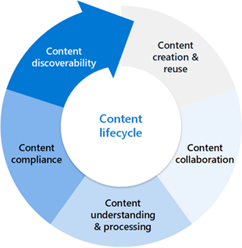

# Drive adoption of document processing for Microsoft 365

Document processing for Microsoft 365 is a suite of cloud-based services that use artificial intelligence (AI) to automate content processing and extract knowledge from unstructured data. These services help transform your content into structured, actionable information that can be easily searched, analyzed, and reused across your organization.

By integrating document processing into your workflows, you can streamline operations, improve compliance, and enhance discoverability. Here are some examples of how the services can be applied:

- **Organize and manage documents**. Automatically extract, summarize, or generate content from files uploaded to your SharePoint document library.

- **Expand global reach**. Create translated copies of a selected file or a set of files in all supported languages.

- **Automatically generate routine documents**. Streamline the creation of recurring documents—such as maintenance reports, status updates, or compliance summaries.

- **Generate documents in bulk**. Automate the creation of large volumes of similar documents—such as contract renewals or onboarding packets—using content assembly tools.

- **Process incoming documents**. Manage and extract data from incoming business documents, including insurance forms, business verifications, and rental agreements.

- **Enhance content discoverability**. Improve how business documents and employee information—such as policies and procedures—are organized and surfaced in document libraries.

- **Extract specific content details**. Centralize and retrieve key information, like patent numbers or compliance data, to make it easier to locate and act on.

- **Support compliance and governance**. Apply document processing to help meet retention and sensitivity requirements for business documents, including event materials and conference files.

## Identify business scenarios

Before implementing document processing services in your organization, it’s important to identify the business scenarios where these capabilities add the most value. Understanding the "why" behind your use cases helps determine which features are most beneficial—and whether document processing is necessary at all. It also guides the selection of the appropriate model type.

To achieve your desired business outcomes, you might want to combine multiple features. Use the [example scenarios and use cases](adoption-scenarios.md) to spark ideas for how document processing can support your organization’s goals.

### Why it matters

Content is the lifeblood of your organization. Many business units rely on data processing, often using manual or semi-automated workflows that involve multiple steps. Document processing services can streamline these efforts and enhance your content management practices by enabling:

- Advanced search and filtering to improve discoverability and retrieval.

- Conditional formatting to simplify document review and filtering.

- One-click Power BI report generation using extracted metadata.

- Automated rules and workflows through Power Automate.

- Compliance enforcement via retention and sensitivity labels.

### Consider your content lifecycle

Content goes through a typical lifecycle—from creation and re-creation to understanding, processing, discovery, and search. There are many services available to support your business at each of these stages.

#### Content creation and reuse

Within the lifecycle of content, there might be use cases for automating content creation, particularly content that is transactional or standardized and [content assembly](content-assembly.md) can be useful for this. Content assembly can automatically create common or repetitive business documents—such as contracts, statements of work, service agreements, letters of consent, sales pitches, and other routine correspondence.

Once you identify repetitive document types, you want to identify the data source that can be used as a source for the documents. Having a list or data source to populate the documents allows you to do this task faster, more consistently, and with fewer errors by creating modern templates and using those templates to generate documents.

#### Content collaboration

The [annotations](annotations.md) feature is used to add notes and comments to content in document libraries—either for yourself or for collaborating with others. The annotations feature can be used without modifying the original files, so the original records are preserved.

Annotation tools currently include pen and highlighter, where colors can be selected along with an eraser for removing ink strokes and previous annotations. Once you configure an Azure subscription in your tenant for pay-as-you-go services, this feature is enabled for your users. You might want to consider providing details to end users about the feature, particularly to business groups that might heavily markup or annotate documents.

#### Content understanding and processing

Using document processing models to automate the classification and data extraction from the content using [document processing](model-types-overview.md) and the [taxonomy tagging](taxonomy-tagging-overview.md) or [image tagging](image-tagging-overview.md) features can save time and money while minimizing risk of typos or missed information.

Document processing models can perform different types of tasks across your content including classification, extraction, and keywords. The following table shows these tasks and related features.

|Task  |Description  |Service feature  |
|---------|---------|---------|
|Classification     |Identifies the type of content the file represents (for example, a report, an invoice, or a form)         |[Unstructured document processing](document-understanding-overview.md)         |
|Extraction         |Identifies information based on an entity from within a document     |[Structured document processing](form-processing-overview.md) [Freeform document processing](form-processing-overview.md) [Prebuilt document processing](prebuilt-overview.md) [Optical character recognition](ocr-overview.md)    |
|Keyword tagging    |Suggests information based on a property of or decision about a document using keywords         |[Taxonomy tagging](taxonomy-tagging-overview.md) [Image tagging](image-tagging-overview.md)         |

#### Content compliance

The document processing models can also be used to add compliance by having them apply [sensitivity labels](apply-a-sensitivity-label-to-a-model.md) and [retention labels](apply-a-retention-label-to-a-model.md) to content added to document libraries with models configured with them.

Once the content type and metadata are available in a document library, business users can take advantage of several capabilities. They can create new views of the content, build reports, and move content automatically using rules based on specific metadata. Additionally, they can design business process workflows for tasks such as approvals, integrating data with other systems, generating work orders, and automating many tasks that were previously done manually.

#### Content discoverability

Using document processing services can improve the search experience as each piece of metadata extracted from content now will be searchable. The [content query](metadata-search.md) feature lets you perform specific metadata-based queries on SharePoint document libraries. You can make faster, more precise queries based on specific metadata column values, rather than just searching for keywords.

In addition to classifying and extracting data from content added to a SharePoint library, your organization might have content currently locked in images that is challenging to locate. The [optical character recognition](ocr-overview.md) (OCR) service lets you extract printed or handwritten text from images and documents. Examples of images include posters, drawings, and product labels. Examples of documents include articles, reports, forms, and invoices. The text is typically extracted as words, text lines, and paragraphs or text blocks, enabling access to digital version of the scanned text. The extracted information is indexed in search and can be made available for compliance features like [data loss prevention](../compliance/dlp-learn-about-dlp.md) (DLP).

## Plan for getting started

To get started with document processing services, begin by assessing your organization’s current state and needs around content management, processing, and analysis. Identify key content repositories used by different teams and engage with those groups to understand their business processes and scenarios.

Look for opportunities where manual content handling could be automated. These tasks might include:

- Intake and processing of standard forms or documents (for exmaple, HR forms or purchase orders).

- Generation of repeatable content at scale (for example, offer letters or proposals).

- Manual annotation workflows (for example, pen-and-paper reviews or partner tools) that could be transitioned into your SharePoint environment.

### Questions to guide scenario planning

When evaluating which business scenarios to prioritize, consider the following questions:

- Does it solve a real problem? Focus on scenarios that address pain points or inefficiencies.

- Will it be widely used or have broad impact? Prioritize use cases that benefit multiple teams or departments.

- Is it obtainable? Ensure the scenario is feasible with your current tools and resources.

- Can you measure success? Define clear metrics to track impact and outcomes.

The [Microsoft 365 Assessment tool](adoption-assessment-tool.md) can also help identify potential areas of your SharePoint environment that could benefit from document processing services.

### Get started with site templates

If you're unsure where to begin, explore the [site templates](site-templates.md) available in your tenant after setting up pay-as-you-go and configuring your Azure subscription. These templates are:

- Prebuilt and ready to deploy.
- Customizable to fit your organization’s needs.
- Available on all team sites.

Use these templates to quickly launch a professional site that helps manage, process, and track business documents using multiple Microsoft 365 features. These sites are ideal for:

- Demonstrating capabilities to business stakeholders.
- Accelerating scenario planning and envisioning.
- Showcasing value for business areas like contract management and accounting.

They provide a strong foundation for building solutions that streamline document workflows and improve content lifecycle management.

## Identify roles and responsibilities

As you plan your document processing projects, it’s important to identify who in your organization needs to be involved. Start by mapping the features you plan to use. This process helps clarify which roles are essential.

For example, if you're focused on document processing, then the SharePoint administrator role is key in creating and managing content centers needed to manage models at scale. If you’re focused on features like OCR and compliance, then the Purview Compliance administrator is needed. If taxonomy tagging is pursued, it’s important to understand your corporate term store management or to determine if you use a content center.

Mapping roles to features early helps ensure the right people are engaged and your project is set up for success.

|Administrator  |Requirement  |Responsibilities  |
|---------|---------|---------|
|Azure Subscriptions administrator     |Microsoft Entra role         |Configure Azure subscription settings, review Microsoft Cost Management in Azure data         |
|Purview Compliance administrator     |Microsoft Entra role         |Plan for compliance settings, such as sensitivity labels and retention policies and OCR settings          |
|SharePoint administrator     |Microsoft Entra role         |Gather business use cases, determine if features will be enabled across all sites or for selected sites Manage content centers and permissions Establish best practices and review model analytics       |
|Power Platform administrator     |Microsoft Entra role         |Configure Dataverse environment (if necessary) for freeform and structured models      |
|SharePoint Term Store administrator     |Configured by SharePoint admin in SharePoint admin center         |Manage enterprise term sets, determine if end users can modify certain term sets      |
|Business user (managing models, using content assembly)     |Permissions managed at the site level or on content centers Content  enter edit permissions SharePoint Manage Lists permissions where you want to publish models or use content assembly features    |Gather business use cases Create, train, and apply models     |

## Setup and configuration considerations

Planning for using document processing services involves determining which features you plan to enable and planning for costs using the [Microsoft SharePoint cost calculator](https://aka.ms/syntex/calculator) to help predicting costs for pay-as-you-go services. This tool gives you a better understanding of your organization’s usage patterns and estimated costs so you can make more informed decisions. It’s also helpful in conjunction with the [Microsoft 365 Assessment tool](adoption-assessment-tool.md), which analyzes your information architecture and highlights libraries with custom content types and extended columns that can benefit from AI-powered automation.

## Readiness checklist

To get ready for implementing document processing services, you need to:

1. **Plan**
    - Plan for harnessing the value of document processing services in areas like:
        - Search
        - Filtering and view formatting
        - Compliance
        - Automation

2. **Identify**
    - Understand existing information architecture and content management feature use.
    - Are any existing content types good candidates for models?
    - What existing processes would be improved by metadata?
    - How much content will you process?

3. **Design**
    - Design your approach to information architecture, managed metadata, and content types.
    - Design the process for definition, creation, and management.

