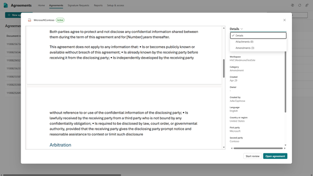

# Manage amendments in SharePoint Agreements

Amendments are documents added to signed, active agreements that modify the original parent agreement. Amendments can be used to alter content or field values of the signed agreement, including updating contact owners, changing payment terms, adding additional clauses, or extending the duration of the agreement. Users can amend an agreement by uploading a signed amendment PDF to the original agreement.

From the Agreements app in Microsoft Teams, on the **Agreements list** page, you can see that agreements with amendments have a populated **Amended** column with its most recent amendment effective date. Additionally, in the **Details** pane, field values that have been altered by amendments have a tooltip indicator containing the effective date of the amendment that has altered the values.

## Add an amendment

You can add one or more amendments individually to an existing agreement by uploading files using the agreements viewer dialog in the SharePoint Agreements app.

To add an attachment, follow these steps:

1. From the Agreements app in Microsoft Teams, on the **Home** tab, select the **Agreements** tab.

2. From the **Agreements** tab, select the agreement to which you want to add an amendment.

3. With the agreement viewer panel now open, select **Details** > **Amendments**.

4. From the **Amendments** panel, select **+ Signed amendment** to open the file picker.

5. Browse to the location of the amendment, and then select the file you want to add to the agreement.

6. Select **Open** to upload the file and view in the viewer panel.

7. Input the required amendment effective date field value.

8. Modify any agreement details that have been altered by the uploaded amendment.

9. Select **Save** to add the amendment to the selected agreement.

    

> [!NOTE]
> Amendments can only be added to agreements that are both active and signed.
> The only supported file type to upload an amendment is PDF.

## View or open an amendment

To view the amendment files in the Agreements app, follow these steps:

1. From the Agreements app in Microsoft Teams, on the **Home** tab, select the **Agreements** tab.

2. From the **Agreements** tab, select an agreement that has a populated **Amended** column.

3. With the agreement viewer panel now open, select **Details** > **Amendments**.

   

4. From the **Amendments** panel, select the amendment you want to view. It opens automatically in the viewer.

5. With the amendment file visible in the viewer, you can return to the original agreement using the breadcrumb in the upper-left corner, the **Return to agreement** button in the lower-left corner, or you can clear the amendment from the amendments list.

6. To open the amendment in the default client application, select the amendment from the list, select **More options** (***...***) next to the amendment name, and then select **Open**. For example, if the amendment is a Microsoft Word document, it launches the Word client if installed.

 

> [!div class="nextstepaction"]
> [See the complete list of help documentation.](agreements-overview.md#help-documentation)
