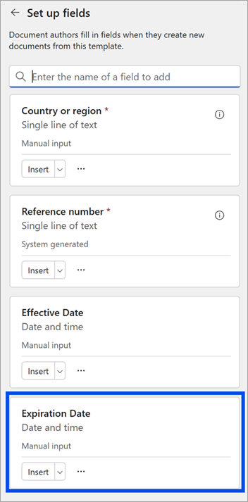
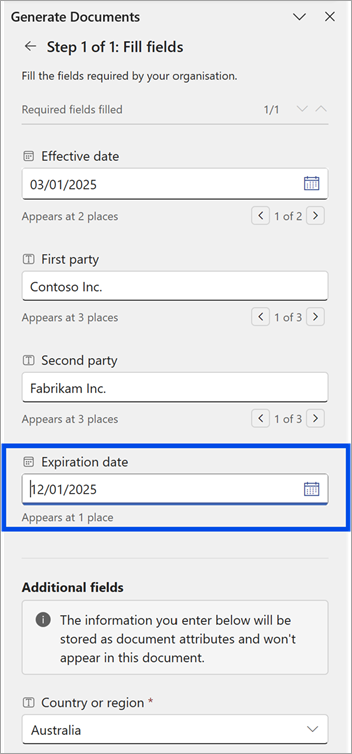
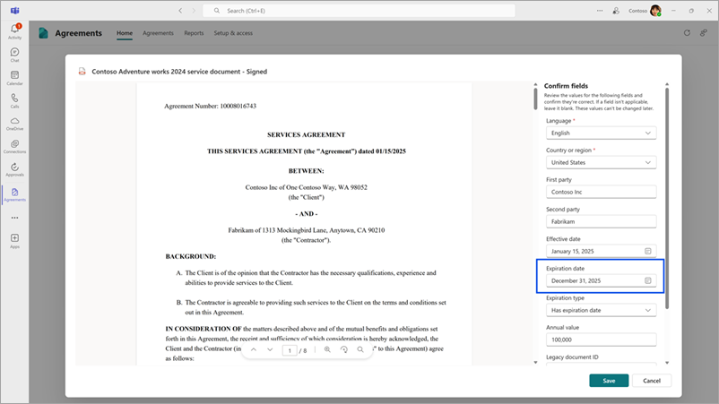

# Manage expirations of agreements in SharePoint Agreements

It's essential to monitor the expiration dates of agreements to ensure they're renewed on time and to prevent any lapses. The Agreements solution offers timely notifications to agreement owners, prompting them to take the necessary actions before the agreements expire.

## Expiration date field

The **Expiration date** is a standard field that records when an agreement is set to expire. Template creators should include this field in any template designed for agreements that have an expiration date. To add this field, template creators need to search for *expiration date* in the **Set up fields** panel and then add it to the template.

The agreements generated using the template should have the **Expiration date** field filled in with the appropriate value by agreement creators. Only when this field value is filled, the reports, notifications, and status changes take effect on corresponding expiration dates.

To ensure that imported agreements follow the expiration flow, make sure that the **Expiration date** field is filled in the agreement's details screen when importing signed agreements.

Once an agreement generated from the solution is signed and executed, or an imported agreement is successfully added after reviewing and confirming its details, the expiration date can no longer be added or updated.

If the **Expiration date** isn't included in the agreement, it's treated as an evergreen agreement.

## Expiration notifications

When the **Expiration date** field is filled in the agreement, the following actions occur:

**Three months before the expiration date:**

- A reminder notification is sent to the [default recipients](#default-recipients-of-notifications), indicating the specific date the agreement will expire.

- This notification is sent weekly for the three months leading up to the expiration date.

**On the expiration date:**

- A notification is sent to the [default recipients](#default-recipients-of-notifications), informing them that the agreement has expired.

- The status of the agreement is updated to **Expired**.

   

### Default recipients of notifications

For agreements generated using the solution, the recipient is the agreement author or creator. For imported agreements, the recipient is the uploader of the agreement.

#### Considerations for managing notifications

- To ensure the expiration notification is sent to a specific person or group other than the default recipient, include the **Owner** field in the template and designate the appropriate recipients during the agreement authoring stage.

- For the agreements in **Draft** status, the expiration notifications and status change aren't triggered.

- If an agreement's Word document is under the status of **Published**, **Reviewed**, or **Approved**, and is downloaded, signed, and converted into a PDF using a non-Microsoft electronic signature service, the following occurs:

    - The PDF is imported into the Agreements solution with the status **Active**, while the Word document remains in its original status.

    - As a result, two different expiration notifications are sent: one for the Word document and one for the PDF.

 

> [!div class="nextstepaction"]
> [See the complete list of help documentation.](agreements-overview.md#help-documentation)
