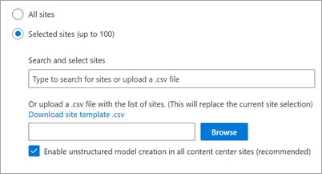

# Set up and manage unstructured document processing

Unstructured document processing is a pay-as-you-go service that is set up in the Microsoft 365 admin center.

## Prerequisites

### Licensing

Before you can use unstructured document processing, you must first link an Azure subscription in [pay-as-you-go](syntex-azure-billing.md). Unstructured document processing is billed based on the [type and number of transactions](syntex-pay-as-you-go-services.md).

### Permissions

You must be a [SharePoint Administrator](/entra/identity/role-based-access-control/permissions-reference#sharepoint-administrator) or [Global Administrator](/entra/identity/role-based-access-control/permissions-reference#global-administrator) to be able to access the Microsoft 365 admin center and set up unstructured document processing.

[!INCLUDE [global-administrator-note](../includes/global-administrator-note.md)]

## Set up unstructured document processing

After an [Azure subscription is linked to pay-as-you-go](syntex-azure-billing.md), unstructured document processing is automatically set up and enabled for all SharePoint sites.

## Manage sites

By default, unstructured document processing is turned on for libraries in all SharePoint sites. To restrict the sites where users can create unstructured models for processing files, follow these steps.

1. In the Microsoft 365 admin center, select <a href="https://go.microsoft.com/fwlink/p/?linkid=2171997" target="_blank">**Settings > Org settings**</a>.

2. On the **Org settings** page, select **Pay-as-you-go services**.

3. On the **Pay-as-you-go services** page, select the **Settings** tab.

4. Under **Document & image services**, select **Unstructured document processing**.

5. On the **Unstructured processing** panel, select the **Sites** tab.

6. In the **Sites where models can be used** section, select **Edit**.

7. On the **Sites where models can be used** panel, change the setting from **All sites** to **Selected sites (up to 100)**.

   For selected sites, follow the instructions to select the sites or upload a CSV listing of the sites. You can then manage site access permissions for the sites you selected.

   To allow model creation on content center sites, select **Enable unstructured model creation in all content center sites (recommended)**.

    

    > [!NOTE]
    > You must be a member of any site that you want to include in the CSV file.

    > [!NOTE]
    > For multi-geo environments, the **No sites** and **Selected sites** settings apply only to the primary geo of multi-geo tenants. If you want to restrict or add sites in nonprimary geos, contact Microsoft support.

8. Select **Save**.

## Turn off unstructured document processing

When the unstructured document processing service is turned off, unstructured models don't run, and users can't create or apply unstructured models.

Follow these steps to turn off unstructured document processing.

1. On the **Unstructured document processing** panel, on the **Settings** tab, clear the **Let people create and apply models to process files** check box.

2. Select **Save**.

    > [!NOTE]
    > For multi-geo environments, when the service is turned off, the service is off for all geos.
