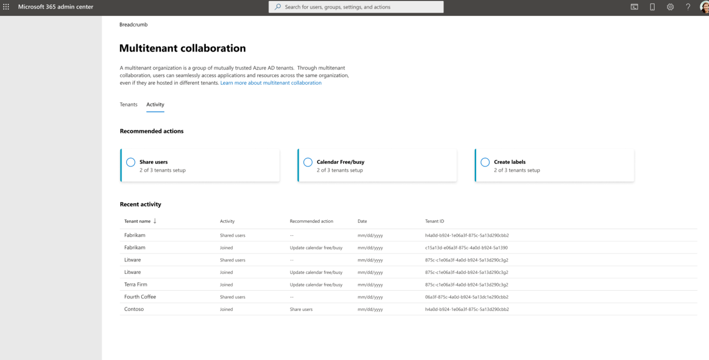
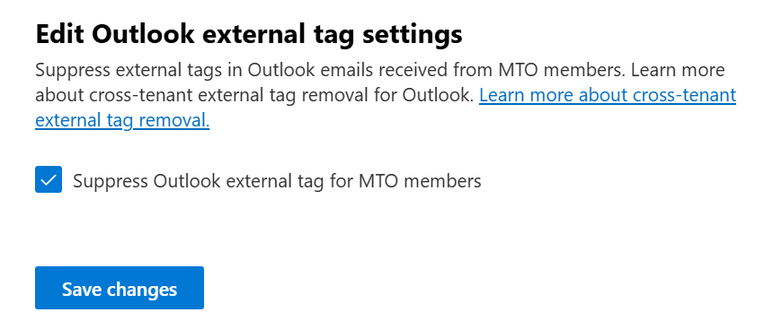

# Manage multitenant org settings

Management of various multitenant org settings can be found in the Microsoft admin center. Some settings may only be managed by owners in the MTO while others can be managed by each tenant themselves. Below are details regarding the available multitenant org settings in the Microsoft Admin center.

## Edit multitenant organization name

Only an owner tenant can edit the MTO name in an MTO.

> [!IMPORTANT]
> Microsoft recommends that you use roles with the fewest permissions. Using least-privileged accounts helps improve security for your organization. Global Administrator is a highly privileged role that should be limited to emergency scenarios when you can't use an existing role.

To edit the multitenant organization name for your MTO:

1. Sign in to the [Microsoft 365 admin center](https://admin.microsoft.com/) as a global administrator.
1. Expand **Settings** and select **Org settings**.
1. On the **Organization profile** tab, select **Multitenant collaboration**.
1. Select **Manage settings**.
1. Select **Edit** under **Multitenant organization name**.
1. Enter the new multitenant org name.
1. Select **Save changes**.

## Edit tenant role for multitenant org tenant

Only an owner tenant can change a tenant's role in an MTO.

> [!IMPORTANT]
> Microsoft recommends that you use roles with the fewest permissions. Using least-privileged accounts helps improve security for your organization. Global Administrator is a highly privileged role that should be limited to emergency scenarios when you can't use an existing role.

To edit the tenant role for a tenant in your MTO:

1. Sign in to the [Microsoft 365 admin center](https://admin.microsoft.com/) as a global administrator.
1. Expand **Settings** and select **Org settings**.
1. On the **Organization profile** tab, select **Multitenant collaboration**.
1. Select the associated tenant for which you would like to change their role.
1. Under Details select **Edit** under **Tenant role**.
1. Select either **Owner** or **Member**.
1. Select **Save changes**.

## Manage calendar sharing for tenants in your MTO
Calendar sharing allows users in each multitenant organization (MTO) tenant to view free/busy (time only) calendar availability information.

> [!NOTE]
> Calendar sharing via Multitenant collaboration portal is currently not available in Microsoft 365 GCC, GCC High, DoD, or Microsoft 365 China (operated by 21Vianet).

> [!IMPORTANT]
> Microsoft recommends that you use roles with the fewest permissions. Using least-privileged accounts helps improve security for your organization. Global Administrator is a highly privileged role that should be limited to emergency scenarios when you can't use an existing role.

To manage free/busy calendar sharing for tenants in your MTO:

1. Sign in to the [Microsoft 365 admin center](https://admin.microsoft.com/) as a global administrator.
1. Expand **Settings** and select **Org settings**.
1. On the **Organization profile** tab, select **Multitenant collaboration**.
1. Select **Manage settings**.
1. Select **Edit calendar settings** under **Calendar**.
1. Select tenants to enable free/busy calendar sharing.
1. Select **Save changes**.

The calendar sharing feature for MTO utilizes [Organization relationships in Exchange Online](/exchange/sharing/organization-relationships/organization-relationships). The organization relationship will share all users calendar availability and must also be set up by the other tenants in your MTO for free/busy information to be shared.

#### Troubleshoot calendar sharing issues

There are a couple of reasons that calendar sharing enablement might not work as it should:

1. "Failed to edit or create an organization relationship with [tenant]. Please try again later"

   1. This error typically only requires a refresh after some time. If error persists, review the setting in [Exchange Online](https://admin.exchange.microsoft.com/#/organizationsharing) to see if there is an existing organization relationship with this tenant.
   
1. "Failed to get all domain names for [tenant]. This is an issue with how [tenant] has their primary domain name configured."

   1. This error typically requires the partner [tenant] to manage the status of their default domain here: [https://admin.microsoft.com/#/Domains](https://admin.microsoft.com/#/Domains). Additional details regarding domain troubleshooting can be found here: [Manage domains ](/microsoft-365/admin/get-help-with-domains/find-and-fix-issues)
   
1. "Failed to create a new organization relationship with [tenant]. This could be due to a duplicate organization relationship." 

   1. Review existing organization relationships in [Exchange Online](https://admin.exchange.microsoft.com/#/organizationsharing) to see if one already exists with this tenant. If organization relationship already exists with [tenant], review settings to ensure it is set up as desired.
   
## Set up MTO user labels in Teams for tenants in your MTO

MTO group admins can now configure an optional label for each tenant that will be displayed alongside MTO synced user's display name in Teams. This allows MTO synced users to be distinguishable within the MTO in Teams interactions. 

> *Fig 1: Teams people card shows MTO user label "US"*

> *Fig 2: Teams search experience shows MTO user label “US”*

Only MTO owners can manage the MTO user labels. Label changes may take some time to process and will only apply to active tenants.

> [!IMPORTANT]
> Microsoft recommends that you use roles with the fewest permissions. Using least-privileged accounts helps improve security for your organization. Global Administrator is a highly privileged role that should be limited to emergency scenarios when you can't use an existing role.

To manage MTO user labels for tenants in your MTO:

1. Sign in to the [Microsoft 365 admin center](https://admin.microsoft.com/) as a global administrator.
1. Expand **Settings** and select **Org settings**.
1. On the **Organization profile** tab, select **Multitenant collaboration**.
1. Select **Manage settings**.
1. Select **Edit** under **Tenant label**.
1. Select either:

   1. No label.
   1. Use the multitenant organization name for all tenants.
   1. Custom (assign a label for each tenant, which cannot be blank).
   
1. Select **Save changes**.

## Manage multitenant org notifications (private preview)

> [!NOTE]
> This is currently only available for private preview.

Admins can opt-in for MTO notifications to ensure they don’t miss any updates or changes to their MTO. Receive email notifications regarding any updates to the MTO such as: a new tenant joined the MTO, a tenant left the MTO, an MTO setting changed (user labels, owner/member role, MTO name), or user sync status changed (Must have full-mesh sync set up via M365 admin center). Email notifications are sent daily, as long as any updates were made to the MTO. No notification is sent if nothing has changed.

Additionally, in the MAC MTO portal you can review the updates and see any Microsoft recommended actions. Opt-in and select the user(s) in your org who you would like to receive the notifications.

> [!IMPORTANT]
> Microsoft recommends that you use roles with the fewest permissions. Using least-privileged accounts helps improve security for your organization. Global Administrator is a highly privileged role that should be limited to emergency scenarios when you can't use an existing role.

To manage MTO notifications:

1. Sign in to the [Microsoft 365 admin center](https://admin.microsoft.com/) as a global administrator.
1. Expand **Settings** and select **Org settings**.
1. On the **Organization profile** tab, select **Multitenant collaboration**.
1. Select **Manage settings**.
1. Select **Edit** under **Email notifications**.
1. Select **Allow email notifications**.
1. Enter the email addresses you would like to receive the notifications.
1. Select **Save changes**.
1. Grant permissions requested in dialog box.

#### Permissions

To enable multitenant org notifications, you must grant application [permissions](/graph/permissions-reference) for the following actions:

These permissions are required to fetch cross-tenant synchronization details and to gather the status of the cross-tenant sync jobs.

- Reading cross-tenant sync information

  - [Application.Read.All](/graph/permissions-reference#applicationreadall)
  
  - [Synchronization.Read.All](/graph/permissions-reference#synchronizationreadall)
  

This permission is required to gather details regarding the multitenant organization.

- Reading MTO details 

  - [MultiTenantOrganization.Read.All](/graph/permissions-reference#multitenantorganizationreadall)

## Manage Outlook external tag removal for MTO members (Private Preview)

> [!NOTE]
> Remove external tag is currently available in private preview and may not be visible in all tenants or Microsoft 365 experiences.

If a tenant has enabled external tags in Outlook to help users identify content from external tenants, MTO group admins can now choose to suppress these tags for members of the multitenant organization. This setting allows for a more seamless collaboration experience and admins can enable this setting in the MAC MTO portal. 

If the tenant hasn't enabled external tags in Outlook, checking the **External tag removal** option will automatically create a remote domain for the partner tenant and mark it as internal (i.e., IsInternal = true), but it won't have effect in end user experience.  In this case, external tags are not displayed to members in MTO. 

