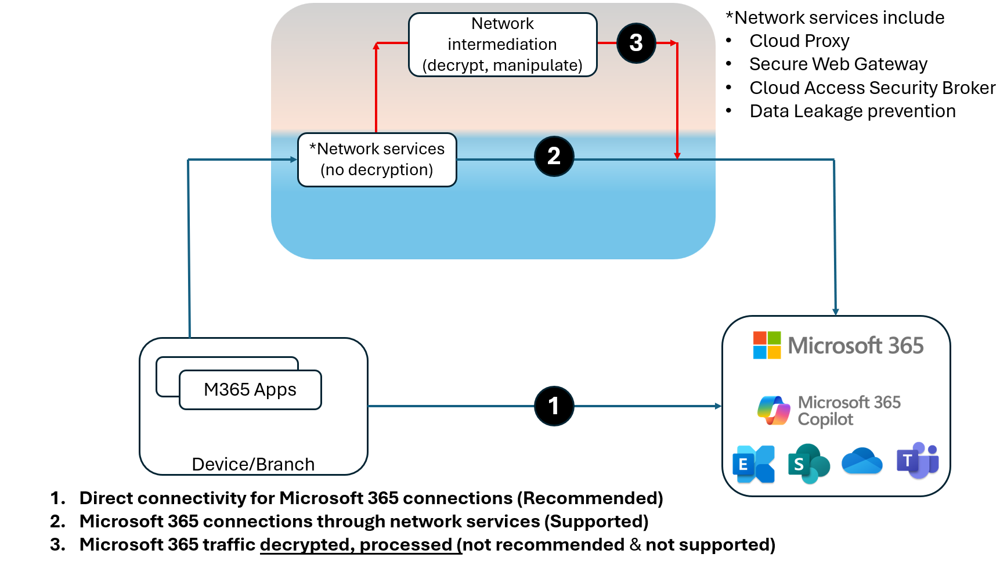

---
# Required metadata
# For more information, see https://learn.microsoft.com/en-us/help/platform/learn-editor-add-metadata
# For valid values of ms.service, ms.prod, and ms.topic, see https://learn.microsoft.com/en-us/help/platform/metadata-taxonomies

title: Understanding implications when using network Intermediation to decrypt or manipulate Microsoft 365 traffic
description: Understanding implications when using network intermediation to decrypt or manipulate Microsoft 365 traffic at the network layer.
author:      roshansabapaty # GitHub alias
ms.author:   roshanp # Microsoft alias
ms.service: microsoft-365-enterprise
ms.topic: article
ms.date:     07/01/2025
ms.subservice: network
---

# Understanding implications when using network intermediation to decrypt or manipulate Microsoft 365 traffic at the network layer.

#### __Summary__

Microsoft 365 is Software-as-a-Service that provides productivity and collaboration opportunities through a distributed set of cloud-hosted applications and services.

The quality and performance of a user's Microsoft 365 experience is directly influenced by the kind of network solutions that users have on the path between the user and Microsoft 365. Third-party network devices and services that do advanced protocol-level and data-level processing and network optimization may interfere with Microsoft 365 client connectivity and affect the availability, performance, interoperability, and supportability of Microsoft 365 to users.

This article outlines Microsoft recommendations and support position for Microsoft 365 users who plan to use advanced network solutions that run active decryption, filtering, inspection functions and other protocol-level or content-level action on Microsoft 365 user traffic. Such solutions include the following:

- WAN acceleration and optimization

- Traffic redirection and inspection devices

- Proxy solutions

- Cloud Access Security Brokers (CASB)

- Secure Web Gateways (SWG)

- Data Leakage Prevention (DLP) systems

- Other network and cloud services

The provisions of this article are focused on Microsoft 365 cloud applications and services, and these provisions do not apply to on-premises based versions of Microsoft products. Microsoft 365 users may see different effects if these provisions are not followed, depending on the kind of Microsoft 365 service.

### __Why You Should Not decrypt or manipulate Microsoft 365 Traffic at the network layer__

#### 

Manipulating Microsoft 365 traffic typically means using a proxy or firewall to decrypt SSL/TLS, scan the data to perform some inspection tasks, then re-encrypt it. Microsoft strongly advises against this for its cloud services. Here’s why:

1. __Preserve End-to-End Integrity:__ Microsoft 365 services expect a direct, secure TLS connection from client to service. Breaking and re-terminating that encryption can disrupt service functionality and reliability. For example, session data might not survive content inspection, causing login loops or errors. The secure channel’s integrity is a design assumption – inserting a device in the middle violates that assumption, often leading to unpredictable issues.

1. __Don’t Undermine Performance & Innovation:__ __Microsoft engineers continually improve Microsoft 365’s protocols__ (e.g. moving from HTTP/2 to HTTP/3 (QUIC), enabling modern TLS features, using WebSockets for live services). If you intercept traffic, you often force the system to fall back to older, slower protocols. For instance, QUIC (HTTP/3) normally speeds up data transfer; an inspecting proxy that doesn’t understand QUIC will prevent its use, degrading performance to legacy HTTP/1.1 or 2. Similarly, WebSocket connections used by apps like Copilot may be blocked or broken by deep inspection, disabling key functionality. In short, inspecting Microsoft 365 traffic can negate years of performance innovation, leaving users with a slower, legacy experience.

1. __New Unified Domains = Known Good Traffic__: Microsoft 365 is consolidating services under dedicated domains like *.cloud.microsoft (for core services), *.static.microsoft (for static content), and *.usercontent.microsoft. Everything on these domains is controlled by Microsoft and requires authentication. This means your network can reliably trust traffic to these domains – it’s not “unknown” internet traffic, but Microsoft’s own cloud. The unified domain effort (drastically reducing the number of endpoints) is specifically to help customers stop treating Microsoft 365 traffic like a risk. If the traffic is headed to *.cloud.microsoft, you can be confident it’s legitimate Microsoft 365 data and not a risky third-party site. Decrypting and inspecting such traffic provides virtually no security gain – it’s already Microsoft-managed, encrypted, and authenticated – but does add latency and potential breakage.

1. __No Lasting Value – Use Built-in Security:__ Microsoft 365 includes extensive, native security features (encryptions, threat detection, data loss prevention, etc.) engineered for its traffic. Inserting your own inspection layer usually duplicates these controls or, worse, interferes with them. There is little long-term benefit to these inspections. In fact, maintaining complex proxy rulesets for Microsoft 365’s ever-updating endpoints is a heavy burden (endpoints can change weekly). It’s far more effective to leverage trust in Microsoft’s cloud security and focus your inspection devices on truly unknown external traffic. As Microsoft bluntly states: there’s no durable value in decrypting Microsoft 365 traffic – it only adds cost and complexity for customers, without appreciable security improvement.

In summary, decrypting Microsoft 365 traffic harms more than helps: It breaks things, slows performance, and wastes effort on already-secure traffic.

#### __Impact Examples: Copilot and QUIC _(Why It Matters to Users)___

Real-world examples show how inspecting Microsoft 365 can directly hurt user experience:

- __Copilot__ — Microsoft 365 Copilot relies on WebSocket Secure (WSS) connections to maintain a live chat and AI feed. Many proxies either don’t handle WebSockets or they inspect them in a way that disrupts the connection. If your network is intercepting traffic, Copilot’s WebSocket calls can fail, rendering Copilot essentially nonfunctional. Users might click the Copilot icon and get nothing, because the live connection can’t establish. The Microsoft 365 admin center now specifically checks for this condition (failed WSS connections) and will flag if Copilot is likely being blocked by a network device. The takeaway: a security device in the middle can break cutting-edge features that users need.

- __QUIC / HTTP3 Performance__ — Microsoft Outlook and other services use QUIC (HTTP/3 over UDP) to improve latency and throughput. QUIC is especially beneficial on high-latency or variable networks (it reduces handshakes and is more tolerant to packet loss). An inspecting device often blocks or can’t decrypt QUIC, forcing clients to drop to TLS over TCP. This _eliminates_ the speed advantages of QUIC. Users on such networks may see slower experience, not knowing their network forced a downgrade. Even without QUIC, any man-in-the-middle adds extra delay (terminating and re-originating connections takes time) and CPU overhead, which can introduce noticeable lag, especially in real-time apps like Teams.

These examples illustrate a broader point: Microsoft designs its cloud and clients to work together optimally. A proxy in the middle is not part of that design – it’s an element that tends to muck things up__.__

#### __Network Insights in admin center: Detecting Problematic patterns like decryption of Microsoft 365 traffic at the network layer__

Microsoft provides tools to help admins discover if their network is misconfigured for Microsoft 365. Network Insights in the Microsoft 365 Admin Center surfaces telemetry about your users’ connectivity. Two relevant insights are:

- __“Decryption/Encryption of Microsoft 365 traffic detected”__ – Microsoft can often detect when large amounts of your tenant’s traffic appear to be proxied or tampered with. If 30% or more of Microsoft 365 requests from a location show signs of network intermediation, an insight alert is generated. It essentially warns: “A network device is decrypting your Microsoft 365 traffic.” This alert is usually accompanied by guidance to stop doing that (i.e. bypass the proxy for these endpoints). It may even identify the likely proxy vendor involved (when possible) so you know where to look.

- __“Copilot impacted by WebSocket failures”__ – As mentioned, if the service sees that WebSocket connections are failing or being reset, the portal can flag that “network devices may be blocking required connections” for apps like Copilot. This shows up as an insight tying network issues to specific feature impact (e.g., _Copilot isn’t working due to network interception_).

These insights appear on the __[Microsoft 365 connectivity dashboard](https://admin.cloud.microsoft/#/networkperformance)__ in the Admin Center and are also delivered via Service Health notifications. They give IT admins a heads-up that something in the network is interfering with Microsoft 365 – and often point to inspection as the culprit. This proactive visibility is extremely helpful; it takes the guesswork out of diagnosing “why is Microsoft 365 slow here?”

_(See reference: [Microsoft 365 Network Insights - Microsoft 365 Enterprise | Microsoft Learn](/microsoft-365/enterprise/office-365-network-mac-perf-insights?view=o365-worldwide))_

#### __Conclusion and Key Takeaways__

Invest in a network path that trusts Microsoft 365’s security and optimizes performance, instead of trying to inspect it yourself. Microsoft has made it clear: the best way to secure Microsoft 365 is to use Microsoft 365’s built-in capabilities, and the best way to deliver Microsoft 365 is via direct, unfiltered connectivity. Organizations that continue to funnel Microsoft traffic through legacy SSL break-and-inspect systems will pay a price in user experience – slower performance, broken features, and more complaints – all for negligible security benefit.

- _Treat Microsoft 365 traffic as trusted._ Use Microsoft’s published endpoints to identify it, and allow it to bypass your generic internet filters. This doesn’t mean no security – it means relying on Microsoft 365’s security (which is very robust) instead of yours for that traffic.

- _Egress locally, connect directly._ Aim for every office (and even home users) to connect to Microsoft 365 without hairpins. This often means provisioning local internet breakout and DNS resolution. The result is users connect to Microsoft’s network at a nearby point, often resulting in 50%+ latency reduction versus tromboning through a distant HQ.

- _Don’t break what you’re trying to protect._ Intercepting Microsoft 365 traffic is well-intentioned (you want to scan for threats), but Microsoft 365 already has those protections. By intervening, you actually _reduce_ security (end-to-end encryption is weakened) and performance. Instead, allocate those security devices to inspect unknown web traffic or third-party services where they are truly needed.

- _Use Microsoft’s monitoring._ Leverage tools like the __[Microsoft 365 connectivity dashboard](https://admin.cloud.microsoft/#/networkperformance)__ in the Admin Center. Microsoft can often tell you if your network setup is suboptimal for Microsoft 365. If you see an insight about TLS decryption – act on it. Microsoft wouldn’t flag it if it wasn’t important.

By following these guidelines, you’ll improve user satisfaction, reduce support issues, and still maintain a strong security posture. Microsoft 365 will perform as designed, and your security team can focus on real threats. In a cloud-first world, networking has to adapt – and that adaptation is to stop treating Microsoft’s cloud as an unknown stranger. It’s a part of your trusted infrastructure, so let it operate as such.

