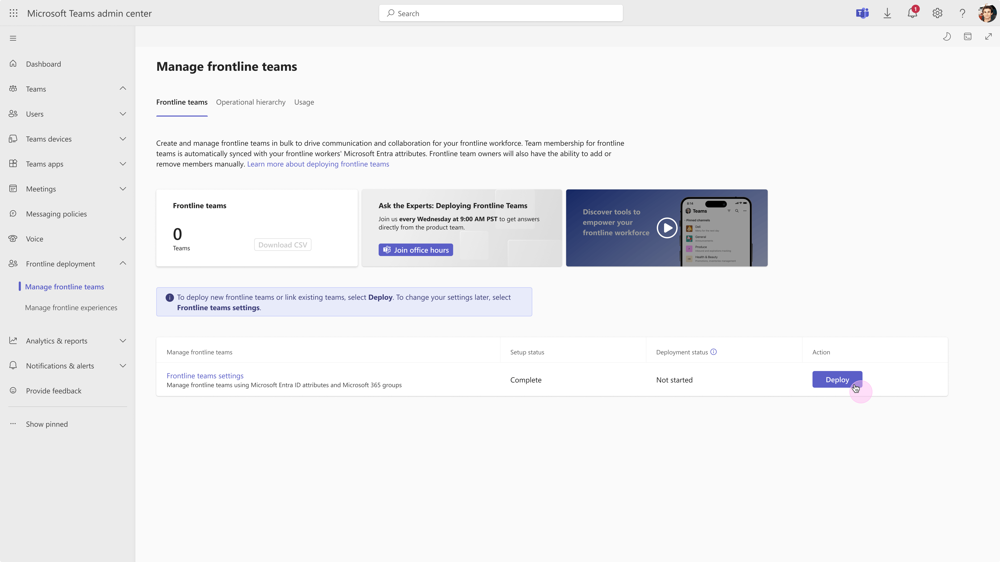

---
# Required metadata
# For more information, see https://learn.microsoft.com/en-us/help/platform/learn-editor-add-metadata
# For valid values of ms.service, ms.prod, and ms.topic, see https://learn.microsoft.com/en-us/help/platform/metadata-taxonomies

title: Link your existing frontline teams to be managed with flexible membership
description: Take advantage of flexible membership by linking your existing teams to the frontline workforce management tool on the Manage frontline teams page.
author:      arnavgupta49 # GitHub alias
ms.author: arnavgupta
ms.service: microsoft-365-frontline
ms.topic: how-to
ms.date:     04/28/2025
---

# Link your existing frontline teams to be managed with flexible membership

## Overview

Save time and enhance the way you manage your existing frontline teams with flexible membership. When you link your existing teams to the frontline workforce management tool on the Manage frontline teams page, membership is automatically synced with your frontline workers’ Microsoft Entra attributes. Additionally, frontline managers can manually add or remove members on their teams.

Existing team members are not removed when you link teams. Monitor usage of Teams and other frontline apps on the **Usage** tab of the **Manage frontline teams** page.

## How it works

1. Complete all the steps to set up your frontline team settings that include identifying frontline workers, managers, and an attribute by which your frontline workers are grouped. Our tool generates a list of frontline locations that exist in your organization based on these inputs.

1. Link your existing frontline teams to discovered frontline locations from the setup process by uploading a CSV that includes the team IDs of your existing frontline teams.

## Linking your existing frontline teams

1. After you follow the instructions to set up your frontline team settings, click on **Deploy** on the Manage frontline teams page.

1. View your discovered frontline locations on the **Deploy or link frontline teams** page. Start linking your teams to these locations by clicking the **Link existing teams** tab.

1. 

1. On the Link existing teams tab, click on **Get started**.

## Uploading your CSV

1. Begin by downloading the CSV template, which have all your identified frontline locations already populated in the first column under **Locations**.

1. Enter the team IDs for each frontline location you wish to associate with a team in the **Team ID** column. Leave the Team ID field blank for any locations where you do not wish to link teams. You can always come back and link teams to more locations.

> [!IMPORTANT]
> Ensure all Team IDs are for static groups. Convert dynamic groups to static before uploading the CSV to avoid errors.

1. To take advantage of flexible membership, where the membership of frontline teams is synced to the frontline workers' Entra attributes and frontline managers can manually add or remove team members, enter TRUE under the **FlexibleMembership** column next to each team ID. Existing team members are not removed if you opt in for flexible membership.

> [!IMPORTANT]
> If you set **FlexibleMembership** to FALSE, no membership changes occur on your behalf. However, you can still track your frontline teams' usage on the Usage tab of the Manage Frontline Teams page.
1. Upload your CSV and click **Link**.

1. Refresh the Manage frontline teams page to check if linking is complete. The Link status shows the last linked date. Click **Deploy** again to link more teams, following the same steps.

## Get analytics on frontline teams usage

The [Teams frontline usage report](/microsoft-365/frontline/frontline-usage-report?view=o365-worldwide) on the usage dashboard of the Manage frontline teams page gives you an overview of usage activity in Teams for each of your frontline locations. You can view data, such as the number of active users, last activity date, active users on Walkie Talkie, etc. to quickly see how many users at your frontline locations are using Teams to communicate and collaborate.

 
