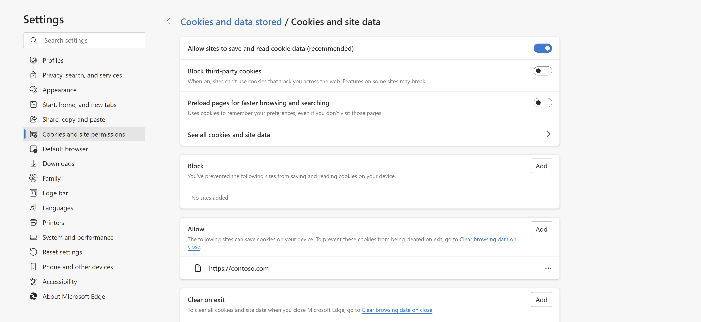

# Allow cookies for LMS URLs in your browser

Learning Management Systems (LMS) need third-party browser cookies to complete the LTI 1.3 handshake, according to IMS Global standards. This means your browser settings need to allow third-party cookies for the LMS URL when you're launching an LTI tool.

For more information on Microsoft's LTI capabilities, see [Integrating Microsoft products with your Learning Management System](index.md).

Here are the steps to allow the cookies in your browser.

## Allow cookies for LMS URLs in Microsoft Edge

1. In the Edge **Settings** window, select **Cookies and site permissions** > **Cookies and data stored** > **Manage and delete cookies and site data**.
1. Turn on **Allow sites to save and read cookie data (recommended)**.
1. Make sure **Block third-party cookies** is turned off.

If you need to keep third-party cookies blocked:

1. In the Edge **Settings** window, select **Cookies and site permissions** > **Cookies and data stored** > **Manage and delete cookies and site data**.
1. Under **Allow**, select **Add** to add the domain URL of the LMS platform.
   1. For example, if the LMS platform is hosted at `https://contoso.com`, then that URL needs to be added in the **Allow** section.

## Allow cookies for LMS URLs in Google Chrome

1. In the Chrome **Settings** window, select the **Privacy and security** tab and then **Third-party cookies**.
1. Select the option for **Allow third-party cookies**.

If you need to keep third-party cookies blocked:

1. Under **Customized behaviors**, select **Add**.
1. Add the domain URL of the LMS platform.
   1. For instance, if the LMS platform is hosted at `https://contoso.com`, then that URL needs to be used.

## Allow cookies for LMS URLs in Mozilla Firefox

1. In the Firefox **Settings** window, select the **Privacy & Security** tab.
1. Under **Cookies and Site Data**, select **Manage Exceptions**.
1. In the **Address of website** text box, enter the URL of the LMS platform.
   1. For instance, if the LMS platform is hosted at `https://contoso.com`, then that URL needs to be used.
1. Select **Allow** to allow cookies for the website.
1. Select **Save Changes**.

## Allow cookies for LMS URLs in Safari

1. In *Settings* you select the Safari app.
1. Go to the **Privacy & Security** section.
1. Turn off the option for **Prevent cross-site tracking**.

> [!NOTE]
> If you can't change the settings yourself because your browser is managed by your organization, reach out to your IT department to let them know what you need.
