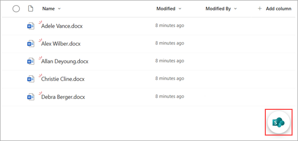
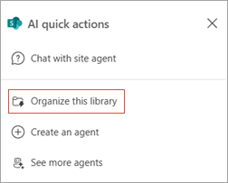
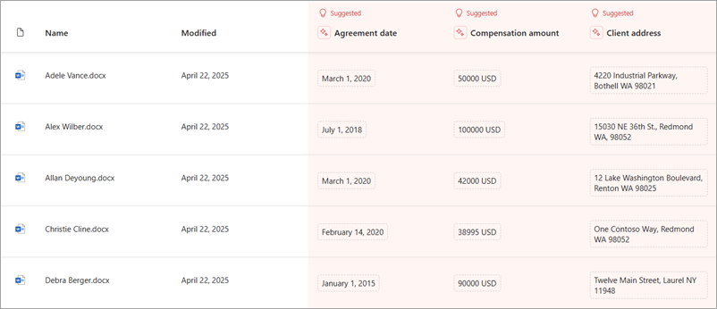
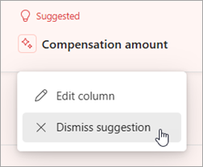
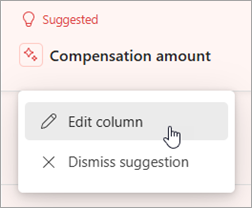
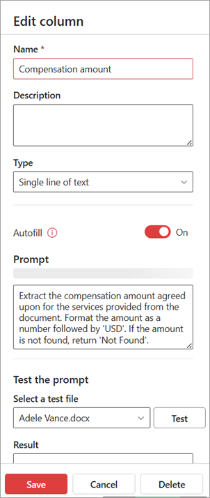

# Organize and automate columns in a SharePoint document library

> [!NOTE]
> This article is in development.

<!---
Having useful columns and metadata in SharePoint document libraries enhances searchability, organization, and automation. It allows users to quickly find documents, group and filter files dynamically, and trigger workflows based on specific attributes. Additionally, it improves content discoverability and user experience by providing structured information and enabling efficient management of document libraries.

This feature integrates with the autofill columns service to streamline your workflows using content from your SharePoint document libraries. It recommends and creates new columns and metadata, unlocks advanced automations, and enhances search capabilities, understanding, and information protection. This helps ensure that the information in your document libraries remains easily accessible, relevant, well-organized, and up-to-date.
--->

You can use the SharePoint Agent Librarian Skill to create richer, more powerful document libraries to manage your content.

Building on the autofill columns feature, this agent skill simplifies the process of configuring a document library and ensures consistent and accurate data capture. Recommended metadata columns enhance library-scoped agent Q&A and will soon be used to suggest rule-based flows to streamline business processes. This approach to automating document management keeps your SharePoint libraries organized, relevant, and up-to-date.

## Suggest and create columns

To get suggested columns in your document library, follow these steps.

1. In the lower-right corner of your document library, select the **Open agent quick actions** icon.

   

2. From the **Agents in SharePoint** menu, select **Organize this library** to launch the process.

   

3. It takes a few moments for the suggested new columns to appear based on the content of your library. Suggested columns are highlighted and shown as **Suggested**.

   

4. Evaluate whether the suggested columns and the associated metadata are appropriate for your content.

5. If you want to remove a suggested column, select the column name, and then select **Dismiss suggestion**.

   

6. If you want to rename the column or to refine the metadata in a suggested column to get a better result, you can edit the prompt. To do so, select the column name, and then select **Edit column**.

   

7. On the **Edit column** panel, you can edit the column name or edit the prompt that generates the metadata. After you edit the prompt, test the prompt to make sure it gives you the information you want. When you're done, select **Save**.

   

8. If you want to apply the suggested columns to the document library, select **Save changes**.

## Planned capabilities coming soon

- Chat with column creation support​
- Select rule automation support via chat​
- Classification support
- New library flow​
- Metadata view creation​
- Classification grounding support

## Help us improve this feature

Your feedback and suggestions can help us to refine this feature to meet your needs. Submit suggestions by using this [bug template](https://onedrive.visualstudio.com/ODSP%20Product%20Experiences/_workitems/create/Bug?templateId=c70796a2-07d9-4045-9ae7-57b0a493a290&ownerId=e1686dd0-4520-4f7f-9947-34d07bf00b0a) and provide feedback by taking this [brief survey](https://forms.office.com/Pages/DesignPageV2.aspx?subpage=design&token=bc020eefeadd43cfb107a4e3443594b1&id=v4j5cvGGr0GRqy180BHbR_PzshIK4BNFl0DNg2VJeqVUMjZWOTZYN0lUNU45SlVFWlNCUjBYR0E2Mi4u).