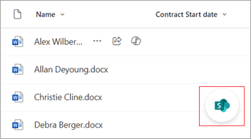
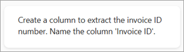
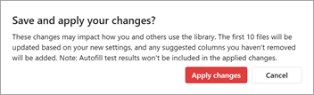

# Organize and automate columns in a SharePoint document library

You can use the SharePoint Agent Librarian Skill to create richer, more powerful document libraries to manage your content.

Building on the autofill columns feature, this agent skill simplifies the process of configuring a document library and ensures consistent and accurate data capture. Recommended metadata columns enhance library-scoped agent chat and are also used to suggest rule-based flows that streamline business processes. This approach to automating document management keeps your SharePoint libraries organized, relevant, and up-to-date.

## Suggest and create columns

To get suggested columns in your document library, follow these steps.

### Launch the quick action

1. In the lower-right corner of your document library, select the **Open AI quick actions** icon.

   

2. From the **AI quick actions** menu, select **Organize this library**.

   

3. The chat panel opens and displays a list of suggested actions related to columns that you can try.

   

### Use a suggested action

1. From the chat panel, select one of the suggested actions. For this example, we selected **Create columns**.

2. It takes a few moments for the suggested new columns to appear based on the content of your library. Suggested columns are highlighted and shown as **Suggested**.

   

3. Review the suggested columns and the associated metadata to make they're appropriate for your content.

4. If you want to remove a suggested column, select the column name, and then select **Dismiss suggestion**.

   

5. If you want to rename the column or to refine the metadata in a suggested column to get a better result, you can edit the instruction. To do so, select the column name, and then select **Edit column**.

   

6. On the **Edit column** panel, you can edit the column name or edit the instruction that generates the metadata. After you edit the instruction, test it to make sure it gives you the information you want. When you're done making changes for that column, select **Save**.

   

### Enter a custom action

1. In the text box in the lower portion of the chat window, enter your own instructions.

   

2. Press **Enter** to submit the action and initiate the suggestion flow based on your custom request.

### Save your changes

1. When you're ready to save all of the column changes, select **Save changes**.

2. On the **Save and apply your changes?** confirmation screen, select **Apply changes**.

   

## Planned capabilities coming soon

- Select rule automation support via chat​
- Classification support
- New library flow​
- Metadata view creation​
- Classification grounding support

## Help us improve this feature

Your feedback and suggestions can help us to refine this feature to meet your needs. Submit suggestions by using this [bug template](https://onedrive.visualstudio.com/ODSP%20Product%20Experiences/_workitems/create/Bug?templateId=c70796a2-07d9-4045-9ae7-57b0a493a290&ownerId=e1686dd0-4520-4f7f-9947-34d07bf00b0a) and provide feedback by taking this [brief survey](https://forms.office.com/Pages/DesignPageV2.aspx?subpage=design&token=bc020eefeadd43cfb107a4e3443594b1&id=v4j5cvGGr0GRqy180BHbR_PzshIK4BNFl0DNg2VJeqVUMjZWOTZYN0lUNU45SlVFWlNCUjBYR0E2Mi4u).