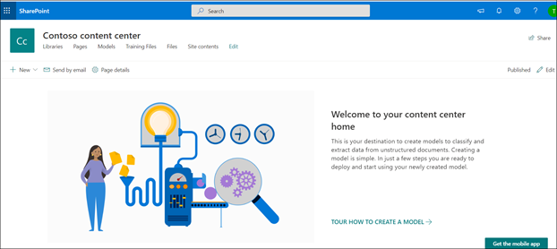

# Create a content center in Microsoft Syntex

**Applies to:**  &ensp; &#10003; All custom models &ensp; | &ensp; &#10003; All prebuilt models

<!--- 

> [!VIDEO https://learn-video.azurefd.net/vod/player?id=b5dd658f-4416-4e80-9e56-a9c57902945d]

 --->

To create and manage enterprise models, you first need a content center. The content center is the model creation interface and also contains information about which document libraries published models have been applied to.

You create a default content center during [setup](set-up-content-understanding.md). But a SharePoint admin can also choose to create additional centers as needed. While a single content center might be fine for environments for which you want a roll-up of all model activity, you might want to have additional centers for multiple departments within your organization, which might have different needs and permission requirements for their models.

   

Additionally, if you want to try Syntex, you can create a content center using the instructions in this article without purchasing licenses. Unlicensed users can create models but can't apply them to a document library.

> [!NOTE]
> In a [Microsoft 365 Multi-Geo environment](../enterprise/microsoft-365-multi-geo.md), if you have a single default content center in your central location, you can only provide a roll-up of model activity from within that location. You currently cannot get a roll-up of model activity across farm-boundaries in Multi-Geo environment. 

## Create a content center

A SharePoint admin can create a content center site like they would [create any other SharePoint site](/sharepoint/create-site-collection) through the admin center site provisioning panel.

To create a new content center:

1. On the Microsoft 365 admin center, go to the <a href="https://go.microsoft.com/fwlink/?linkid=2185220" target="_blank">**SharePoint admin center** > **Active sites**</a>.

2. On the **Active sites** page, select **Create**, and then select **Browse more sites**.

3. On the **Choose a template** menu, select **Content center**.

4. For the new site, provide a **Site name**, **Primary administrator**, and a **Language**.

5. Select **Finished**.
 
After you create a content center site, you'll see it listed on <a href="https://go.microsoft.com/fwlink/?linkid=2185220" target="_blank">**Active sites**</a> in the SharePoint admin center.

### Give access to additional users
 
After you create the site, you can give additional users access to the site through the standard [SharePoint site permissions model](/sharepoint/modern-experience-sharing-permissions).

### Roll up of models in the default content center

In Syntex, the first content center created during setup is the *default content center*. If subsequent content centers are created, their models are shown in the default content center view.

The **Models** library in the default content center view groups the created models by content center for a summary view of all models that have been created.

> [!NOTE]
> You can't change the designated default content center. It's always the first content center created during setup. 
