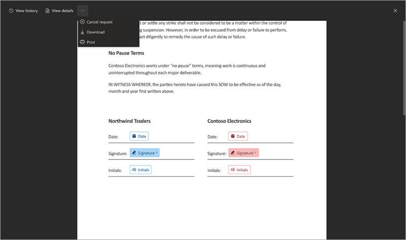
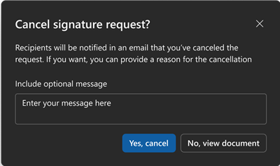

# Cancel a signature request from PDF or Word in SharePoint eSignature

If you create a signature request and want to cancel it, follow these steps.

1. From one of your email notifications, select **View Request**.

2. When the document is open in the document viewer, select **More options** (...), and then select **Cancel request**.

    

3. On the **Cancel signature request** confirmation screen, enter a message detailing why the request is canceled if needed, and then select **Yes, cancel**.

    

    Once canceled, the status of the request is set to **Canceled** and recipients receive an email notification telling them that the request was canceled and that no further action is possible on this request.

<!---
 

> [!div class="nextstepaction"]
> [Review and sign a request](esignature-review-sign-requests.md)--->
