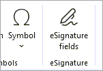
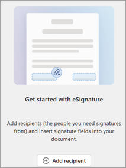
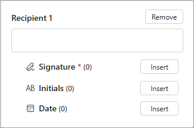
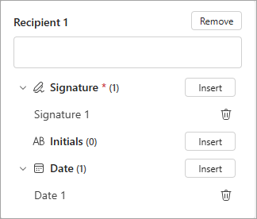
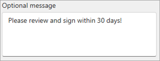

# Create a signature request from Word in SharePoint eSignature

> [!NOTE]
> This feature begins rolling out to users on the Microsoft 365 Beta and Current Channels at the end of May. To get access to the feature, ensure your admin has completed [these steps to allow signature requests in Microsoft Word](esignature-setup.md#allow-signature-requests-in-microsoft-word).

When you request electronic signatures from Word, the recipients sign a PDF copy of the Word document.

- Recipients don't access the source Word document during the signing process.
- Recipient information, such as an email address, isn't stored in the Word document.
- Upon completion of signing, the signed PDF is stored in the same location as the Word document.
- Requests can be sent from editable Word documents and read-only Word documents that have prepositioned eSignature fields placeholders.

## SharePoint eSignature for Word scenarios

- Create a request directly from a Word document. 
- Reuse the same document to create multiple requests.
- Create a template with prepositioned eSignature fields.
- Create a request from an eSignature template.
- Allow multiple users to create requests in parallel.

## Prerequisites

- A subscription version of Word desktop.
- User is on the Microsoft 365 Beta Channel or Current Channel.
- The document is stored in a SharePoint library.
- The document is in the .docx format.
- The document is unencrypted.

## Create a signature request from Word

Follow these steps to use SharePoint eSignature for Microsoft Word.

1. Open a document from a SharePoint eSignature enabled site in Word (Desktop).

2. On the Word **Insert** ribbon, select **eSignatures fields**.

    

3. From the side panel, select **Add recipient**.

    

4. Add one or more recipients to sign the document.

    

5. Select the document location where you want to add an eSignature field. From the side panel, select **Insert** to add signature fields to the document.

6. The fields are inserted at the location of the insertion point in the document canvas.

7. Repeat step 5 for all fields you want to be inserted into the document.

    

8. Optionally, you can add a message to the recipient.

    

9. Select **Create request**.

    

10. You will recieve a mail confirmation the request was sent and recipients will receive a link in mail to sign a PDF of the Word document.

11. You can now close the eSignature panel in Word or select **Start new request** to create another eSignature request.

 

> [!div class="nextstepaction"]
> [Review and sign a request](esignature-review-sign-requests.md)
