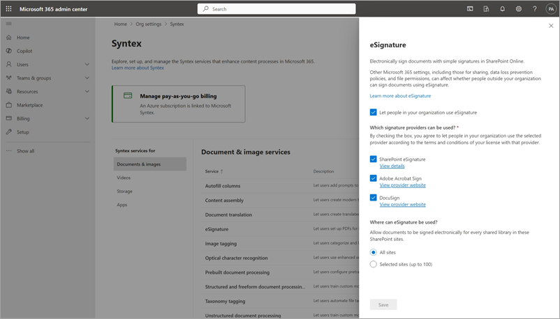

# Set up SharePoint eSignature

> [!NOTE]
> SharePoint eSignature is available in selected regions. If a tenant's location is a supported region, SharePoint eSignature is available for that tenant. For multi-geo enabled tenants in supported regions, eSignature is available in the home geo only. SharePoint eSignature rolls out to [other regions](esignature-overview.md#regional-availability) later this year.

SharePoint eSignature is a pay-as-you-go service that is set up in the Microsoft 365 admin center. Before you begin, determine whether this feature is appropriate for your needs by reading the [Before you begin section](esignature-overview.md#before-you-begin).

## SharePoint eSignature admin checklist

- Review prerequisites
- Set up SharePoint eSignature
- Add other signature providers
- Manage sites
- Enable new external guests or default to existing guests only 

## Prerequisites

### Licensing

Before you can use SharePoint eSignature, you must first link an Azure subscription in [Syntex pay-as-you-go](syntex-azure-billing.md). SharePoint eSignature is billed based on the [type and number of transactions](syntex-pay-as-you-go-services.md).

### Permissions

You must be a [SharePoint Administrator](/entra/identity/role-based-access-control/permissions-reference#sharepoint-administrator) or [Global Administrator](/entra/identity/role-based-access-control/permissions-reference#global-administrator) to be able to access the Microsoft 365 admin center and set up SharePoint eSignature.

[!INCLUDE [global-administrator-note](../includes/global-administrator-note.md)]

> [!NOTE]
> If you're requesting signatures from external recipients, you need to enable [Microsoft Entra B2B integration for SharePoint and OneDrive](/sharepoint/sharepoint-azureb2b-integration) and [guest sharing](/microsoft-365/solutions/collaborate-in-site). External recipients are people outside your organization and would be onboarded as guests into your tenant. Microsoft Entra B2B provides authentication and management of guests. For more information, see [External recipients](#external-recipients) later in this article.

## Set up SharePoint eSignature

To let people in your organization use SharePoint eSignature, follow these steps.

1. In the Microsoft 365 admin center, select <a href="https://go.microsoft.com/fwlink/p/?linkid=2171997" target="_blank">**Settings > Org settings**</a>.

2. On the **Org settings** page, select **Pay-as-you-go services**.

3. On the **Pay-as-you-go services** page, select the **Settings** tab.

4. Under **Document & image services**, select **eSignature**.

5. On the **eSignature** panel, select **Let people in your organization use eSignature**.

Once configured, several background processes automatically begin to integrate the feature seamlessly into your existing Microsoft 365 tenant and services. These processes include data synchronization, configuration updates, and performance optimizations. SharePoint eSignature will be fully operational within 24 hours of activation.

### Add other signature providers

To select which signature providers to use, follow these steps.

1. On the **eSignature** panel, in the **Which signature providers can be used?** section, select the providers you want to use.

    

2. Select **Save**.

> [!NOTE]
> Although [pay-as-you-go billing](syntex-azure-billing.md) must be set up to use eSignature, you aren't charged for using other signature providers.

### Allow signature requests in Microsoft Word

To let users use SharePoint eSignature in Word, you need to [turn on the Word feature](#turn-on-the-word-feature) and [apply the group policy](#apply-the-group-policy).

#### Turn on the Word feature

1. On the **eSignature** panel, in the **Which apps can use SharePoint eSignature?** section, select **Word (Desktop)**.

    

2. Select **Save**.

#### Apply the group policy

The **Allow the use of SharePoint eSignature for Microsoft Word** group policy setting controls whether users can request eSignatures directly from Word in tenants that have enabled the Microsoft native eSignature service. If the policy is inactive or not applied, the eSignature action isn't visible and invokable on the **Insert** ribbon in Word.

1. Acquire and deploy the **Allow the use of SharePoint eSignature for Microsoft Word** group policy via the standard methods of:

    - Cloud Policy service for Microsoft 365
    - Microsoft Intune
    - Group Policy Manager

    Or, acquire the policy via the Microsoft Download Center: [Administrative Template files (ADMX/ADML) for Microsoft Office](https://www.microsoft.com/en-us/download/details.aspx?id=49030).

2. Apply the policy setting.

3. *[Include guidance on PowerShell or regkey application?]*

### Manage sites

To specify the sites where users can use eSignature, follow these steps.

1. On the **eSignature** panel, in the **Where can eSignature be used?** section, select **All sites** or **Selected sites (up to 100)**. Follow the instructions to either select the sites or upload a CSV listing a maximum of 100 sites. Be sure to add your content center site if you want it to be included. You can then manage site access permissions for the sites you selected.

2. Select **Save**.

> [!NOTE]
> The first eSignature request in a Microsoft 365 tenant might take a little longer to execute than usual. It can take a few seconds to a few minutes; however, subsequent requests are executed normally. We recommend that admins create the first eSignature request in a SharePoint site as the final setup step.

### Turn off eSignature

1. On the **Pay-as-you-go services** page, select the **Settings** tab.

2. Under **Document & image services**, select **eSignature**.

3. On the **eSignature** panel, clear the **Let people in your organization use eSignature** check box.

## External recipients

### Microsoft Entra B2B

Microsoft Entra B2B provides authentication and management of **new guests**. External signers or recipients are considered as guests within your tenant. To be able to send requests to **new signers** outside your organization, you need to enable [Microsoft Entra B2B integration for SharePoint and OneDrive](/sharepoint/sharepoint-azureb2b-integration). Consider whether this meets your compliance and security requirements when enabling eSignature.

If a guest is deleted from the tenant while the request is ongoing, they can no longer access the request document or the final signed document. In such cases, you need to resend the eSignature request. Before deleting a guest, ensure they aren't involved in any ongoing requests. This setting doesn't affect your existing Microsoft Entra ID guests.

### Authentication

External recipients might need to authenticate before they're able to access a document for signing. The type of authentication required by the external recipients depends on the configuration for guests at the SharePoint level or at the tenant level. Additionally, if the guest belongs to an organization with a Microsoft 365 tenant, it's possible for their organization's setup to affect their authentication experience when attempting to sign the document. For more information, see [Collaboration with guests in a site](/microsoft-365/solutions/collaborate-in-site).

### Conditional access

Certain [conditional access](/entra/identity/conditional-access/overview) might determine whether external recipients (signers outside of your organization or Microsoft 365 tenant) are able sign a document. Depending on the admin setup, external signers might not be able to access and read the document for signing. In some other cases, they might be able to access the document for signing, but the signing operation is unsuccessful. One common way to resolve this issue is to add **SharePoint eSignature** (formally called **Microsoft eSignature Service**) to the list of approved apps via the Microsoft Entra admin center.

> [!NOTE]
> When you use other electronic signature providers, settings within Microsoft 365 don't affect whether you can send requests outside to external recipients.

## Document storage and retention

### Document storage

SharePoint eSignature lets a requester start a signature request from a PDF document that is saved in a SharePoint library on which eSignature is enabled. After all required parties have signed, the SharePoint eSignature service saves a copy of the signed document to the folder of the original document (originating folder). The sender is notified in an email that includes a link to view the document and a separate link to the SharePoint folder where the signed document was saved.

Before a signature request is sent and at the completion of the request, certain checks are done to ensure that the sender has the permission to write to the document and the originating folder. If the permission changes when the signature request is in progress, the service might not be able to save a copy of the signed document in the originating folder. This event can happen when:

- The sender of the request no longer has access to the originating folder. For example, the owner of the originating folder or a SharePoint admin has revoked the sender's access.

- Initial write permission of the sender to the originating folder was downgraded to view only.

- The originating folder was deleted.

### Document retention

When a signature request is created for a document in SharePoint, the SharePoint eSignature service creates a working copy of the document. It's this working copy that is sent out to all recipients for signing, and it's how the sender can track the status of their requests. The working copy of the request is stored in a hidden document library in SharePoint. The signature will be added to the working copy of the request document only after all parties have signed. If any party hasn't signed, the document appears as unsigned, even if one party has already added their signature.

The working copy of the request is stored and retained for five years, or according to the document retention policy established by the SharePoint or tenant admin. Learn more about [retention policies](/purview/retention-policies-sharepoint).

### Expiration of URL links in email

Every email notification sent in relation to a signature request contains a URL link that allows the recipient to view, review, and sign the document. When a request reaches a terminal state (when the status is **Completed**, **Canceled**, or **Declined**), the recipient has 30 days to view, download, and store the document in a preferred location. After the link expires, it can no longer be used to access the document.
  
For more protection, when a sender cancels a request, recipients immediately lose access to the request document. The email notification received by recipients won't contain a URL link to view the request.

### Other electronic signature providers

At the end of the signing process when all required parties have signed, a copy of the signed document is automatically saved to SharePoint. The signed document is saved to a provider-specific folder of a special **Apps** folder in SharePoint. Every document library has a provider-specific folder where all documents signed by using that provider are saved. The signed document is stored in the folder path *Document library\Apps\Signed documents\Provider*.

> [!NOTE]
> How long a copy of the signed document is retained in the other provider's platform depends solely on your document storage and retention policy settings for that provider service.
