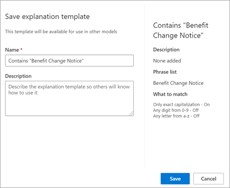

# Use explanation templates for document processing in SharePoint

**Applies to:**  &ensp; &#10003; Unstructured document processing 

While you can manually add various phrase list values for your explanation, it can be easier to use the templates provided to you in the explanation library.

For example, instead of manually adding all the variations for *date*, you can use the phrase list template for *date* because it already includes many phrase lists values:

The explanation library includes commonly used *phrase list* explanations, including:

- Date: Calendar dates, all formats. Includes text and numbers (for example, "Dec 9, 2022").
- Date (numeric): Calendar dates, all formats. Includes numbers (for example, 1-11-2022).
- Time: 12-hour and 24-hour formats.
- Number: Positive and negative numbers up to two decimals.
- Percentage: A list of patterns representing a percentage. For example, 1%, 11%, 100%, or 11.11%.
- Phone number: Common US and International formats. For example, 000 000 0000, 000-000-0000, (000)000-0000, or (000) 000-0000.
- Zip code: US Zip code formats. For example, 11111, 11111-1111.
- First word of sentence: Common patterns for words up to nine characters.
- End of sentence: Common punctuation for end of a sentence.
- Credit card: Common credit card number formats. For example, 1111-1111-1111-1111.
- Social security number: US Social Security Number format. For example, 111-11-1111.
- Checkbox: A phrase list representing variations on a filled in checkbox. For example, _X_, __X_.
- Currency: Major international symbols. For example, $.
- Email CC: A phrase list with the term 'CC:', often found near the names or email addresses of other people or groups the message was sent to.
- Email date: A phrase list with the term 'Sent on:', often found near the date the email was sent.
- Email greeting: Common opening lines for emails.
- Email recipient: A phrase list with the term 'To:', often found near the names or email addresses of people or groups the message was sent to.
- Email sender: A phrase list with the term 'From:', often found near the sender's name or email address.
- Email subject: A phrase list with the term 'Subject:', often found near the email's subject.

The explanation library also includes commonly used *regular expression* explanations, including:

- 6-digit to to 17-digit numbers: Matches any number from 6 to 17 digits long. US bank account numbers fit this pattern.
- Email address: Matches a common type of email address like meganb@contoso.com.
- US taxpayer ID number: Matches a three-digit number starting with 9 followed by a 6 digit number starting with 7 or 8.
- Web address (URL): Matches the format of a web address, starting with http:// or https://.

In addition, the explanation library includes three automatic template types that work with the data you've labeled in your example files:

- After label: The words or characters that occur after the labels in the example files.
- Before label: The words or characters that occur before the labels in the example files.
- Labels: Up to the first 10 labels from the example files.

To give you an example of how automatic templates work, in the following example file, we'll use the Before label explanation template to help give the model more information to get a more accurate match.

When you select the Before label explanation template, it will look for the first set of words that appear before the label in your example files. In the example, the set of words that are identified in the first example file is "As of".

You can select **Add** to create an explanation from the template. As you add more example files, additional words will be identified and added to the phrase list.

## Use a template from the explanation library

1. On the **Explanations** section of your model's **Train** page, select **New**, then select **From a template**.

   

2.  On the **Explanation templates** page, select the explanation you want to use, then select **Add**.

    

3. The information for the template you selected displays on the **Create an explanation** page. If needed, edit the explanation name and add or remove items from the phrase list.

    

4. When finished, select **Save**.

## Save a template to the explanation library

You can save an explanation as a template to make it available in the explanation library of a content center to be used with other models. The template will include the basic and advanced settings for the explanation, with the exception of the option to state where the phrases appear in a document.

> [!NOTE]
> Only phrase list and regular expression explanations can be saved as a template.

1. On the **Explanations** section of your model's **Train** page:

   a. From the list of explanations, select the one you want to save as a template.

   b. Select **Save as template**.

    

2. On the **Save explanation template** page:

   a. In the **Name** section, rename the explanation if needed.

   b. In the **Description** section, add a description to let others know how to use the explanation.

   c. Select **Save**.

    

### See also

[Explanation types in Microsoft Syntex](explanation-types-overview.md)
