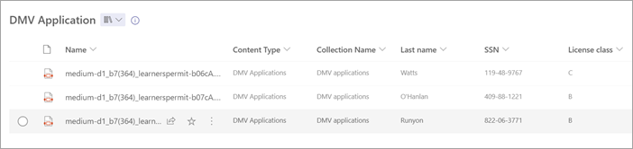

# Overview of structured and freeform document processing in SharePoint

> [!NOTE]
> Through June 2025, you can try out a [limited amount](promo-syntex.md#monthly-included-capacity) of structured and freeform document processing and other selected content services at no cost if you have [pay-as-you-go billing](syntex-azure-billing.md) set up. For information and limitations, see [Try out pay-as-you-go services](promo-syntex.md).

<!--- 

> [!VIDEO https://learn-video.azurefd.net/vod/player?id=43234179-fd0c-47c0-96a9-0fd6bc76163b]

 --->

Use the structured document processing model ([layout method](create-syntex-model.md#create-a-custom-model)) to automatically identify field and table values. It works best for structured or semi-structured documents, such as forms and invoices.

Use the freeform document processing model ([freeform selection method](create-syntex-model.md#create-a-custom-model)) to automatically extract information from unstructured and freeform documents, such as letters and contracts.

> [!NOTE]
> Microsoft respects the privacy and ownership of data you use to train and process models in Syntex. None of your organization's data is used or transferred by Microsoft to train AI models, large-language models, or any other models. Your data remains securely within your organization’s tenant. For more information, see [Microsoft data protection and privacy](https://www.microsoft.com/en-us/trust-center/privacy).

## Introduction to structured and freeform models

Microsoft Syntex uses Microsoft Power Apps [AI Builder](/ai-builder/form-processing-model-overview) to enable both structured and freeform document processing directly within SharePoint document libraries.

With AI Builder, you can create models that use machine learning to identify and extract key-value pairs and table data from various document types—including structured or semi-structured formats like forms and invoices, as well as unstructured formats like contracts and correspondence.

For example, organizations often receive large volumes of invoices through mail, fax, or email. Manually processing and entering this data can be time-consuming. Syntex streamlines this process by using AI to extract text, key-value pairs, and tables—automating data capture and reducing manual effort.

> [!NOTE]
> For more ideas about how to use these models in your organization, see [Get started driving adoption](adoption-getstarted.md) and [Scenarios and use cases](adoption-scenarios.md).

You can create structured or freeform document processing models that automatically identify and extract important information from files uploaded to a SharePoint document library.

  

To get started, you use example files to train your model. Microsoft Syntex uses these examples to learn the layout of your documents and identify key-value pairs and tables. You only need five sample documents to begin. During training, you can review and manually tag any fields that weren’t automatically detected. AI Builder also lets you test your model’s accuracy using your example files.

You can only create document processing models in SharePoint libraries where Syntex has been enabled. If it’s available, you see the **Classify and extract** option in the library’s command bar.

If you don’t see this option, contact your Microsoft 365 admin to enable Microsoft Syntex for your library.

## Requirements and limitations

For information about requirements to consider when choosing this model, see the [requirements and limitations for structured and freeform document processing](structured-freeform-requirements.md).
