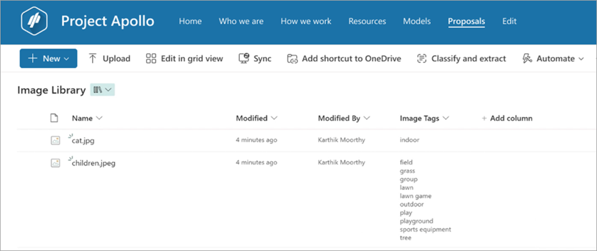

# Overview of image tagging in SharePoint

> [!NOTE]
> Through December 2025, you can try out a [limited amount](promo-syntex.md#included-monthly-capacity) of image tagging and other selected content services at no cost if you have [pay-as-you-go billing](syntex-azure-billing.md) set up. For information and limitations, see [Try out pay-as-you-go services](promo-syntex.md).

Image tagging in SharePoint helps you find and manage images more efficiently. Using AI, it automatically adds descriptive keywords—called tags—to images. These tags are stored in the Image Tags managed metadata column, making it easier to search, sort, filter, and organize your image files.

 

This feature works without requiring manual tagging or custom AI models. You can quickly locate images and build processes that use the tags applied to them.

## Requirements and limitations

| Icon          | Description   |
| ------------- | ------------- |
|   | **Supported file types**  This service supports the following file types: `.bmp, .png, .gif, .jpeg, .jpg, .tif, .tiff, .ari, .arw, .bay, .cap, .crw, .cr2, .cr3, .dcr, .dcs, .dng, .drf, .eip, .erf, .fff, .heic, .heif, .iiq, .kdc, .k25, .mef, .mos, .mrw, .nef, .nrw, .orf, .pef, .ptx, .pxn, .raf, .raw, .rwl, .rw2, .sr2, .srf, .srw, .x3f, and .3fr.` |

### Current release notes

- The time taken for tags to appear in the **Image Tags** column ranges from a minimum of 5 minutes to a maximum of 24 hours.

- **Image Tags** is an editable taxonomy column, allowing you to add new tags or remove AI-generated tags as needed to meet your requirements.

- If the image already has custom metadata applied, that information is extracted and displayed in the **Image** Tags column.

- Existing images aren't processed when the image tagger is enabled. Only newly uploaded images are processed for automatic image tagging.

- Send us feedback on the image tagging quality. We closely monitor feedback and take appropriate action based on it.
