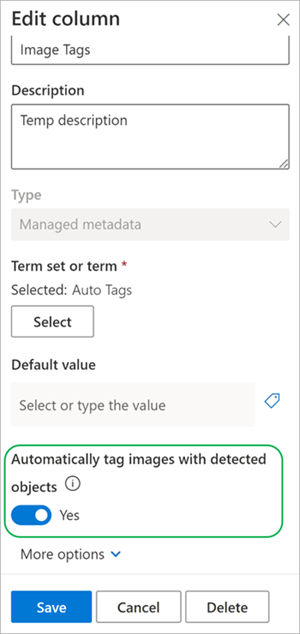
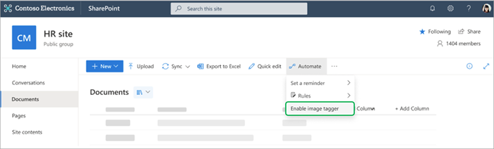
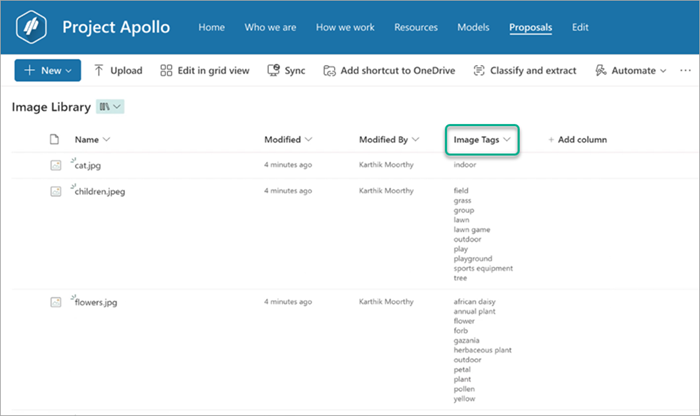

# Find and manage images using enhanced image tagging in SharePoint

Before you can use image tagging, you need to turn it on in a document library. There are two methods you can use to do this:

- [Use an existing **Image Tags** column](#use-an-existing-image-tags-column)
- [Turn on the **Image Tags** column](#turn-on-the-image-tags-column)

## Use an existing Image Tags column

If you already have an **Image Tags** column in your library, use these steps to turn on enhanced image tagging:

1. On the **Image Tags** column, select **Column settings** > **Edit**.

2. On the **Edit column** panel, in the **Automatically tag images with detected objects** section, toggle the switch to **Yes**.

   

3. Once turned on, any new images uploaded to the library are tagged with the descriptive keywords.

## Turn on the Image Tags column

If you don't have an **Image Tags** column in your library, use these steps to turn on enhanced image tagging:

1. From the document library, select **Automate** > **Enable image tagger**.

   

2. Enhanced image tagging is then activated. Images uploaded are tagged with a set of descriptive keywords. The keywords are available in the **Image Tags** column that is added to the library view.

   

3. Once the **Image Tags** column is configured, you can upload images. The relevant tags are displayed in the library for each image.
