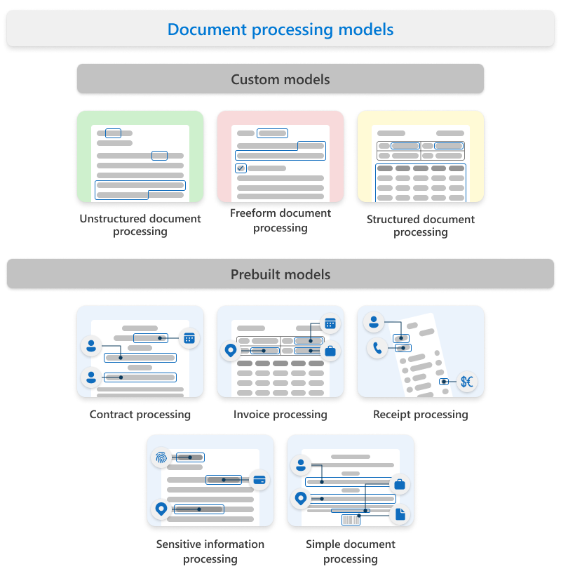
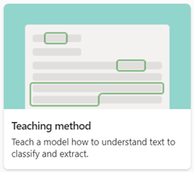
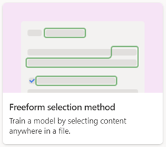
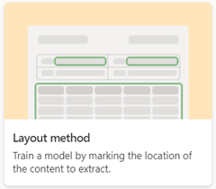
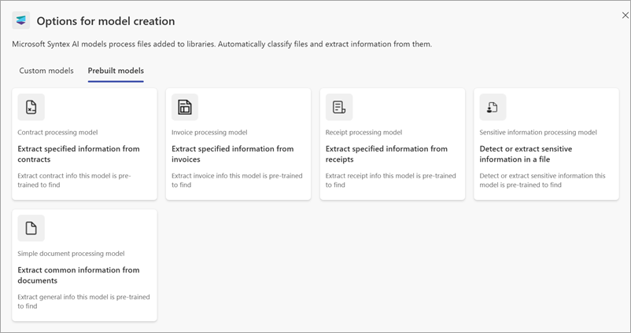

# Overview of model types in Microsoft Syntex

**Applies to:**  &ensp; &#10003; All custom models &ensp; | &ensp; &#10003; All prebuilt models

<!--- 

> [!VIDEO https://learn-video.azurefd.net/vod/player?id=2fdd05b9-cf37-40a8-b3e5-9cb9949a1a62] 

 --->

In Microsoft Syntex, document processing begins with models—powerful tools that help you identify, classify, and extract information from documents stored in SharePoint document libraries. These models are the foundation for turning unstructured content into structured, usable data.

When you apply a model to a SharePoint library, it’s linked to a content type that defines the structure of the information being extracted. This content type, which includes columns for storing extracted data, is saved in the SharePoint content type gallery. You can create a new content type tailored to your needs or leverage existing ones to reuse their schema and maintain consistency across your organization.

Microsoft Syntex uses [custom models](#custom-models) and [prebuilt models](#prebuilt-models).

Models can be either *enterprise models*, which are created in a [content center](create-a-content-center.md), or *local models*, which are created on your [local SharePoint site](create-local-model.md).

## Custom models

The type of custom model you choose will depend on the types of files you use, the format and structure of the files, and where you want to apply the model.

Custom models include:

- [Unstructured document processing](#unstructured-document-processing)
- [Freeform document processing](#freeform-document-processing)
- [Structured document processing](#structured-document-processing)

To view the side-by-side differences in custom models, see [Compare custom models](./difference-between-document-understanding-and-form-processing-model.md).
<!---
When you create a custom model, you'll select the training method associated with the model type. For example, if you want to create an unstructured document processing model, on the **Options for model creation** page where you create a model, you'll choose the **Single class model** option. The following table shows the training method associated with each custom model type.

|Unstructured  document processing  |Freeform  document processing  |Structured  document processing  |
|---------|---------|---------|
|  |  |  |

> [!NOTE]
> To make the **Freeform selection method** and the **Layout method** options available to users, they first must be configured in the Microsoft 365 admin center.
--->
### Unstructured document processing

Use the unstructured document processing model when working with documents like letters or contracts that don’t follow a consistent layout but contain identifiable phrases or patterns. This model automatically classifies documents and extracts relevant information based on text patterns.

For example, a contract renewal letter might vary in format but consistently include a phrase like “Service start date of” followed by a date. The model uses such patterns to determine both the document type (classification) and the data to extract (extractors).

**Best for**: Unstructured documents with recognizable text patterns.
**File support**: Broadest range of file types.
**Language support**: More than [40 languages](/ai-builder/form-processing-model-requirements#model-for-unstructured-and-free-form-documents).
**Setup**: Use the **Single class model** option.

For more information, see [Overview of unstructured document processing](document-understanding-overview.md).

### Freeform document processing

The freeform document processing model is ideal for extracting information from documents where data can appear anywhere—such as scanned letters, faxes, or PDFs. Unlike unstructured models, freeform models don’t classify the document type; they focus solely on extracting data.

These models are built using Microsoft Power Apps AI Builder and are especially useful when processing large volumes of incoming documents from various sources.

**Best for**: PDFs or image files where classification isn’t required.
**File support**: PDF and image formats.
**Language support**: More than [40 languages](/ai-builder/form-processing-model-requirements#model-for-unstructured-and-free-form-documents).
**Setup**: Use the **Freeform extraction model** option.
**Availability**: [Varies by region](/ai-builder/availability-region).

For more information, see [Overview of structured and freeform document processing](form-processing-overview.md).

### Structured document processing

Choose the structured document processing model for documents with a consistent layout, such as forms or invoices. This model identifies field and table values based on their fixed positions in the document.

Built with Microsoft Power Apps AI Builder, structured models learn from example documents and extract data from similar locations in future files. For instance, a tax form might always place the social security number in the same spot.

**Best for**: Structured or semi-structured documents like forms.
**File support**: Forms with consistent layouts.
**Language support**: Widest [range of supported languages](/ai-builder/form-processing-model-requirements#model-for-structured-and-semi-structured-documents).
**Setup**: Use the **Structured extraction model** option.

For more information, see [Overview of structured and freeform document processing](form-processing-overview.md).

## Prebuilt models

If you don't need to build a custom model, you can use a [prebuilt document processing model](prebuilt-overview.md) that has already been trained for specific structured documents.

Prebuilt models include:

- [Contract processing](#contract-processing)
- [Invoice processing](#invoice-processing)
- [Receipt processing](#receipt-processing)
- [Sensitive information processing](#sensitive-information-processing)
- [Simple document processing](#simple-document-processing)
<!---

--->

In addition to custom models, Microsoft Syntex offers a set of prebuilt models that provide out-of-the-box capabilities for extracting structured information from common business documents. These models are designed to save time and effort by eliminating the need for manual training or configuration.

### Contract processing

The contract processing model is designed to analyze and extract key information from contract documents. It works across various formats and identifies important contract details such as:

- Client or party name
- Billing address
- Jurisdiction
- Expiration date

This model is ideal for legal, procurement, or operations teams that manage large volumes of contracts.

For more information, see [Use a prebuilt model to extract information from contracts](prebuilt-model-contract.md).

### Invoice processing

The invoice processing model extracts essential data from sales invoices, helping streamline accounts payable workflows. It can identify information such as:

- Customer name
- Billing address
- Due date
- Amount due

This model is especially useful for finance teams looking to automate invoice intake and reduce manual data entry.

For more information, see [Use a prebuilt model to extract information from invoices](prebuilt-model-invoice.md).

### Receipt processing

The receipt processing model handles both printed and handwritten receipts, extracting key transaction details such as:

- Merchant name
- Merchant phone number
- Transaction date
- Tax and total amount

This model is well-suited for expense reporting and reimbursement workflows.

For more information, see [Use a prebuilt model to extract information from receipts](prebuilt-model-receipt.md).

### Sensitive information processing

The sensitive information processing model helps identify and extract personal and confidential data from documents. It can detect information such as:

- Social Security numbers
- Financial account numbers
- Driver’s license IDs
- Other personally identifiable information (PII)

This model supports compliance and data protection efforts across your organization.

For more information, see [Use a prebuilt model to detect sensitive information from documents](prebuilt-model-sensitive-info.md).

### Simple document processing

The simple document processing model offers a flexible, pretrained solution for extracting information such as:

- Key-value pairs
- Selection marks (for example, checkboxes)
- Named entities
- Barcodes
- Language detection

Unlike other prebuilt models with fixed schemas, this model adapts to a wider variety of structured documents and is a great alternative when custom labeling isn’t feasible.

For more information, see [Use a prebuilt model to detect sensitive information from documents](prebuilt-model-simple.md).
