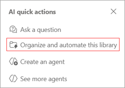
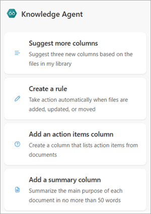
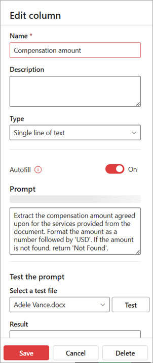

# Organize and automate columns in a SharePoint document library

The Knowledge agent in SharePoint empowers you to build richer, more intelligent document libraries for streamlined content management. By simplifying the configuration process, it ensures consistent and accurate data capture across your organization.

With recommended metadata columns, the agent improves library-scoped chat experiences and enables rule-based automation flows that support efficient business processes. This approach keeps your SharePoint libraries organized, relevant, and continuously up-to-date—making document management smarter and more scalable.

<!---
Use the Knowledge agent in SharePoint to create richer, more powerful document libraries to manage your content.

This agent simplifies the process of configuring a document library and ensures consistent and accurate data capture. Recommended metadata columns enhance library-scoped agent chat and are also used to suggest rule-based flows that streamline business processes. This approach to automating document management keeps your SharePoint libraries organized, relevant, and up-to-date.
--->

## Get suggested columns and metadata

To get suggested columns and metabase based on the content in your document library, follow these steps.

1. [Launch the quick action](#launch-the-quick-action).
2. [Use a suggested action](#use-a-suggested-action) or [enter a custom action](#enter-a-custom-action).
3. [Save your changes](#save-your-changes).

### Launch the quick action

1. In the lower-right corner of your document library, select the **AI quick actions** icon.

   

2. From the **AI quick actions** menu, select **Organize and automate this library**.

   

3. The chat panel opens and displays a list of [suggested actions](#use-a-suggested-action) related to columns.

   

    You can also enter a [custom action](#enter-a-custom-action) in the chat panel.

### Use a suggested action

1. From the chat panel, select an action. For this example, we selected **Create columns**.

2. The system analyzes your library and suggests new columns, which appear highlighted and marked as **Suggested**. This might take a few moments.

   

3. Review the suggested columns and the associated metadata to make sure they're appropriate for your content.

4. If you want to remove a suggested column, select the column name, and then select **Dismiss suggestion**.

   

5. If you want to rename the column or to refine the metadata in a suggested column to get a better result, you can edit the instruction. To do so, select the column name, and then select **Edit column**.

   

6. On the **Edit column** panel, you can edit the column name or edit the instruction that generates the metadata. After you edit the instruction, test it to make sure it gives you the information you want. When you're done making changes for that column, select **Save**.

   

### Enter a custom action

1. In the chat panel’s text box, enter your own instruction.

   

2. Press **Enter** to submit the action and initiate the suggestion flow.

### Save your changes

1. When you're ready to save all of the column changes, select **Save changes**.

2. On the **Save and apply your changes?** confirmation screen, select **Apply changes**.

   

## Natural language automations

### Create automations with plain language

With the Knowledge agent, you can automate tasks in your document library simply by describing what you want to happen. No need to learn technical jargon or navigate complex menus—just explain your intent in everyday language. The agent will interpret your request, suggest the right workflow, and set it up for you automatically.

#### Supported automation actions

- **Send an email** (for example, “Email me when a contract is approved”)
- **Move a file** (for example, “Move reviewed invoices to the Verified Expenses folder”)
- **Copy a file** (for example, “Copy all Northwind Traders invoices to their folder”)
- **Translate a file** (for example, “Create a translated copy in French when a new policy is added”)

#### How it works

- The agent parses your chat input and, using library metadata, suggests a workflow.
- You see a summary card in chat and can confirm or edit before enabling.
- If your request references data not yet tracked (for example, “Expiration Date”), the agent suggests creating the necessary column.
- For more complex automations or if the agent needs more details, you might be prompted for clarification or directed to the Rules UI for advanced editing.

#### Example prompts

- “Alert me to unpaid invoices due in the next seven days.”
- “Flag invoices missing invoice numbers.”
- “Move ‘Reviewed’ invoices to the Verified Expenses folder.”
- “Copy all invoices from Northwind Traders to their folder.”
- “Translate new HR policies to Spanish.”

### How automations are surfaced in chat

When you use the Knowledge agent to organize and automate your document library, the agent communicates proposed workflows and automations directly in the chat panel as interactive cards. Each card summarizes the trigger, conditions, and actions that are set up. For example, after you describe your intent (for example, “Alert me when an invoice is due in seven days”), the agent parses your request and presents a card in chat showing:

- **Trigger**: When a new file is added, or when a file/metadata is modified
- **Condition**: For example, “Invoice Date is within seven days”
- **Action**: For example, “Send an email to me”

You can review, confirm, or edit the workflow directly from the chat card before it's enabled. This keeps you in control and ensures transparency at every step. If more information is needed, the agent prompts you in chat to clarify details before finalizing the automation.

## Frequently asked questions

##### What do I need to set up to see these capabilities?

You need to have a Copilot license and the autofill pay-as-you-go meter turned on (for all sites or select ones).

##### Why am I seeing errors when I try to process files?

The Knowledge agent can't process encrypted files, so it's likely that the files in your document library are encrypted. If your organizational policy allows, you'll need to change the sensitivity label on the files for the Knowledge agent to be able to process them.

##### I don't see the "Organize and Automate" skill in the floating button. What's happening?

The "organize and automate" action is only available to site owners or site members when in the root of a document library. It's disabled if the user has navigated into a folder.

##### How does the agent keep me in control?

Every agent action is shown as a card in chat for your review. You can edit or decline any suggestion, and changes aren't applied to the document library until you select **Save changes**.

##### What kinds of automations can I create with the Knowledge agent?

The agent can help you configure rules to send email notifications, move or copy files, and created translated document copies based on triggers like file creation, file change, or metadata change.

##### What if I want to edit an automation later?

You can edit automations via chat by selecting **Edit** on the rule card.

##### What languages are supported?

The agent [supports the same languages as Copilot](https://support.microsoft.com/topic/26de43a1-c176-4908-bef7-29c8c37ac7ce) for text-based prompts and responses, but can only process files in English currently.

<!---
## We value your feedback

Your feedback drives improvements for everyone. Share your experience with this feature by filling out this [quick survey](https://forms.office.com/Pages/DesignPageV2.aspx?subpage=design&token=bc020eefeadd43cfb107a4e3443594b1&id=v4j5cvGGr0GRqy180BHbR_PzshIK4BNFl0DNg2VJeqVUMjZWOTZYN0lUNU45SlVFWlNCUjBYR0E2Mi4u).
--->

<!---
## Planned capabilities coming soon

We’re actively working on expanding this feature. Upcoming enhancements include:

- Select rule automation support via chat​
- Classification support
- New library flow​
- Metadata view creation​
- Classification grounding support

## Help us improve this feature

Your feedback and suggestions can help us to refine this feature to meet your needs. Submit suggestions by using this [bug template](https://onedrive.visualstudio.com/ODSP%20Product%20Experiences/_workitems/create/Bug?templateId=c70796a2-07d9-4045-9ae7-57b0a493a290&ownerId=e1686dd0-4520-4f7f-9947-34d07bf00b0a) and provide feedback by taking this [brief survey](https://forms.office.com/Pages/DesignPageV2.aspx?subpage=design&token=bc020eefeadd43cfb107a4e3443594b1&id=v4j5cvGGr0GRqy180BHbR_PzshIK4BNFl0DNg2VJeqVUMjZWOTZYN0lUNU45SlVFWlNCUjBYR0E2Mi4u).
--->
