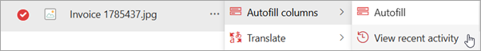

# Monitor the status of files processed for autofill and translation in SharePoint

**Applies to:**  &ensp; &#10003; Autofill columns &ensp; | &ensp; &#10003; Document translation

> [!NOTE]
> This article is currently in development.

You can view real-time updates on files processed for autofill columns and document translation.

Use the **View recent activity** panel to:

- See when a file is being processed.
- Check the status of the file: In progress, Completed, or Failed.
- Understand what worked, what didn’t, and why.

You can view and monitor the processing status for a [single file](#monitor-the-processing-status-for-a-single-file) or for [all files](#monitor-the-processing-status-for-all-files-in-the-library) in a document library.

<!---
The detailed view in the **View recent activity** pane If something goes wrong, you’ll get a clear error message and a link to helpful guidance—so you can fix issues quickly and keep things moving.

The processing status pane gives you full visibility into your file processing workflows with real-time updates on autofill columns and document translation. It helps you:

- Track when a file is being processed.
- See whether it’s **In progress**, **Completed**, or **Failed**.
- Understand both successful outcomes and failure reasons.

This feature helps you keep track of what’s happening with each file—every step of the way. You can see when a file starts processing, when it finishes, and if something goes wrong.

Instead of just showing one status, you now get a detailed view. You’ll know which services worked, which didn’t, and why. If there’s an issue, you’ll see a clear error message and a link to helpful documentation so you can fix it quickly.
--->

## Prerequisites

- Ensure your SharePoint library has the [autofill columns service](autofill-overview.md) or the [document translation service](translation-overview.md) enabled.

- Ensure you have permission to view or manage the library.

## Monitor the processing status for a single file

1. In a SharePoint document library, select a file.

2. From the **More options** (**...**) menu either next to the file name or on the command bar, select **Autofill columns** > **View recent activity** or **Translate** > **View recent activity**.

    

3. Depending on the service you selected, The **Autofill activity** panel or the **Translation activity** panel opens. The activity panel shows:

   - The file name
   - A brief summary of the action that was performed
   - The processing status: **In progress**, **Completed**, or **Failed**
   - The date of the update

4. Select **Filter** to choose a date range or to show only files that have the status of **Failed**.

### Monitor the processing status for all files in the library

1. In a SharePoint document library, on the command bar, select **Autofill columns** > **View recent activity** or **Translate** > **View recent activity**.

    

2. Depending on the service you selected, The **Autofill activity** panel or the **Translation activity** panel opens. The activity panel shows:

   - The file name
   - A brief summary of the action that was performed
   - The processing status: **In progress**, **Completed**, or **Failed**
   - The date of the update

1. The pane shows:
   - A chronological list of all file processing events
   - File name, service name, status, and timestamp
   - Grouped by time (Today, Last Week, etc.)

3. Use the **graphical summary** at the top to see:
   - Number of files per status (In progress, Completed, or Failed)
   - Select any status count to drill into the relevant files

4. Apply filters to focus on failed jobs or specific services.

### Status definitions

| Status       | Description                                                                 |
|--------------|-----------------------------------------------------------------------------|
| In progress  | The service has started processing the file. Timestamp is shown.           |
| Completed    | The service finished successfully. Might include extracted metadata or translated files. |
| Failed       | The service encountered an error. Select to view the reason and resolution. |
