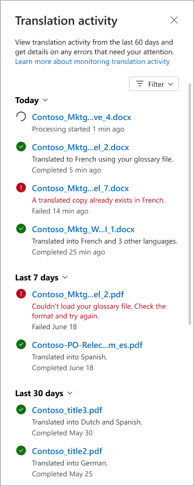

# Monitor the activity status of files processed for autofill and translation in SharePoint

**Applies to:**  &ensp; &#10003; Autofill columns &ensp; | &ensp; &#10003; Document translation

You can now view real-time updates on files processed for autofill columns and document translation.

This feature lets you:

- See when a file is being processed.
- Check the status of the file: **In progress**, **Completed**, or **Failed**.
- Understand what worked, what didn’t, and why.

You can view and monitor the processing status for a [selected file](#monitor-the-processing-status-for-a-selected-file) or for [all files](#monitor-the-processing-status-for-all-files-in-a-library) in a document library.

> [!NOTE]
> For autofill and translation, the **Status** column is hidden by default in the document library view. If you don’t see it, you can unhide it by customizing the library view.

## Prerequisites

- Ensure your SharePoint library has the [autofill columns service](autofill-overview.md) or the [document translation service](translation-overview.md) enabled.

- Ensure you have permission to view or manage the library.

## Monitor the status of a file being processed

When you submit on-demand request for autofill or translation, a message bar appears at the top of the library. This bar indicates that the action is being processed and provides a **View activity feed** button.

1. Select **View activity feed** to open the activity panel. [Learn more about the activity panel.](#view-the-activity-panel)

2. At the top of the panel, you’ll see the current action being processed.

The message bar remains visible while requests are being processed. It disappears once the request is either completed or failed.

## Monitor the status of any file

1. In a SharePoint document library, select the file or files you want for which you want to view the status.

    > [!NOTE]
    > If no files or more than 30 files are selected, the activity pane displays the processing status for the entire library, rather than for individual files.

2. From the **More options** (**...**) menu either next to the file name or on the command bar, select **Autofill columns** > **View recent activity** or **Translate** > **View recent activity**.

    

3. Depending on the service you selected, the **Autofill activity** panel or the **Translation activity** panel opens. [Learn more about the activity panel.](#view-the-activity-panel)

## Monitor the status of all files

1. In a SharePoint document library, on the command bar:

    - For autofill columns, select **More options** (**...**) > **Autofill columns** > **View recent activity**.

    - For translation, select **Translate** > **View recent activity**.

<!---
1. In a SharePoint document library, on the command bar, select **Autofill columns** > **View recent activity** or **Translate** > **View recent activity**.

    
--->

2. Depending on the service you selected, the **Autofill activity** panel or the **Translation activity** panel opens. [Learn more about the activity panel.](#view-the-activity-panel)

## View the activity panel

The activity panel shows you a list of file processing events, including:

- The file name
- A brief summary of the action that was performed, or information about why it failed
- The processing status: **In progress**, **Completed**, or **Failed**
- The date and time of the event

    

If no files or more than 30 files are selected, the activity pane displays the processing status for the entire library, rather than for individual files.

By default, the panel shows activity for the last 60 days.

To choose a specific date range, select **Filter** > **Date range**.

To show only files that have the status of **Failed**, select **Filter** > **Failed status**.

### Status definitions

| Status       | Description                                                                 |
|--------------|-----------------------------------------------------------------------------|
| In&nbsp;progress  | The service has started processing the file. A timestamp is displayed.           |
| Completed    | The service has finished processing successfully. A description of the completed actions is provided. |
| Failed       | The service has encountered an error. A description of the cause of the failure is provided. |
