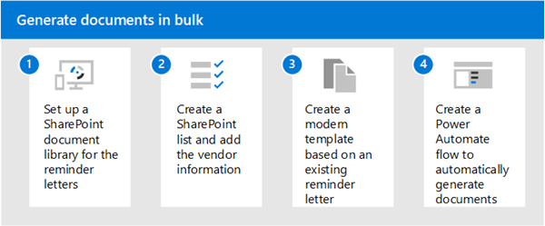

# Scenario: Generate documents in bulk with document processing for Microsoft 365

:::row:::
   :::column span="":::      
      You can use content assembly to automatically generate documents in bulk. These documents are based on a modern template that is populated with values from a data source such as a SharePoint list or database.

      Features used:
      - Content assembly 
      - Power Automate  
   :::column-end:::
   :::column span="":::
      
   :::column-end:::
:::row-end:::

## Contract renewals

You can use content assembly to generate documents in bulk using a template. You need to send correspondence to all of your vendors to remind them about upcoming contract renewals.

To implement a document processing solution:

   

1. Set up a SharePoint document library where you want to store the reminder letters.  

2. Set up a SharePoint list with the required vendor details.  

3. Go to the document library and create a modern template using a reminder letter. Create fields for the values that represent vendor details and associate them with the columns of the SharePoint list you previously set up.  

4. Now create a Power Automate flow using the action to generate document and with a manual trigger to get items in the list. This ensures that you can generate documents when you want for all values in the list.  

> [!Note]
> Although this example uses a SharePoint list as a data source, you can use any data source as a trigger for generating documents if you have access to the required Power Automate connector.  

 

> [!div class="nextstepaction"]
> [See more scenarios and use cases for document processing](adoption-scenarios.md)