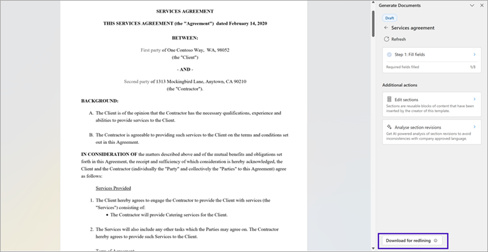
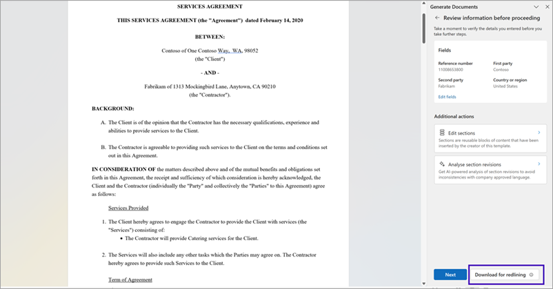
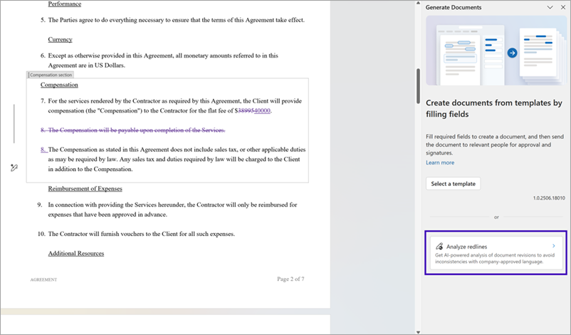
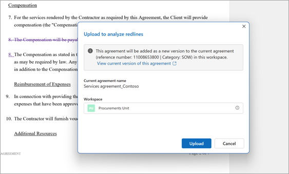
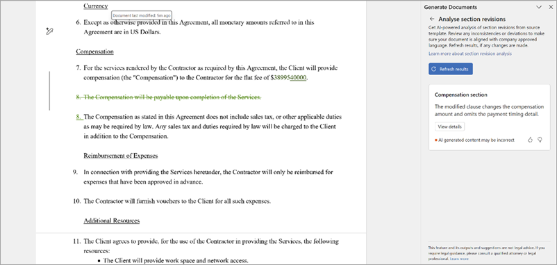

# Download an agreement for redlining and upload it for AI-powered analysis in SharePoint Agreements

You can now share agreements with external parties for redlining and negotiation using the new offline negotiation feature in the Agreements solution. This capability allows you to download an agreement document in Word format, share it for edits, and then bring it back into the Agreements workspace for automated analysis of any proposed changes.

## Why use offline negotiation?

Collaborating with external stakeholders is a crucial step in reaching consensus on key clauses and terms in a contract. Offline negotiation helps you:

- Seamlessly export an agreement for redlining and discussion.

- Reimport the redlined version to apply AI-powered section revision analysis, which identifies and summarizes proposed changes.

- Maintain traceability and document integrity throughout the process.

## Download an agreement for offline redlining

After [creating an agreement from a template](agreements-create-agreement.md), you can download a copy specifically for redlining and offline collaboration.

1. In the Agreements workspace, create your agreement using a published template.

2. Once the document is generated, select **Download for redlining** in the action menu. You can also fill in the field values in Step 1, and then download the document for redlining.

    **Download for redlining option in the home pane**
    

    **Download for redlining option after fields are filled in**
    

3. Selecting this action downloads a Word document with **Reviewing mode** enabled. The file is saved to your local **Downloads** folder.

    

> [!TIP]
> This option is only available while the document is in **Draft** state. You can download the agreement multiple times at this stage, but it’s best to track and share a single offline copy with stakeholders to avoid versioning issues.

> [!NOTE]
> Unlike using **Save As** or Word's built-in export options, **Download for redlining** preserves agreement metadata and structure to ensure smooth reimport and compatibility with AI analysis.

## Upload the redlined agreement for analysis

Once you receive the edited or redlined agreement from an external party, follow these steps to analyze changes and take further action.

1. Open the redlined document in Microsoft Word.

2. Go to the **Agreements** tab in the Word ribbon.

3. Select **Generate document** to open the pane.

4. Select the **Analyze redlines** option.

    

5. A modal dialog appears, showing:

    - The original agreement name

    - The associated Agreements workspace and category

6. Select **Upload** to reimport the redlined version. This version is added as a new version to the original agreement, maintaining version history for auditing.

    

After upload, the AI-powered section revision analysis runs automatically. The system semantically summarizes all the changes made to each clause, allowing you to do any or all of the following actions:

- Quickly identify proposed modifications.

- Take action on each suggestion.

- Accept, reject, or escalate changes for legal or business review.

Use the **Refresh results** option to rerun the analysis if you continue to update the document or receive other feedback.

> [!NOTE]
> Only files originally generated using the **Download for redlining** action can be uploaded back for redline analysis. Documents downloaded using other methods might not retain required metadata or structure.

> [!NOTE]
> Once a redlined agreement is uploaded and analyzed, you can continue the negotiation cycle by downloading it again for further offline edits. This process can be repeated as many times as needed until the agreement terms are finalized.

 

> [!div class="nextstepaction"]
> [See the complete list of help documentation.](agreements-overview.md#help-documentation)
