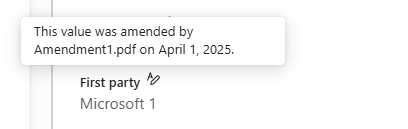
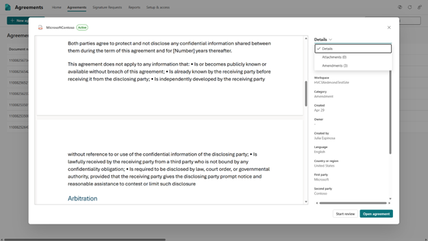
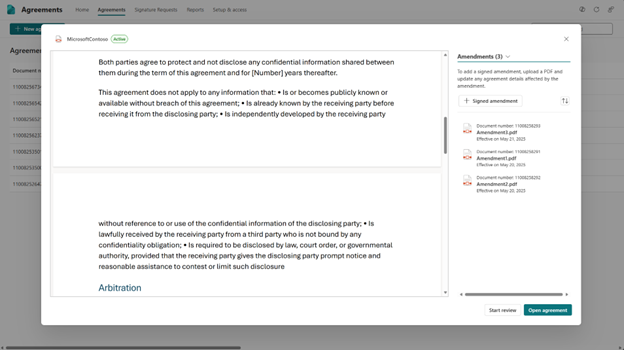

# Manage amendments in SharePoint Agreements

Amendments are documents added to signed, active agreements which modify the original parent agreement. Amendments can be used to alter content or field values of the signed agreement, including updating contact owners, changing payment terms, adding additional clauses, or extending the duration of the agreement. Users can amend an agreement by uploading a signed amendment pdf to the original agreement. 

On the Agreements list page in the Agreements Teams app, agreements with amendments will have a populated Amended column with its most recent amendment effective date. Additionally, in the Details pane, field values that have been altered by amendments will have a tooltip indicator containing the effective date of the amendment that has altered them. 

## Add an amendment

You can add one or more amendments individually to an existing agreement by uploading files using the agreements viewer dialog in the SharePoint Agreements app.

To add an attachment, follow these steps:

1.	From the Agreements app in Microsoft Teams, on the **Home** tab, select the **Agreements** tab.

2.	From the **Agreements** tab, select the agreement to which you wish to add an amendment.

3.	With the agreement viewer panel now open, select **Details** > **Amendments**.

4.	From the Attachments panel, select **+ Signed amendment** to open the file picker.

5.	Browse to the location of the amendment, and then select the file you'd like to add to the agreement.

6.	**Select** to upload the file and view in the viewer panel.

7.	Input the required amendment effective date field value.

8.	Modify any agreement details that have been altered by the uploaded amendment.

9.	**Save** to add the amendment to the selected agreement.

    

> [!NOTE]
> Amendments can only be added to agreements that are both active and signed.
> The only supported file type to upload an amendment is pdf.

## View or open an attachment

To view the attached files from with in the Agreements teams app, follow these steps:

1. From the Agreements app in Microsoft Teams, on the **Home** tab, select the **Agreements** tab.

2. From the **Agreements** tab, select an agreement which has a populated Amended column.

3. With the agreement viewer panel now open, select **Details** > **Amendments**.

   

4. From the **Amendments** panel, select the amendments you want to view and it loads in the viewer.

5. With the attachment file visible in the viewer you can return to the original agreement using the breadcrumb in the upper left, the **Return to agreement** button in the lower left, or you can clear the attachment from the attachments list.

6. To open the attachment in the default client application, select the attachment from the list, select **More options** (***...***) next to the attachment name, and then select **Open**. For example, if the attachment is a Microsoft Word document, it launches the Word client if installed.

 

> [See the complete list of help documentation.](agreements-overview.md#help-documentation)
