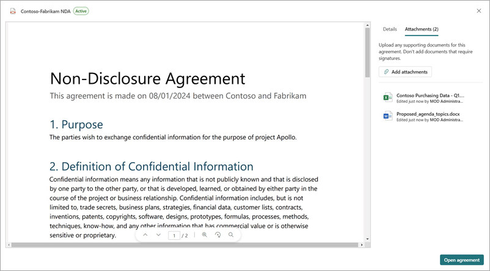

# Manage attachments in SharePoint Agreements

Attachments are files related to the agreement and are also commonly referred to as supporting documents. Typically attachments might be meeting minutes, financial documents, emails, or other types that contribute the agreement package.

## Add an attachment

You can add one or more attachments to an existing agreement by uploading files using the agreements viewer dialog in the SharePoint Agreements app.

To add an attachment, follow these steps:

1. From the Agreements app in Microsoft Teams, on the **Home** tab, select the **Agreements** tab.

2. From the **Agreements** tab, select the agreement to which you wish to add an attachment.

3. With the agreement viewer panel now open, select **Attachments** in the upper right of the panel.

4. From the **Attachments** panel, select **Add attachment** to open the file picker.

5. Browse to the location of the attachment, and then choose one or more files to attach to the agreement.

6. Select **Open** to upload the files and view them as attachments in the viewer panel.

7. On the Agreements list page in the Agreements Teams app, agreements with attachments have an attachment icon with the attachment count displayed next to the file name.

> [!NOTE]
> The supported filetypes for attachments are Adobe .pdf, Microsoft Office files including Word, Excel and PowerPoint, and email files in Outlook or Gmail format. Attempting to add unsupported files results in an error. 
> When you add a file to an attachment, only one instance of the same file can be attached. Duplicates generate a warning. 
> Attachments added to an agreement have the same access permissions as the agreement to which they're attached.

## View or open an attachment

To view the attached files from with in the Agreements teams app, follow these steps:

1. From the Agreements app in Microsoft Teams, on the **Home** tab, select the **Agreements** tab.

2. From the **Agreements** tab, select an agreement which has the attachment icon next to the filename.

3. With the agreement viewer panel now open, select **Attachments** in the upper right of the panel.

   

4. From the **Attachments** panel, select the attachment you want to view and it loads in the viewer.

5. With the attachment file visible in the viewer you can return to the original agreement using the breadcrumb in the upper left, the **Return to agreement** button in the lower left, or you can clear the attachment from the attachments list.

6. To open the attachment in the default client application, select the attachment from the list, select **More options** (***...***) next to the attachment name, and then select **Open**. For example, if the attachment is a Microsoft Word document it launches the Word client if installed.

## Delete an attachment

Attachments can be added to agreements in any state within the Agreements Teams app. However, they can only be removed for agreements that are in draft state.

To delete an existing attachment from an agreement, follow these steps:

1. From the Agreements app in Microsoft Teams, on the **Home** tab, select the **Agreements** tab.

2. From the **Agreements** tab, select an agreement which has the attachment icon next to the filename.

3. With the agreement viewer panel now open, select **Attachments** in the upper right of the panel.

4. From the **Attachments** panel, select **More options** (***...***) next to the name of the attachment you want to remove, and then select **Delete**.

5. To cancel the delete operation, select the **Undo** button on the notification in the lower right of the browser window. This notification remains visible for several seconds after a file is deleted.

> [!NOTE]
> Although you can add multiple attachments to an agreement at the same time, you can delete attachments only one at a time.

 

> [!div class="nextstepaction"]
> [See the complete list of help documentation.](agreements-overview.md#help-documentation)

