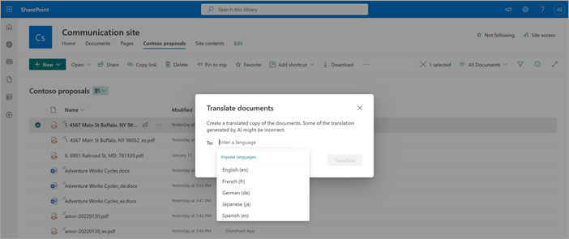

# Overview of document translation in SharePoint

> [!NOTE]
> Through June 2025, you can try out a [limited amount](promo-syntex.md#monthly-included-capacity) of document translation and other selected content services at no cost if you have [pay-as-you-go billing](syntex-azure-billing.md) set up. For information and limitations, see [Try out pay-as-you-go services](promo-syntex.md).

Document translation lets you easily create a translated copy of a selected file or a set of files in a SharePoint document library. You can translate a file in one language or up to 10 language at a time, while preserving the original format and structure of the file. Translation is available for all supported languages and dialects.

This feature lets you translate files of different types either manually or automatically by [creating a rule](content-processing-translate.md).

You can also use the translation feature for translating video transcripts and closed captioning files. For more information, see [Transcript translations in Stream for SharePoint](https://support.microsoft.com/office/microsoft-syntex-pay-as-you-go-transcript-translations-in-stream-for-sharepoint-2e34ad1b-e213-47ed-a806-5cc0d88751de).

## Requirements and limitations

| Icon          | Description   |
| ------------- | ------------- |
|   | **Supported file types**  This service supports the following file types: .csv, .docx, .htm, .html, .markdown, .md, .msg, .pdf, .pptx, .txt, and .xlsx.  For older file types like .doc, .odp, .ods, .rtf, .ppt, and .xls, the translated copy is created in the modern equivalent formats: .docx, .pptx, or .xlsx.  SharePoint site pages aren't supported at this time. |
|   | **Supported file sizes**  The maximum file size for documents to be translated is limited to 40 MB. |
|   | **Supported languages**  This service is available for [all supported languages and dialects](/azure/ai-services/translator/language-support?source=recommendations#translation). |
|   | **Manage Lists permission**  To create translated file copies, a user must be a site member and have the Manage Lists permission on the document library. |
|   | **Multi-Geo environments**  When setting up this service in a [Microsoft 365 Multi-Geo](/microsoft-365/enterprise/microsoft-365-multi-geo) environment, you can only configure it to use the service in the central location. If you want to use this service in a satellite location, contact Microsoft support. |

## Current release notes

- Encrypted files aren't translated.
- Password-protected files aren't translated.
- Text on images within documents isn't translated.
- Document translation is also [available for files in OneDrive](/sharepoint/onedrive-document-translation).
- On-demand translation on folders will be available in a future release.

## Frequently asked questions

#### What are the best practices and limitations for translating documents with various formats and content types?

For answers to frequently asked questions about document translation, see [Document Translation: FAQ](/azure/ai-services/translator/document-translation/faq#document-translation-faq).

#### How does translation count characters and what are the implications for character consumption in various translation methods?

For answers to frequently asked questions character count, see [How does Translator count characters](/azure/ai-services/translator/translator-faq#how-does-translator-count-characters).

#### How can I provide feedback on a translated document?

Hover over the translated file in the library, select the feedback icon, and follow the prompts. For more information, see [Give feedback on translated documents](translation.md#give-feedback-on-translated-documents).
